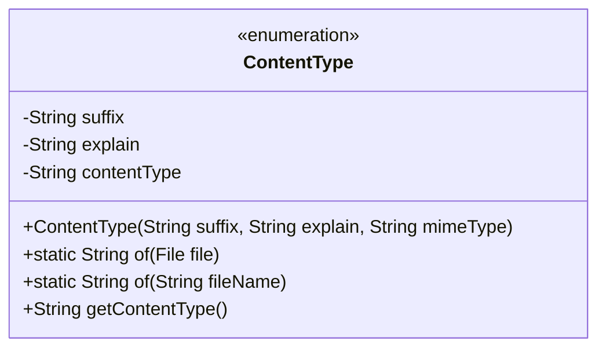
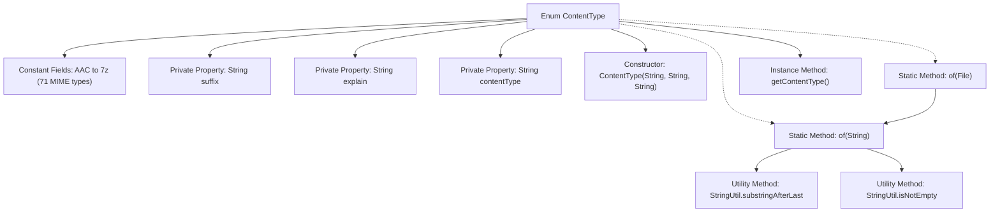

# Basic Information

|      |      |
|------|------|
| Name | ContentType |
| Language | .java |
| Code Path | WeFe/common/java/common-lang/src/main/java/com/welab/wefe/common/util/enums/ContentType.java |
| Package Name | com.welab.wefe.common.util.enums |
| Dependencies | ['com.welab.wefe.common.util.StringUtil', 'java.io.File'] |
| Brief Description | The enumeration ContentType defines common file extensions, descriptions, and MIME types, providing a method to retrieve the corresponding MIME type based on the file name. |

# Description

This is an enumeration class ContentType that defines the extensions, descriptions, and corresponding MIME types for various file types. Each enumeration value contains three attributes: `suffix` represents the file extension, `explain` is the type description, and `contentType` is the MIME type. The class provides a static method `of` to retrieve the corresponding MIME type via a filename or file object, returning the default binary data type if no match is found. This class covers common formats such as audio, video, documents, images, compressed files, etc., facilitating quick retrieval of MIME type information during file processing.

# Class Summary

| Name   | Type  | Description |
|-------|------|-------------|
| ContentType | enum | The enumeration ContentType defines the mapping relationships between file extensions, descriptions, and MIME types, providing a method to retrieve the corresponding MIME type based on the file name. |

## Class ContentType

|      |      |
|------|------|
| Access Modifier | public |
| Type | enum |
| Name | ContentType |
| Description | The enumeration ContentType defines the mapping relationships between file extensions, descriptions, and MIME types, providing a method to retrieve the corresponding MIME type based on the file name. |

### UML Class Diagram

This code defines an enumeration class named ContentType for managing file extensions, type descriptions, and corresponding MIME types. The class contains three private fields: suffix (file extension), explain (type description), and contentType (MIME type), along with a constructor and three public methods. The static method of() is used to retrieve the corresponding MIME type based on a file name or file object, while getContentType() is used to obtain the MIME type of the current enumeration instance. This enumeration class provides definitions for numerous common file types and their corresponding MIME types, defaulting to the MIME type for binary data when no match is found.

### Internal Method Call Graph

This flowchart illustrates the complete structure of the ContentType enum class, including 71 predefined MIME type constants, three private property fields, a constructor, and key business methods. The core logic involves matching file extensions to corresponding MIME types, defaulting to binary stream type when no match is found. The static method 'of' forms the primary processing chain, relying on string utility classes for path parsing and null checks, ultimately returning the corresponding contentType string.

### Field List

| Name  | Type  | Description |
|-------|-------|------|

### Method List

| Name  | Type  | Description |
|-------|-------|------|

