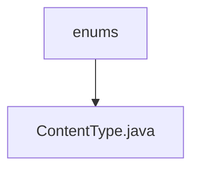

# Basic Information

|      |      |
|------|------|
| Name | enums |
| Language | .java |
| Code Path | WeFe/common/java/common-lang/src/main/java/com/welab/wefe/common/util/enums |
| Package Name | docs.common.java.common-lang.src.main.java.com.welab.wefe.common.util.enums |
| Brief Description | The enumeration ContentType defines common file extensions, descriptions, and MIME types, providing a method to retrieve the corresponding MIME type based on the filename. |

# Description

This is an enumeration class ContentType that defines the extensions, descriptions, and corresponding MIME types for various file types. Each enum value contains three attributes: `suffix` represents the file extension, `explain` provides a type description, and `contentType` is the MIME type. The class provides a static method `of` to retrieve the corresponding MIME type via a filename or file object, returning the default binary data type if no match is found. The class covers common formats such as audio, video, documents, images, compressed files, etc., facilitating quick access to MIME type information during file processing.

### Package Internal Structure View

This flowchart illustrates the hierarchical relationship of enum utility classes in the WeFe project. The top-level node is the "enums" directory, which contains a specific enum class file "ContentType.java". This structure reflects a common package organization approach in Java projects, where enum types are centrally stored in dedicated directories.

# File List

| Name   | Type  | Description |
|-------|------|-------------|
| [ContentType.java](ContentType.md) | file | The enumeration ContentType defines common file extensions, descriptions, and MIME types, providing a method to retrieve the corresponding MIME type based on the file name. |

