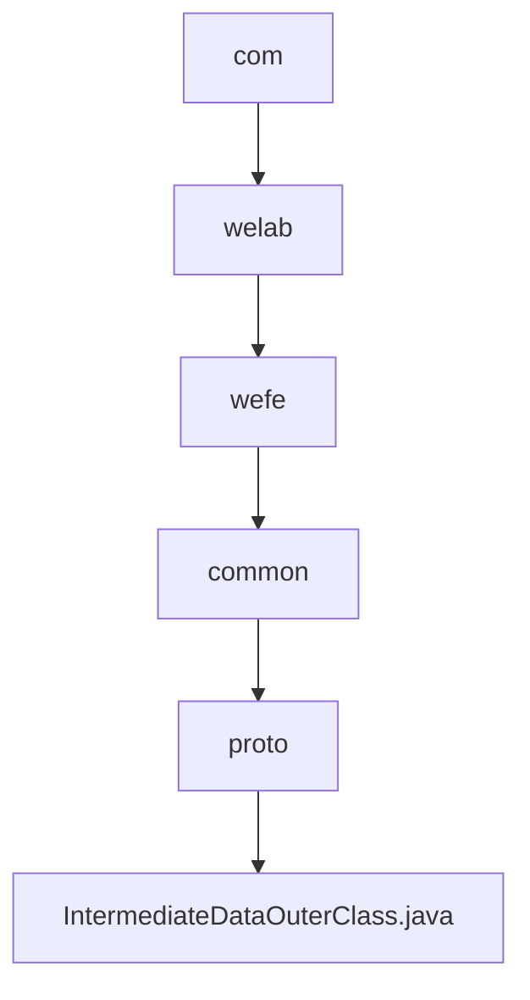

# Basic Information

|      |      |
|------|------|
| Name | com |
| Language | .java |
| Code Path | WeFe/common/java/common-proto/src/main/java/com |
| Package Name | docs.common.java.common-proto.src.main.java.com |
| Brief Description | This is a Google Protocol Buffers (protobuf) definition file describing a protocol for intermediate data structures. It primarily contains three message types: IntermediateDataItem (key-value pair data item), BatchSerializationData (batch serialized data), and IntermediateData (intermediate data container). IntermediateData supports two storage methods: 1) a collection of multiple key-value pair data entries; 2) binary data after complete serialization. The file defines the data structures and related operational methods for data exchange between different systems. |

# Description

The content defines a Protobuf protocol for intermediate data transmission, comprising three primary structures: IntermediateDataItem represents a key-value pair data item, BatchSerializationData denotes serialized binary data chunks, and IntermediateData serves as a container supporting two storage modes (multiple data item collections or a single data chunk). The protocol distinguishes storage types via the dataFlag field and provides comprehensive serialization/deserialization support.

### Package Internal Structure View

This flowchart illustrates the complete hierarchical relationship from the com directory to the final Java file. The path starts from the top-level package com, progressively delving into sub-packages welab, wefe, common, and proto, ultimately pointing to the IntermediateDataOuterClass.java source file. The entire process reflects standard Java package naming conventions and hierarchical structure, comprising 5 directory nodes and 1 file node.

# File List

| Name   | Type  | Description |
|-------|------|-------------|
| [welab](welab/_module.md) | package | This is a Google Protocol Buffers (protobuf) definition file describing a protocol for intermediate data structures. It primarily includes three message types: IntermediateDataItem (key-value data item), BatchSerializationData (batch serialized data), and IntermediateData (intermediate data container). IntermediateData supports two storage methods: 1) a collection of multiple key-value data items; 2) binary data after overall serialization. The file defines the data structures and related operation methods for data exchange between different systems. |

