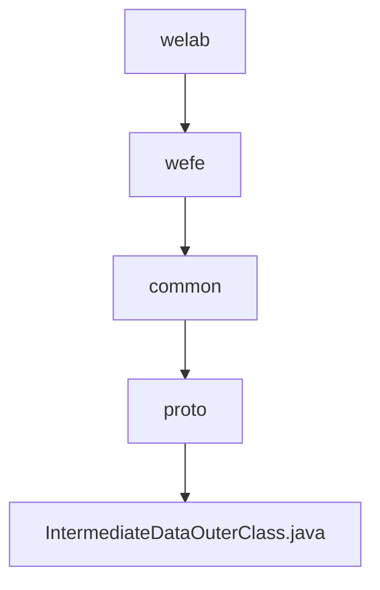

# Basic Information

|      |      |
|------|------|
| Name | welab |
| Language | .java |
| Code Path | WeFe/common/java/common-proto/src/main/java/com/welab |
| Package Name | docs.common.java.common-proto.src.main.java.com.welab |
| Brief Description | This is a Google Protocol Buffers (protobuf) definition file describing a protocol for intermediate data structures. It primarily includes three message types: IntermediateDataItem (key-value data item), BatchSerializationData (batch serialized data), and IntermediateData (intermediate data container). IntermediateData supports two storage methods: 1) a collection of multiple key-value data items; 2) binary data after overall serialization. The file defines the data structures and related operation methods for data exchange between different systems. |

# Description

The content defines a Protobuf protocol for intermediate data transmission, comprising three primary structures: IntermediateDataItem represents a key-value pair data item, BatchSerializationData denotes a serialized binary data block, and IntermediateData serves as a container supporting two storage modes (a collection of multiple data items or a single data block). The protocol distinguishes storage types via the dataFlag field and provides comprehensive serialization/deserialization support.

### Package Internal Structure View

This flowchart illustrates the hierarchical Java package structure of the common-proto module in the WeFe project. Starting from the root package com/welab, it progressively expands to sub-packages wefe, common, and proto, ultimately pointing to the specific Protocol Buffers file IntermediateDataOuterClass.java. The entire structure presents a clear tree-like dependency relationship, comprising 4 directory levels and 1 Java source file node.

# File List

| Name   | Type  | Description |
|-------|------|-------------|
| [wefe](wefe/_module.md) | package | This is a Google Protocol Buffers (protobuf) definition file describing a protocol for intermediate data structures. It primarily includes three message types: IntermediateDataItem (key-value pair data item), BatchSerializationData (batch serialized data), and IntermediateData (intermediate data container). IntermediateData supports two storage methods: 1) a collection of multiple key-value pair data items; 2) binary data after complete serialization. The file defines the data structures and related operational methods for data exchange between different systems. |

