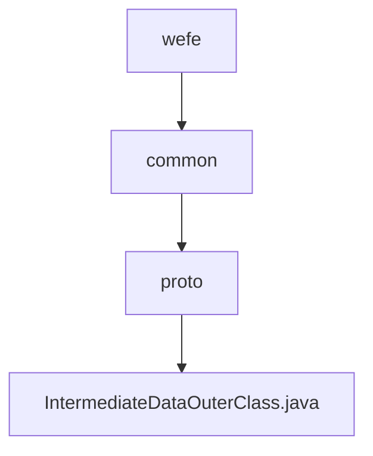

# Basic Information

|      |      |
|------|------|
| Name | wefe |
| Language | .java |
| Code Path | WeFe/common/java/common-proto/src/main/java/com/welab/wefe |
| Package Name | docs.common.java.common-proto.src.main.java.com.welab.wefe |
| Brief Description | This is a Google Protocol Buffers (protobuf) definition file describing a protocol for intermediate data structures. It primarily includes three message types: IntermediateDataItem (key-value pair data item), BatchSerializationData (batch serialized data), and IntermediateData (intermediate data container). IntermediateData supports two storage methods: 1) a collection of multiple key-value pair data items; 2) binary data after complete serialization. The file defines the data structures and related operational methods for data exchange between different systems. |

# Description

The content defines a Protobuf protocol for intermediate data transmission, comprising three main structures: IntermediateDataItem represents a key-value data item, BatchSerializationData denotes serialized binary data chunks, and IntermediateData serves as a container supporting two storage modes (a collection of multiple data items or a single data chunk). The protocol distinguishes storage types via the dataFlag field and provides full serialization/deserialization support.

### Package Internal Structure View

This flowchart illustrates the Java package structure of the common-proto module in the WeFe project. The root node is wefe, which contains the common subpackage. Within common, there is a proto subpackage, and finally, the proto package contains the IntermediateDataOuterClass.java source file. This represents a typical three-layer Java package structure, demonstrating the hierarchical relationship from a general package to a specific protocol class.

# File List

| Name   | Type  | Description |
|-------|------|-------------|
| [common](common/_module.md) | package | This is a Google Protocol Buffers (protobuf) definition file describing a protocol for intermediate data structures. It primarily includes three message types: IntermediateDataItem (key-value pair data item), BatchSerializationData (batch serialized data), and IntermediateData (intermediate data container). IntermediateData supports two storage methods: 1) a collection of multiple key-value pair data entries; 2) binary data after complete serialization. The file defines the data structures and related operational methods for data exchange between different systems. |

