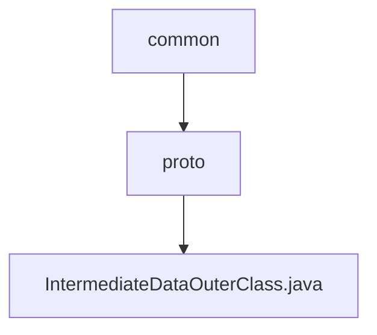

# Basic Information

|      |      |
|------|------|
| Name | common |
| Language | .java |
| Code Path | WeFe/common/java/common-proto/src/main/java/com/welab/wefe/common |
| Package Name | docs.common.java.common-proto.src.main.java.com.welab.wefe.common |
| Brief Description | This is a Google Protocol Buffers (protobuf) definition file describing a protocol for intermediate data structures. It primarily includes three message types: IntermediateDataItem (key-value pair data item), BatchSerializationData (batch serialized data), and IntermediateData (intermediate data container). IntermediateData supports two storage methods: 1) a collection of multiple key-value pair data entries; 2) binary data after complete serialization. The file defines the data structures and related operational methods for data exchange between different systems. |

# Description

The content defines a Protobuf protocol for intermediate data transmission, comprising three primary structures: `IntermediateDataItem` represents a key-value pair data item, `BatchSerializationData` denotes a serialized binary data block, and `IntermediateData` serves as a container supporting two storage modes (a collection of multiple data items or a single data block). The protocol distinguishes storage types via the `dataFlag` field and provides comprehensive serialization/deserialization support.

### Package Internal Structure View

This flowchart illustrates the directory structure under the proto folder within the common module of the WeFe project. The root node is the common directory, which contains the proto subdirectory, and the proto directory houses the IntermediateDataOuterClass.java source file. This represents a typical three-level Java project structure, demonstrating the storage location of proto files in the common module.

# File List

| Name   | Type  | Description |
|-------|------|-------------|
| [proto](proto/_module.md) | package | This is a Google Protocol Buffers (protobuf) definition file describing a protocol for intermediate data structures. It primarily includes three message types: IntermediateDataItem (key-value data item), BatchSerializationData (batch serialized data), and IntermediateData (intermediate data container). IntermediateData supports two storage methods: 1) a collection of multiple key-value data items; 2) binary data after complete serialization. The file defines the data structures and related operation methods for data exchange between different systems. |

