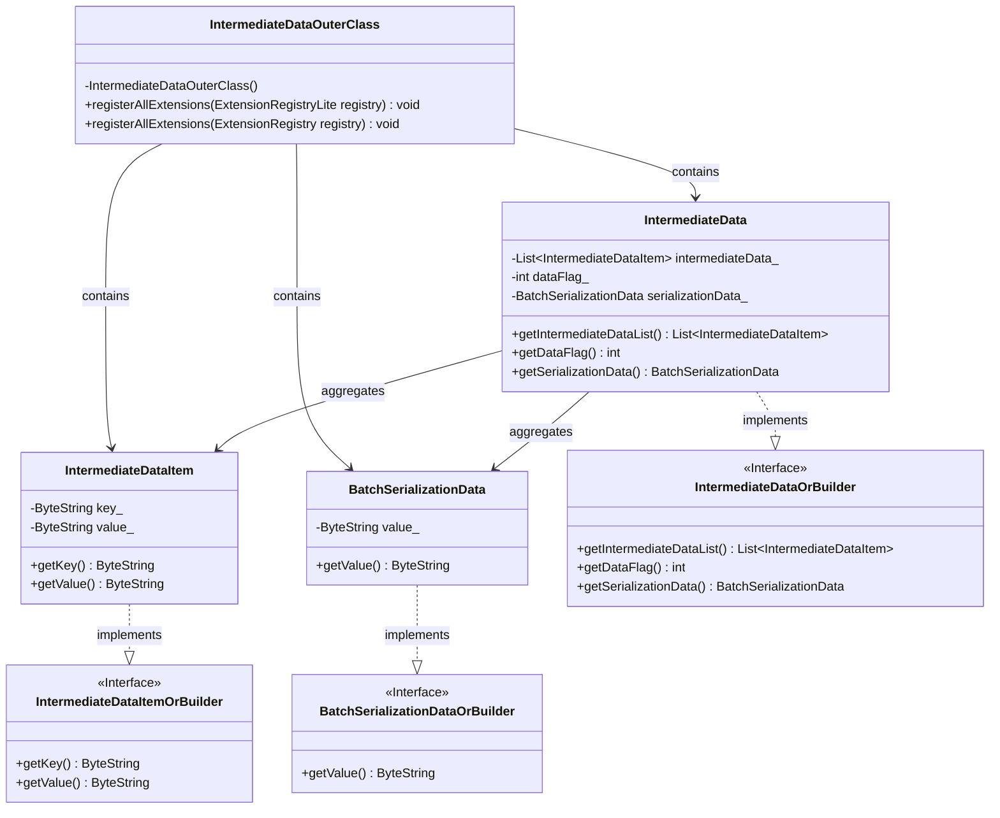

# Basic Information

|      |      |
|------|------|
| Name | IntermediateDataOuterClass |
| Language | .java |
| Code Path | WeFe/common/java/common-proto/src/main/java/com/welab/wefe/common/proto/IntermediateDataOuterClass.java |
| Package Name | com.welab.wefe.common.proto |
| Dependencies | [] |
| Brief Description | This is a Google Protocol Buffers (protobuf) definition file describing a protocol for intermediate data structures. It primarily includes three message types: IntermediateDataItem (key-value pair data item), BatchSerializationData (batch serialized data), and IntermediateData (intermediate data container). IntermediateData supports two storage methods: 1) a collection of multiple key-value pair data entries; 2) binary data after complete serialization. The file defines the data structures and related operational methods for data exchange between different systems. |

# Description

The content defines a Protobuf protocol for intermediate data transmission, comprising three main structures: IntermediateDataItem represents a key-value pair data item, BatchSerializationData denotes a serialized binary data block, and IntermediateData serves as a container supporting two storage modes (a collection of multiple data items or a single data block). The protocol distinguishes storage types via the dataFlag field and provides comprehensive serialization/deserialization support.

# Class Summary

| Name   | Type  | Description |
|-------|------|-------------|
| IntermediateDataOuterClass | class | This is a Protobuf definition file containing three message types: IntermediateDataItem (key-value pair data item), BatchSerializationData (batch serialized data), and IntermediateData (intermediate data collection). Its primary function is to define data structures and serialization methods, supporting both key-value pair storage and batch serialization data formats. |

## Class IntermediateDataOuterClass

|      |      |
|------|------|
| Access Modifier | public final |
| Type | class |
| Name | IntermediateDataOuterClass |
| Description | This is a Protobuf definition file containing three message types: IntermediateDataItem (key-value pair data item), BatchSerializationData (batch serialized data), and IntermediateData (intermediate data collection). Its primary function is to define data structures and serialization methods, supporting both key-value pair storage and batch serialization data formats. |

### UML Class Diagram

This code defines a Protobuf message structure primarily used for intermediate data serialization and deserialization. Core classes include IntermediateData (aggregating multiple IntermediateDataItem), BatchSerializationData (batch serialized data), and their corresponding builder interfaces. IntermediateDataOuterClass serves as a container class providing extension registration functionality, with all message classes implementing their respective OrBuilder interfaces to enable the builder pattern. The data structure supports two storage modes: itemized storage (IntermediateDataItem list) and bulk serialized storage (BatchSerializationData), distinguished by the dataFlag field.

### Internal Method Call Graph

```mermaid
graph TD
    A["Class IntermediateDataOuterClass"]
    B["Static Method: registerAllExtensions(ExtensionRegistryLite)"]
    C["Static Method: registerAllExtensions(ExtensionRegistry)"]
    D["Interface: IntermediateDataItemOrBuilder"]
    E["Method: getKey()"]
    F["Method: getValue()"]
    G["Inner Class: IntermediateDataItem"]
    H["Constructor: IntermediateDataItem(GeneratedMessageV3.Builder)"]
    I["Method: getKey()"]
    J["Method: getValue()"]
    K["Inner Class: Builder"]
    L["Method: setKey(ByteString)"]
    M["Method: setValue(ByteString)"]
    N["Interface: BatchSerializationDataOrBuilder"]
    O["Method: getValue()"]
    P["Inner Class: BatchSerializationData"]
    Q["Constructor: BatchSerializationData(GeneratedMessageV3.Builder)"]
    R["Method: getValue()"]
    S["Inner Class: Builder"]
    T["Method: setValue(ByteString)"]
    U["Interface: IntermediateDataOrBuilder"]
    V["Method: getIntermediateDataList()"]
    W["Method: getDataFlag()"]
    X["Method: getSerializationData()"]
    Y["Inner Class: IntermediateData"]
    Z["Constructor: IntermediateData(GeneratedMessageV3.Builder)"]
    AA["Method: getIntermediateDataList()"]
    AB["Method: getDataFlag()"]
    AC["Method: getSerializationData()"]
    AD["Inner Class: Builder"]
    AE["Method: addIntermediateData(IntermediateDataItem)"]
    AF["Method: setDataFlag(int)"]
    AG["Method: setSerializationData(BatchSerializationData)"]

    A --> B
    A --> C
    A --> D
    D --> E
    D --> F
    A --> G
    G --> H
    G --> I
    G --> J
    G --> K
    K --> L
    K --> M
    A --> N
    N --> O
    A --> P
    P --> Q
    P --> R
    P --> S
    S --> T
    A --> U
    U --> V
    U --> W
    U --> X
    A --> Y
    Y --> Z
    Y --> AA
    Y --> AB
    Y --> AC
    Y --> AD
    AD --> AE
    AD --> AF
    AD --> AG
```

This code defines a Protobuf message structure comprising three main components: IntermediateDataItem (key-value data item), BatchSerializationData (batch serialized data), and IntermediateData (intermediate data container). IntermediateData can contain multiple IntermediateDataItems or one BatchSerializationData, distinguished by the dataFlag field. The code employs the Builder pattern to construct message objects and provides comprehensive interface methods for data access and modification. The overall structure is clear and well-organized, making it suitable for serialization and transmission of intermediate data in distributed systems.

### Field List

| Name  | Type  | Description |
|-------|-------|------|
| internal_static_com_welab_wefe_common_proto_IntermediateData_descriptor | com.google.protobuf.Descriptors.Descriptor | Private static constant defining the Protobuf descriptor for IntermediateData. |
| descriptor | com.google.protobuf.Descriptors.FileDescriptor | The static private variable descriptor, of type com.google.protobuf.Descriptors.FileDescriptor. |
| internal_static_com_welab_wefe_common_proto_BatchSerializationData_fieldAccessorTable | com.google.protobuf.GeneratedMessageV3.FieldAccessorTable | private static final FieldAccessorTable field of protobuf type, used for accessing internal structural fields of BatchSerializationData. |
| internal_static_com_welab_wefe_common_proto_IntermediateDataItem_fieldAccessorTable | com.google.protobuf.GeneratedMessageV3.FieldAccessorTable | Defined a private static final variable of type GeneratedMessageV3.FieldAccessorTable for accessing internal fields of IntermediateDataItem. |
| internal_static_com_welab_wefe_common_proto_IntermediateDataItem_descriptor | com.google.protobuf.Descriptors.Descriptor | Private static final descriptor variables for internal Protocol Buffer definitions of intermediate data items. |
| internal_static_com_welab_wefe_common_proto_IntermediateData_fieldAccessorTable | com.google.protobuf.GeneratedMessageV3.FieldAccessorTable | Private static final field of type protobuf FieldAccessorTable, used for intermediate data model field access. |
| internal_static_com_welab_wefe_common_proto_BatchSerializationData_descriptor | com.google.protobuf.Descriptors.Descriptor | Private static final descriptor for the protocol buffer definition of the BatchSerializationData class. |

### Method List

| Name  | Type  | Description |
|-------|-------|------|
| registerAllExtensions | void | This is a Java static method designed to register all extensions into a given Protobuf extension registry. Internally, it invokes another overloaded method that converts a regular registry to its Lite version for registration. |
| registerAllExtensions | void | The static method `registerAllExtensions` is used to register extensions with Protobuf's `ExtensionRegistryLite`, currently implemented as an empty method. |
| getDescriptor | com.google.protobuf.Descriptors.FileDescriptor | This is a static method that returns the protobuf file descriptor descriptor. |

