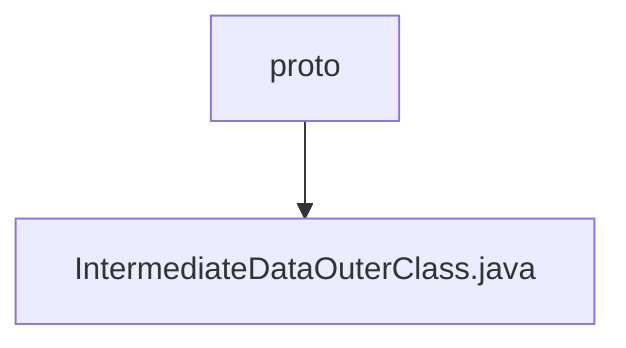

# Basic Information

|      |      |
|------|------|
| Name | proto |
| Language | .java |
| Code Path | WeFe/common/java/common-proto/src/main/java/com/welab/wefe/common/proto |
| Package Name | docs.common.java.common-proto.src.main.java.com.welab.wefe.common.proto |
| Brief Description | This is a Google Protocol Buffers (protobuf) definition file describing a protocol for intermediate data structures. It primarily includes three message types: IntermediateDataItem (key-value data item), BatchSerializationData (batch serialized data), and IntermediateData (intermediate data container). IntermediateData supports two storage methods: 1) a collection of multiple key-value data items; 2) binary data after complete serialization. The file defines the data structures and related operation methods for data exchange between different systems. |

# Description

The content defines a Protobuf protocol for intermediate data transmission, comprising three primary structures: `IntermediateDataItem` represents a key-value data item, `BatchSerializationData` denotes a serialized binary data block, and `IntermediateData` serves as a container supporting two storage modes (a collection of multiple data items or a single data block). The protocol distinguishes storage types via the `dataFlag` field and provides comprehensive serialization/deserialization support.

### Package Internal Structure View

This flowchart illustrates the hierarchical relationship between the proto folder and the IntermediateDataOuterClass.java file. As the parent directory, proto contains a child file named IntermediateDataOuterClass.java, which represents a typical protocol buffer file structure in Java projects for defining protobuf message formats.

# File List

| Name   | Type  | Description |
|-------|------|-------------|
| [IntermediateDataOuterClass.java](IntermediateDataOuterClass.md) | file | This is a Google Protocol Buffers (protobuf) definition file describing a protocol for intermediate data structures. It primarily contains three message types: IntermediateDataItem (key-value pair data item), BatchSerializationData (batch serialized data), and IntermediateData (intermediate data container). IntermediateData supports two storage methods: 1) a collection of multiple key-value pair data entries; 2) binary data after complete serialization. The file defines the data structures and related operational methods for data exchange between different systems. |

