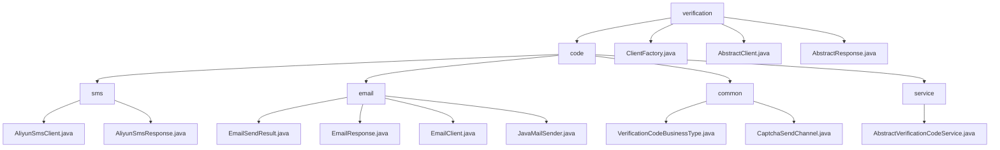

# Basic Information

|      |      |
|------|------|
| Name | verification |
| Language | .java |
| Code Path | WeFe/common/java/common-verification-code/src/main/java/com/welab/wefe/common/verification |
| Package Name | docs.common.java.common-verification-code.src.main.java.com.welab.wefe.common.verification |
| Brief Description | Alibaba Cloud SMS Service Java client encapsulates the SDK to provide SMS sending functionality, supporting verification code scenarios, and depends on the Alibaba Cloud SDK. The email sending module encapsulates the SMTP protocol, supports HTML emails and SSL encryption, and relies on JavaMail. The verification code management module defines business types and sending channel enumerations with no external dependencies. The abstract verification code service class provides generation, sending, and validation functions with a 2-minute validity period. The factory class returns SMS or email client instances based on the channel. Abstract client and response classes provide basic encapsulation, requiring subclasses to implement specific logic. |

# Description

## Overview  
This module is a unified verification code service framework, with its core responsibility being to provide standardized management of multi-channel (SMS/email) verification codes, covering the entire process of generation, delivery, and validation. The interface specification includes an abstract client (AbstractClient) and a base response class (AbstractResponse), utilizing the factory pattern (ClientFactory) to dynamically select delivery channels. Key data structures include the verification code business enumeration (VerificationCodeBusinessType), channel enumeration (CaptchaSendChannel), and extended parameter mapping. External dependencies include the Alibaba Cloud SMS SDK and the JavaMail library. For example, ExpiringMap is used to implement a verification code cache with a 2-minute validity period.  

## Primary Business Scenarios  
A typical workflow involves: selecting a business type (e.g., member registration) → specifying a delivery channel (SMS/email) → the factory obtaining the corresponding client → sending and validating the verification code. The interaction mode resembles gateway routing, with results determined via status codes (e.g., RESP_STATUS_OK). Functional completeness is reflected in multi-channel support, cache management, and exception handling. For instance, SMS delivery employs AliyunSmsClient, while email delivery relies on JavaMailSender. Integration examples include SMS verification code delivery during user registration and email notifications for password recovery.

### Package Internal Structure View

This flowchart illustrates the hierarchical structure of the verification code module, with the top-level being the verification directory, which branches into nodes such as code and ClientFactory. The code directory is further divided into submodules: sms, email, common, and service, each containing specific implementation class files. The sms module handles Alibaba Cloud SMS-related classes, email includes mail-sending related classes, common stores general enumeration classes, and service provides abstract service classes. The overall structure clearly reflects the modular design of the verification code functionality.

# File List

| Name   | Type  | Description |
|-------|------|-------------|
| [code](code/_module.md) | package | Alibaba Cloud SMS Service Java client encapsulates the SDK to provide SMS sending functionality, supporting verification code scenarios, and depends on the Alibaba Cloud SDK. The email sending module encapsulates the SMTP protocol, supports HTML emails and SSL encryption, and relies on JavaMail. The verification code management module defines business types and sending channel enumerations with no external dependencies. The abstract verification code service class provides generation, sending, and validation functions with a 2-minute validity period. The factory class returns SMS or email client instances based on the channel. The abstract client and response classes provide basic encapsulation, requiring subclasses to implement specific logic. |

