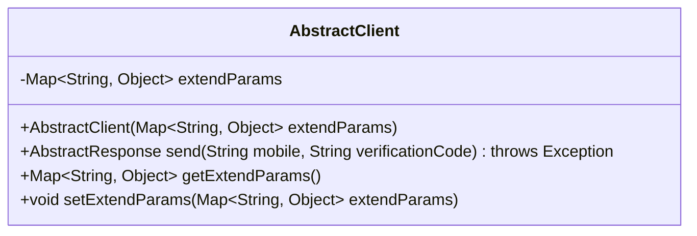
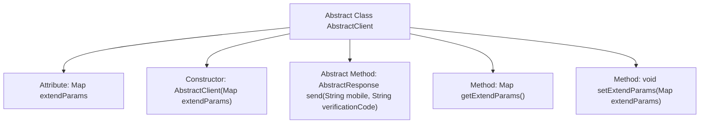

# Basic Information

|      |      |
|------|------|
| Name | AbstractClient |
| Language | .java |
| Code Path | WeFe/common/java/common-verification-code/src/main/java/com/welab/wefe/common/verification/code/AbstractClient.java |
| Package Name | com.welab.wefe.common.verification.code |
| Dependencies | ['java.util.Map'] |
| Brief Description | The abstract class AbstractClient contains extension parameters and an abstract method for sending SMS verification codes, providing parameter access functionality. |

# Description

This is an abstract class named AbstractClient, designed to encapsulate basic client functionalities. The class includes a Map-type property called extendParams for storing extended parameters, along with corresponding getter and setter methods. The constructor initializes the class with the extendParams parameter. It defines an abstract method named send, which accepts a phone number and verification code as parameters, returns an AbstractResponse object, and may throw exceptions. This method is intended for sending verification code SMS messages.

# Class Summary

| Name   | Type  | Description |
|-------|------|-------------|
| AbstractClient | class | The abstract class AbstractClient contains extension parameters and an abstract method for sending SMS verification codes. |

## Class AbstractClient

|      |      |
|------|------|
| Access Modifier | public abstract |
| Type | class |
| Name | AbstractClient |
| Description | The abstract class AbstractClient contains extension parameters and an abstract method for sending SMS verification codes. |

### UML Class Diagram

This class diagram illustrates an abstract class AbstractClient, which contains a private member extendParams (of type Map<String, Object>) and four methods: a constructor, an abstract send() method, and getter/setter methods for extendParams. As an abstract base class, AbstractClient requires its subclasses to implement the send() method, which is used to send SMS verification codes and returns a response of type AbstractResponse. The class supports extended parameters through extendParams, embodying the Template Method design pattern and providing a foundational framework for SMS clients.

### Internal Method Call Graph

This code defines an abstract class AbstractClient, which includes a Map-type extendParams attribute and related operation methods. The core is the abstract method send() for sending verification code SMS messages, which must be implemented by subclasses. The class structure clearly demonstrates attribute encapsulation, constructor initialization, and getter/setter methods, reflecting fundamental object-oriented characteristics. The design of the abstract method enforces that subclasses must implement the SMS sending logic, while extendParams provides flexible handling capabilities for extended parameters.

### Field List

| Name  | Type  | Description |
|-------|-------|------|
| extendParams | Map<String, Object> | A private Map variable named extendParams is defined, with keys of type String and values of type Object, used to store extended parameters. |

### Method List

| Name  | Type  | Description |
|-------|-------|------|
| send | AbstractResponse | The abstract method `send` takes a phone number and verification code as parameters, returns an `AbstractResponse`, and may throw exceptions. |
| getExtendParams | Map<String, Object> | Get the extension parameter Map, where the key is of type String and the value is of type Object. |
| setExtendParams | void | This is a Java method used to set extended parameters. The method takes a parameter of type Map and assigns it to the class's member variable extendParams. |

