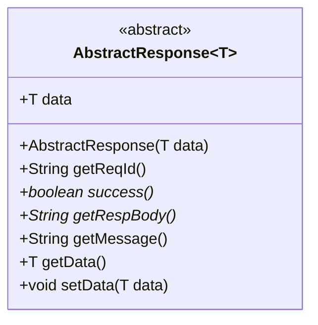
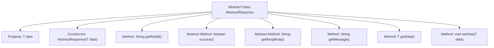

# Basic Information

|      |      |
|------|------|
| Name | AbstractResponse |
| Language | .java |
| Code Path | WeFe/common/java/common-verification-code/src/main/java/com/welab/wefe/common/verification/code/AbstractResponse.java |
| Package Name | com.welab.wefe.common.verification.code |
| Dependencies | ['java.util.UUID'] |
| Brief Description | The abstract class AbstractResponse<T> contains a generic data field `data`, providing methods to retrieve the request ID, response status, response content, and messages, while supporting data read and write operations. |

# Description

AbstractResponse is an abstract generic class designed to encapsulate response data. It contains a generic data field `data`, initialized via the constructor, and provides getter and setter methods. The class defines a method `getReqId` to retrieve the request ID, returning a UUID string without hyphens. The abstract method `success` determines whether the request was successful, while `getRespBody` is used to obtain the response body content. The `getMessage` method defaults to returning null and can be overridden by subclasses. This class provides the basic structure and common functionality for response data, with specific implementations to be completed by subclasses.

# Class Summary

| Name   | Type  | Description |
|-------|------|-------------|
| AbstractResponse | class | The abstract class AbstractResponse defines a generic response structure, including a generic data field, a request ID generation method, abstract methods for success status and response content, as well as data access methods. |

## Class AbstractResponse

|      |      |
|------|------|
| Access Modifier | public abstract |
| Type | class |
| Name | AbstractResponse |
| Description | The abstract class AbstractResponse defines a generic response structure, including a generic data field, a request ID generation method, abstract methods for success status and response content, as well as data access methods. |

### UML Class Diagram

This class diagram illustrates a generic abstract class AbstractResponse<T>, which defines a common structure for handling response data. The class contains a generic data field 'data', provides basic data access methods (getData/setData), and declares two abstract methods success() and getRespBody() that require subclass implementation. It also includes a getReqId() method for generating request IDs and an optional getMessage() method. This abstract class establishes a unified processing framework for various concrete response types, supporting different data payloads through the generic type T.

### Internal Method Call Graph

This code describes a generic abstract class AbstractResponse<T>, primarily used for encapsulating response data. The class includes a generic data field 'data', provides a constructor for initializing the data, and various methods for obtaining the request ID, response status, response content, message, and data. Among these, success() and getRespBody() are abstract methods requiring subclass implementation, while getMessage() has a default implementation returning null. This design pattern is commonly employed in building extensible response processing frameworks, allowing subclasses to customize success determination and response body formatting.

### Field List

| Name  | Type  | Description |
|-------|-------|------|
| data | T | Expose the data field, which is of generic type T. |

### Method List

| Name  | Type  | Description |
|-------|-------|------|
| getRespBody | String | Abstract method, returns a response body of string type. |
| getReqId | String | Generate a unique request ID: Use the string obtained by removing hyphens from a UUID. |
| success | boolean | Abstract method, returns a boolean value indicating whether the operation was successful. |
| getMessage | String | The method getMessage returns null. |
| getData | T | This is a Java method with a return type of generic T, whose function is to retrieve the value of the private variable data. |
| setData | void | Methods for setting object data, assigning the parameter `data` to the `data` property of the current object. |

