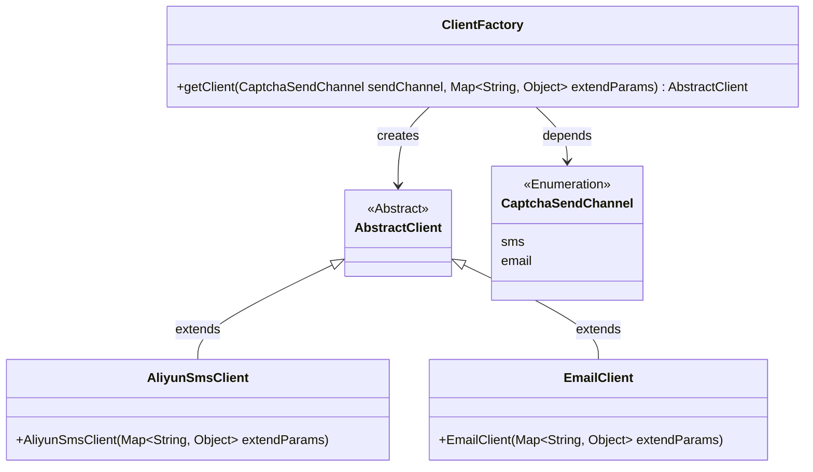
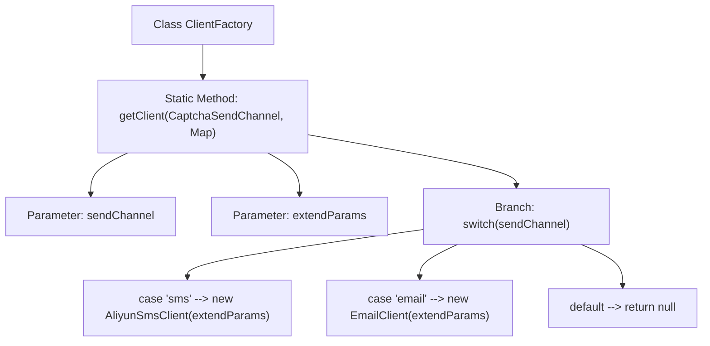

# Basic Information

|      |      |
|------|------|
| Name | ClientFactory |
| Language | .java |
| Code Path | WeFe/common/java/common-verification-code/src/main/java/com/welab/wefe/common/verification/code/ClientFactory.java |
| Package Name | com.welab.wefe.common.verification.code |
| Dependencies | ['com.welab.wefe.common.verification.code.common.CaptchaSendChannel', 'com.welab.wefe.common.verification.code.email.EmailClient', 'com.welab.wefe.common.verification.code.sms.AliyunSmsClient', 'java.util.Map'] |
| Brief Description | The ClientFactory class provides a static method getClient, which returns the corresponding verification code sending client instance (AliyunSmsClient or EmailClient) based on the sending channel (sms or email). The parameters are the sending channel and extended parameters. |

# Description

ClientFactory is a factory class used to obtain the corresponding verification code sending client based on the delivery channel. It contains a static method `getClient`, which accepts two parameters: `sendChannel` represents the delivery channel, and `extendParams` is a map of extended parameters. The method uses a switch statement to determine the type of `sendChannel`. If it is `sms`, it returns an instance of `AliyunSmsClient`; if it is `email`, it returns an instance of `EmailClient`; otherwise, it returns `null`. Both client instances are initialized with the `extendParams` parameter. The method may throw an `Exception`.

# Class Summary

| Name   | Type  | Description |
|-------|------|-------------|
| ClientFactory | class | The ClientFactory class provides a static method getClient, which returns the corresponding verification code sending client instance based on the sendChannel (AliyunSmsClient for SMS, EmailClient for email). The parameters are the sending channel and extended parameters. |

## Class ClientFactory

|      |      |
|------|------|
| Access Modifier | public |
| Type | class |
| Name | ClientFactory |
| Description | The ClientFactory class provides a static method getClient, which returns the corresponding verification code sending client instance based on the sendChannel (AliyunSmsClient for SMS, EmailClient for email). The parameters are the sending channel and extended parameters. |

### UML Class Diagram

This code demonstrates a client factory pattern implementation for creating corresponding client instances based on different captcha delivery channels (SMS or email). The ClientFactory class dynamically returns either an Alibaba Cloud SMS client or an email client through its static method getClient, which accepts an enumeration parameter and extended parameters. The class diagram clearly illustrates the inheritance relationship between abstract classes and concrete implementations, as well as the factory class's dependency on the enumeration type. The overall structure adheres to the Open-Closed Principle, facilitating the extension of new delivery channels.

### Internal Method Call Graph

This code demonstrates a factory pattern implementation where the `ClientFactory` class dynamically creates corresponding client instances based on different captcha sending channels (sms/email) through the static method `getClient`. The flowchart clearly presents the method entry, parameter processing, branch judgment, object creation paths for different channels, and finally handles the default case by returning null. This design achieves loose coupling in client creation, facilitating the extension of new sending channels.

### Field List

| Name  | Type  | Description |
|-------|-------|------|

### Method List

| Name  | Type  | Description |
|-------|-------|------|
| getClient | AbstractClient | The static method getClient returns different client instances based on sendChannel: sms returns the Alibaba Cloud SMS client, email returns the email client, and other cases return null. |

