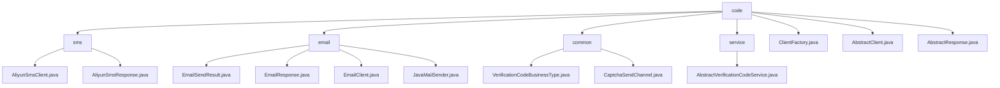

# Basic Information

|      |      |
|------|------|
| Name | code |
| Language | .java |
| Code Path | WeFe/common/java/common-verification-code/src/main/java/com/welab/wefe/common/verification/code |
| Package Name | docs.common.java.common-verification-code.src.main.java.com.welab.wefe.common.verification.code |
| Brief Description | Alibaba Cloud SMS Service Java client encapsulates the SDK to provide SMS sending functionality, supporting verification code scenarios, and depends on the Alibaba Cloud SDK. The email sending module encapsulates the SMTP protocol, supports HTML emails and SSL encryption, and relies on JavaMail. The verification code management module defines business types and sending channel enumerations with no external dependencies. The abstract verification code service class provides generation, sending, and validation functions with a 2-minute validity period. The factory class returns SMS or email client instances based on the channel. The abstract client and response classes provide basic encapsulation, requiring subclasses to implement specific logic. |

# Description

## Overview  
This module is a unified verification code service framework, with its core responsibility being to provide standardized management of multi-channel (SMS/email) verification codes, covering the entire process of generation, delivery, and validation. The interface specification includes an abstract client (AbstractClient) and a base response class (AbstractResponse), utilizing the factory pattern (ClientFactory) to dynamically select delivery channels. Key data structures include the verification code business enumeration (VerificationCodeBusinessType), channel enumeration (CaptchaSendChannel), and extended parameter mapping. External dependencies include the Alibaba Cloud SMS SDK and the JavaMail library. For example, ExpiringMap is used to implement a verification code cache with a 2-minute validity period.  

## Key Business Scenarios  
The typical workflow involves: selecting a business type (e.g., member registration) → specifying a delivery channel (SMS/email) → the factory obtaining the corresponding client → sending and validating the verification code. The interaction mode resembles gateway routing, with results determined via status codes (e.g., RESP_STATUS_OK). Functional completeness is reflected in multi-channel support, cache management, and exception handling. For instance, SMS delivery uses AliyunSmsClient, while email delivery relies on JavaMailSender. Integration examples include SMS verification code delivery during user registration and email notifications for password recovery.

### Package Internal Structure View

This flowchart illustrates the hierarchical structure of the verification code module, with the root node being the 'code' directory, which contains four submodules: 'sms' for SMS messaging, 'email' for email, 'common' for shared components, and 'service' for services. Each submodule includes specific implementation class files. For example, the SMS module contains Alibaba Cloud SMS client and response classes, while the email module includes implementation classes such as email sending results, responses, clients, and JavaMail senders. Additionally, the root directory contains three core base class files: the client factory, abstract client, and abstract response.

# File List

| Name   | Type  | Description |
|-------|------|-------------|
| [ClientFactory.java](ClientFactory.md) | file | The `ClientFactory` class provides a static method `getClient`, which returns the corresponding verification code sending client instance (`AliyunSmsClient` or `EmailClient`) based on the sending channel (sms or email). The parameters are the sending channel and extended parameters. |
| [AbstractClient.java](AbstractClient.md) | file | The abstract class AbstractClient contains extension parameters and an abstract method for sending SMS verification codes, providing parameter access functionality. |
| [AbstractResponse.java](AbstractResponse.md) | file | The abstract class AbstractResponse<T> contains a generic data field `data`, providing methods to retrieve request ID, response status, response content, and messages, while supporting data read/write operations. |
| [service](service/_module.md) | package | The abstract class AbstractVerificationCodeService provides verification code services, including sending, validating, and generating verification codes. It uses caching to store verification codes with a validity period of 2 minutes, and supports custom business types and sending channels. |
| [common](common/_module.md) | package | The VerificationCodeBusinessType enumeration defines business scenarios for member registration and password recovery verification codes. The CaptchaSendChannel enumeration defines two verification code delivery channels: SMS and email. |
| [email](email/_module.md) | package | The EmailSendResult class encapsulates the email sending result, including status code and message fields. EmailResponse inherits from AbstractResponse, determines whether the sending is successful, and returns a message. EmailClient inherits from AbstractClient, configures, and sends emails. JavaMailSender implements SMTP email sending functionality, supporting HTML format and SSL encryption. |
| [sms](sms/_module.md) | package | Alibaba Cloud SMS Service client class, inherits from an abstract class, sends SMS via the send method, requiring a phone number and verification code, internally configures requests using Alibaba Cloud SDK. The response handling class inherits from AbstractResponse, encapsulates response logic, includes methods such as obtaining the request ID and status determination, with the success status code being "OK". |

