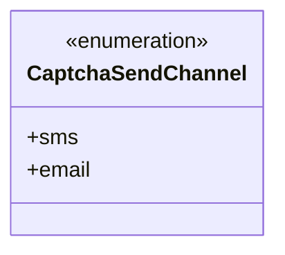
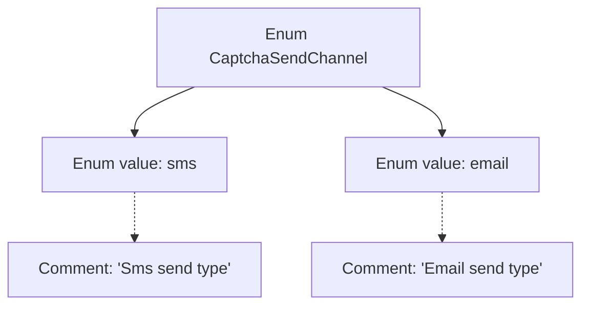

# Basic Information

|      |      |
|------|------|
| Name | CaptchaSendChannel |
| Language | .java |
| Code Path | WeFe/common/java/common-verification-code/src/main/java/com/welab/wefe/common/verification/code/common/CaptchaSendChannel.java |
| Package Name | com.welab.wefe.common.verification.code.common |
| Dependencies | [] |
| Brief Description | Verification code delivery channel enumeration: two types, sms text message and email. |

# Description

This is an enumeration type named CaptchaSendChannel, which defines two channels for sending verification codes. The first one is sms, indicating sending the verification code via SMS; the second one is email, indicating sending the verification code via email. Each enumeration value is accompanied by a corresponding comment explaining its purpose.

# Class Summary

| Name   | Type  | Description |
|-------|------|-------------|
| CaptchaSendChannel | enum | The CaptchaSendChannel enumeration defines the channels for sending verification codes, including two types: SMS and email. |

## Class CaptchaSendChannel

|      |      |
|------|------|
| Access Modifier | public |
| Type | enum |
| Name | CaptchaSendChannel |
| Description | The CaptchaSendChannel enumeration defines the channels for sending verification codes, including two types: SMS and email. |

### UML Class Diagram

This code defines an enumeration type named `CaptchaSendChannel`, which represents two channels for sending verification codes: SMS (`sms`) and email (`email`). In the class diagram, the enumeration type is marked with `<<enumeration>>`, clearly indicating that it is a fixed set of values. This simple enumeration structure provides the system with a type-safe way to choose verification code delivery methods, avoiding potential errors that could arise from using primitive types like strings or integers. The two enumeration values, `sms` and `email`, are listed as public members, corresponding to the SMS delivery type and email delivery type described in the comments, respectively.

### Internal Method Call Graph

This flowchart illustrates the structure of the CaptchaSendChannel enum, which contains two enum values: sms and email. Each enum value has corresponding comments explaining its purpose. 'sms' represents the SMS sending type, while 'email' represents the email sending type. This enum is used to define different channel types for sending verification codes. Its simple and clear structure facilitates distinguishing between various verification code sending methods in code.

### Field List

| Name  | Type  | Description |
|-------|-------|------|

### Method List

| Name  | Type  | Description |
|-------|-------|------|

