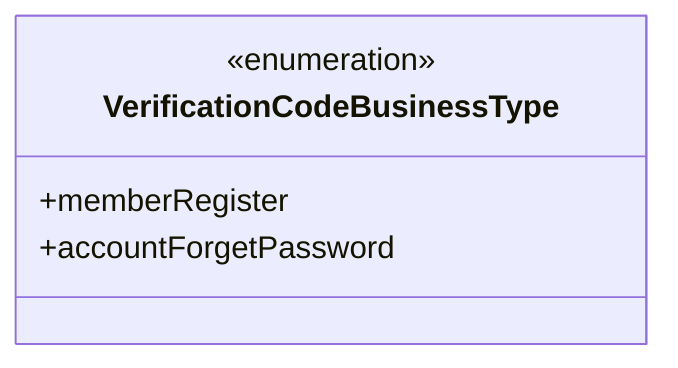
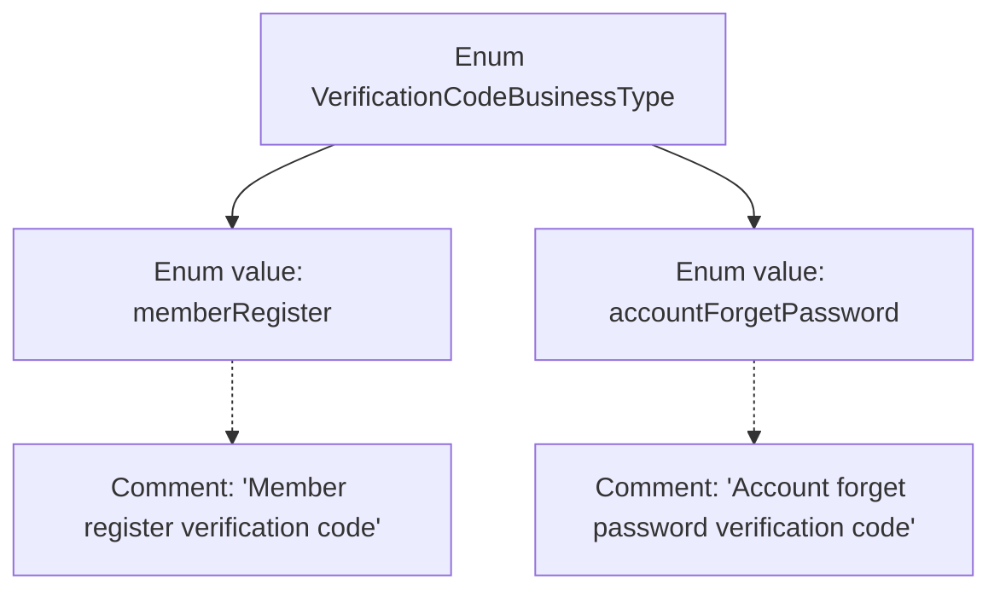

# Basic Information

|      |      |
|------|------|
| Name | VerificationCodeBusinessType |
| Language | .java |
| Code Path | WeFe/common/java/common-verification-code/src/main/java/com/welab/wefe/common/verification/code/common/VerificationCodeBusinessType.java |
| Package Name | com.welab.wefe.common.verification.code.common |
| Dependencies | [] |
| Brief Description | The enumeration VerificationCodeBusinessType defines two types of verification code business scenarios: member registration and account password recovery. |

# Description

The content defines an enumeration type named VerificationCodeBusinessType, which includes two business scenarios: memberRegister represents a verification code for member registration, and accountForgetPassword represents a verification code for account password recovery. The enumeration clearly specifies the purpose of each type through comments.

# Class Summary

| Name   | Type  | Description |
|-------|------|-------------|
| VerificationCodeBusinessType | enum | The enumeration VerificationCodeBusinessType defines two types of verification code business scenarios: member registration and account password recovery. |

## Class VerificationCodeBusinessType

|      |      |
|------|------|
| Access Modifier | public |
| Type | enum |
| Name | VerificationCodeBusinessType |
| Description | The enumeration VerificationCodeBusinessType defines two types of verification code business scenarios: member registration and account password recovery. |

### UML Class Diagram

This code defines an enumeration type named VerificationCodeBusinessType, which includes two enum constants: memberRegister (member registration verification code) and accountForgetPassword (account password recovery verification code). The enumeration type is used to represent a fixed set of business type constants, with each constant corresponding to different verification code usage scenarios. This design ensures type safety, avoids the use of magic strings, and enhances code readability and maintainability.

### Internal Method Call Graph

This flowchart illustrates the structure of the VerificationCodeBusinessType enum, which contains two enum values: memberRegister and accountForgetPassword, each accompanied by comments describing their purposes. memberRegister is used for member registration verification code scenarios, while accountForgetPassword is used for account password recovery verification code scenarios. This enum defines two distinct business types to differentiate the use cases of verification codes in different contexts.

### Field List

| Name  | Type  | Description |
|-------|-------|------|

### Method List

| Name  | Type  | Description |
|-------|-------|------|

