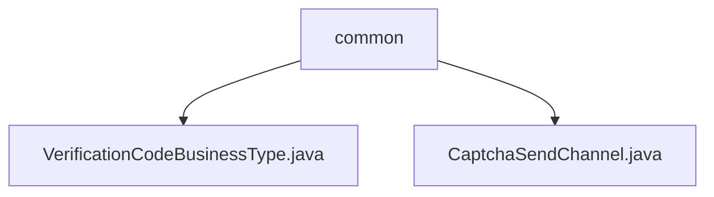

# Basic Information

|      |      |
|------|------|
| Name | common |
| Language | .java |
| Code Path | WeFe/common/java/common-verification-code/src/main/java/com/welab/wefe/common/verification/code/common |
| Package Name | docs.common.java.common-verification-code.src.main.java.com.welab.wefe.common.verification.code.common |
| Brief Description | The VerificationCodeBusinessType enumeration defines business scenarios for member registration and password recovery verification codes. The CaptchaSendChannel enumeration defines two verification code delivery channels: SMS and email. |

# Description

## Overview  
The core responsibility of this module is to manage the business types and delivery channels of verification codes, providing standardized enumeration definitions. The interface specification includes two types of enumerations: VerificationCodeBusinessType defines business scenarios (e.g., member registration), and CaptchaSendChannel defines delivery methods (e.g., SMS). The key data structures are the business type enumeration (including registration/password recovery) and the channel enumeration (SMS/email). There are no external dependencies. For example, member registration requires an SMS verification code.  

## Key Business Scenarios  
The module supports typical verification code workflows: first selecting a business type (e.g., password recovery) and then sending it through a specified channel (e.g., email). The interaction mode involves matching enumeration values to ensure alignment between business and channel. The functionality fully covers the process from verification code generation to delivery, making it suitable for account security-related scenarios. The API type is an enumeration class, and integration examples include SMS verification code delivery during registration.

### Package Internal Structure View

This flowchart illustrates the file structure under the `common` directory in the WeFe verification code module. The top-level node represents the `common` folder, which contains two Java files: `VerificationCodeBusinessType.java` and `CaptchaSendChannel.java`, denoting the verification code business type enumeration class and the verification code sending channel enumeration class, respectively. The entire structure clearly reflects the code organization of the verification code's common functionalities.

# File List

| Name   | Type  | Description |
|-------|------|-------------|
| [VerificationCodeBusinessType.java](VerificationCodeBusinessType.md) | file | The enumeration VerificationCodeBusinessType defines two types of verification code business scenarios: member registration and account password recovery. |
| [CaptchaSendChannel.java](CaptchaSendChannel.md) | file | Verification code delivery channel enumeration: two types, SMS text message and email. |

