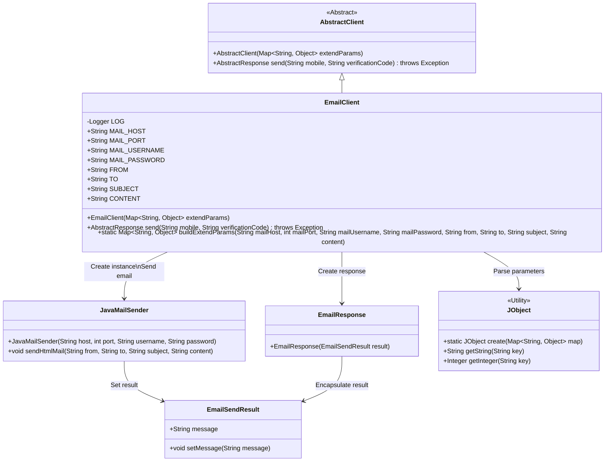
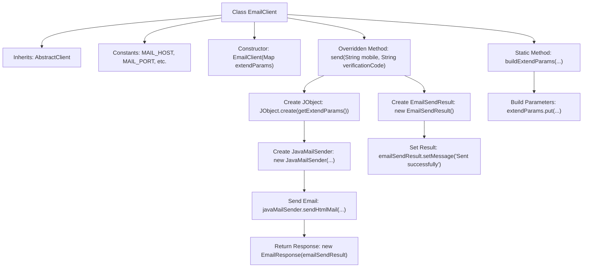

# Basic Information

|      |      |
|------|------|
| Name | EmailClient |
| Language | .java |
| Code Path | WeFe/common/java/common-verification-code/src/main/java/com/welab/wefe/common/verification/code/email/EmailClient.java |
| Package Name | com.welab.wefe.common.verification.code.email |
| Dependencies | ['com.welab.wefe.common.util.JObject', 'com.welab.wefe.common.verification.code.AbstractClient', 'com.welab.wefe.common.verification.code.AbstractResponse', 'org.slf4j.Logger', 'org.slf4j.LoggerFactory', 'java.util.HashMap', 'java.util.Map'] |
| Brief Description | The EmailClient class inherits from AbstractClient, providing email sending functionality. It includes constants such as host, port, and username. Emails are sent via the send method, and parameters are constructed using buildExtendParams. |

# Description

The EmailClient is a mail client class that inherits from AbstractClient, designed for sending emails. It contains multiple static constants defining email-related parameters such as host, port, username, password, sender, recipient, subject, and content. The constructor accepts an extended parameter map. The send method uses JavaMailSender to dispatch HTML emails and returns an EmailResponse containing the sending results. The buildExtendParams method is used to construct a map containing email parameters. The entire process involves initializing the mail sender, setting up the email content, and executing the send operation.

# Class Summary

| Name   | Type  | Description |
|-------|------|-------------|
| EmailClient | class | The `EmailClient` class inherits from `AbstractClient` and is used for sending emails. It includes email configuration constants, and its constructor accepts extended parameters. The `send` method utilizes `JavaMailSender` to dispatch HTML emails and returns an `EmailResponse`. The `buildExtendParams` method constructs a parameter Map for the email. |

## Class EmailClient

|      |      |
|------|------|
| Access Modifier | public |
| Type | class |
| Name | EmailClient |
| Description | The `EmailClient` class inherits from `AbstractClient` and is used for sending emails. It includes email configuration constants, and its constructor accepts extended parameters. The `send` method utilizes `JavaMailSender` to dispatch HTML emails and returns an `EmailResponse`. The `buildExtendParams` method constructs a parameter Map for the email. |

### UML Class Diagram

Class diagram description: The diagram illustrates how EmailClient inherits from AbstractClient, sends emails via JavaMailSender, and returns an EmailResponse. EmailClient uses JObject to parse parameters, JavaMailSender manipulates EmailSendResult to set the sending status, and finally EmailResponse encapsulates the result. The entire structure clearly presents the collaboration relationships of the email sending components.

### Internal Method Call Graph

This code demonstrates an EmailClient class that inherits from AbstractClient, primarily used for sending emails. The class defines constant parameters related to email, including a constructor and two main methods: send() for actual email transmission and buildExtendParams() for constructing required email-sending parameters. The send() method sends HTML-formatted emails via JavaMailSender and returns an EmailResponse object containing the sending result. The entire process clearly illustrates the complete workflow from parameter preparation to email dispatch.

### Field List

| Name  | Type  | Description |
|-------|-------|------|
| FROM = "from" | String | Define a public static constant string FROM with the value "from". |
| TO = "to" | String | Define an immutable static string constant TO with the value "to". |
| MAIL_PORT = "mailPort" | String | Define the mail port constant string MAIL_PORT with the value "mailPort". |
| MAIL_HOST = "mailHost" | String | Defined a public static immutable string constant MAIL_HOST with the value "mailHost". |
| LOG = LoggerFactory.getLogger(EmailClient.class) | Logger | Define a protected log object LOG for logging in the EmailClient class. |
| CONTENT = "content" | String | Defined a public static immutable string constant CONTENT with the value "content". |
| MAIL_PASSWORD = "mailPassword" | String | Defined a public static constant string MAIL_PASSWORD with the value "mailPassword". |
| SUBJECT = "subject" | String | Defined a public static immutable string constant SUBJECT with the value "subject". |
| MAIL_USERNAME = "mailUsername" | String | Defined a public static constant string MAIL_USERNAME with the value "mailUsername". |

### Method List

| Name  | Type  | Description |
|-------|-------|------|
| send | AbstractResponse | The method sends an HTML email via JavaMailSender, configures the host, port, username, and password using extended parameters, and returns a successful sending response. |
| buildExtendParams | Map<String, Object> | Static method for constructing email parameters, which takes in host, port, account, password, sender, recipient, subject, and content, and returns a Map containing these parameters. |

