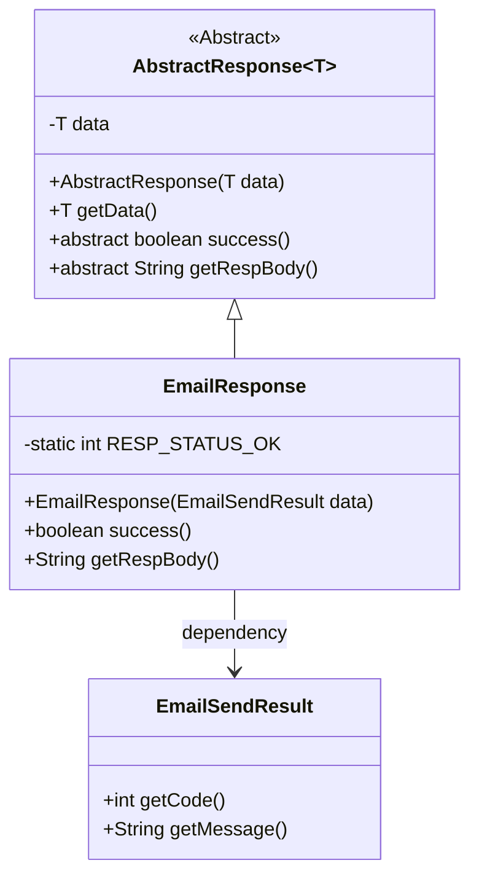
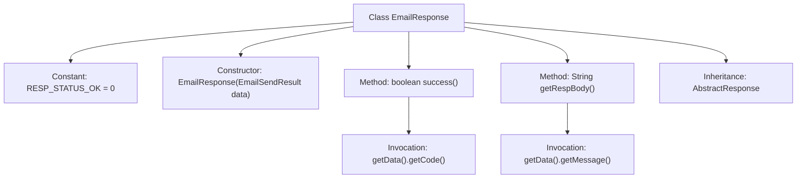

# Basic Information

|      |      |
|------|------|
| Name | EmailResponse |
| Language | .java |
| Code Path | WeFe/common/java/common-verification-code/src/main/java/com/welab/wefe/common/verification/code/email/EmailResponse.java |
| Package Name | com.welab.wefe.common.verification.code.email |
| Dependencies | ['com.welab.wefe.common.verification.code.AbstractResponse'] |
| Brief Description | The `EmailResponse` class inherits from `AbstractResponse`, includes a success status code of 0, accepts `EmailSendResult` data through the constructor, determines the success condition as a matching status code, and returns the message body from the response data. |

# Description

The `EmailResponse` class inherits from `AbstractResponse`, with the generic type specified as `EmailSendResult`. This class defines the successful response code `RESP_STATUS_OK` as 0. The constructor accepts data of type `EmailSendResult` and invokes the parent class's constructor. It overrides the `success` method, determining success by comparing `RESP_STATUS_OK` with the `code` value of the data object. Additionally, it overrides the `getRespBody` method to return the content of the `message` field from the data object.

# Class Summary

| Name   | Type  | Description |
|-------|------|-------------|
| EmailResponse | class | The `EmailResponse` class inherits from `AbstractResponse`, containing a success status code of 0, and determines whether the operation is successful through `EmailSendResult` to return a message. |

## Class EmailResponse

|      |      |
|------|------|
| Access Modifier | public |
| Type | class |
| Name | EmailResponse |
| Description | The `EmailResponse` class inherits from `AbstractResponse`, containing a success status code of 0, and determines whether the operation is successful through `EmailSendResult` to return a message. |

### UML Class Diagram

This code demonstrates the class structure of an email response system. EmailResponse inherits from the generic abstract class AbstractResponse<EmailSendResult> and implements the success() and getRespBody() methods. The EmailSendResult class provides methods to retrieve status codes and messages. RESP_STATUS_OK is a static constant representing a successful response. The class diagram clearly illustrates the inheritance and dependency relationships, reflecting the logic for processing response results.

### Internal Method Call Graph

This code demonstrates an EmailResponse class that inherits from AbstractResponse<EmailSendResult>, primarily used for handling email sending responses. The class includes a constant RESP_STATUS_OK representing successful status code, and a constructor that accepts EmailSendResult type data. Core functionalities consist of: the success() method determining operation status by comparing response codes, and the getRespBody() method retrieving response message bodies. Both methods rely on the parent class's getData() method to access underlying data objects.

### Field List

| Name  | Type  | Description |
|-------|-------|------|
| RESP_STATUS_OK = 0 | int | Define the static constant RESP_STATUS_OK with a value of 0, indicating a normal response status. |

### Method List

| Name  | Type  | Description |
|-------|-------|------|
| success | boolean | Check if the response status code equals the successful status code RESP_STATUS_OK. |
| getRespBody | String | The method getRespBody returns the message content in the data object. |

