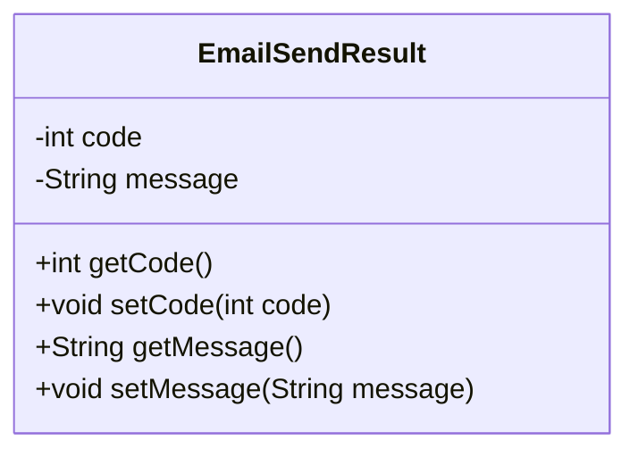
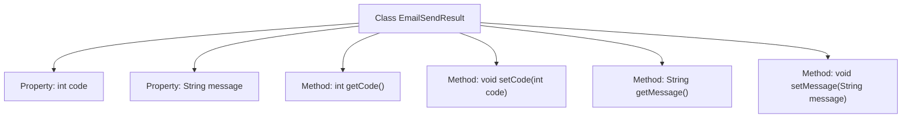

# Basic Information

|      |      |
|------|------|
| Name | EmailSendResult |
| Language | .java |
| Code Path | WeFe/common/java/common-verification-code/src/main/java/com/welab/wefe/common/verification/code/email/EmailSendResult.java |
| Package Name | com.welab.wefe.common.verification.code.email |
| Dependencies | [] |
| Brief Description | The EmailSendResult class contains code and message attributes, providing getter and setter methods. |

# Description

This is a Java class named EmailSendResult, used to represent the result of an email sending operation. It contains two private fields: an integer code for storing the status code, and a string message for storing the result message. The class provides standard getter and setter methods for retrieving and setting the values of these two fields, respectively. This class is primarily used to encapsulate the returned result data after sending an email.

# Class Summary

| Name   | Type  | Description |
|-------|------|-------------|
| EmailSendResult | class | The EmailSendResult class contains code and message attributes, providing getter and setter methods for accessing and modifying these two fields. |

## Class EmailSendResult

|      |      |
|------|------|
| Access Modifier | public |
| Type | class |
| Name | EmailSendResult |
| Description | The EmailSendResult class contains code and message attributes, providing getter and setter methods for accessing and modifying these two fields. |

### UML Class Diagram

This code defines a class named EmailSendResult, which encapsulates information related to email sending results. The class contains two private fields: code representing the status code, and message representing the status message. It also provides corresponding getter and setter methods for accessing and modifying these fields. This is a typical Data Transfer Object (DTO) design used to convey the status of email sending results between different layers. Its structure is simple and clear, making it suitable for serialization and deserialization operations.

### Internal Method Call Graph

This code defines a class named EmailSendResult, which represents the result of an email sending operation. The class contains two private properties: code (integer type) and message (string type), representing the status code and description message of the sending result respectively. The class provides four public methods: getCode and setCode for retrieving and setting the status code, and getMessage and setMessage for retrieving and setting the description message. This class is typically used to encapsulate the return result after sending an email, facilitating the transfer and processing of sending status within the program.

### Field List

| Name  | Type  | Description |
|-------|-------|------|
| message | String | Declare a private string variable named message. |
| code | int | Private integer variable code. |

### Method List

| Name  | Type  | Description |
|-------|-------|------|
| setMessage | void | This is a Java method used to set the value of the message property in a class. The method takes a string parameter message and assigns it to the member variable this.message of the class. |
| setCode | void | Set the value of the integer variable code. |
| getMessage | String | This is a Java method that returns the value of the string-type message variable. |
| getCode | int | The method returns the value of the integer variable code. |

