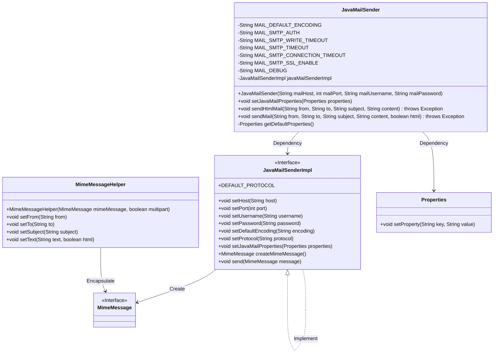
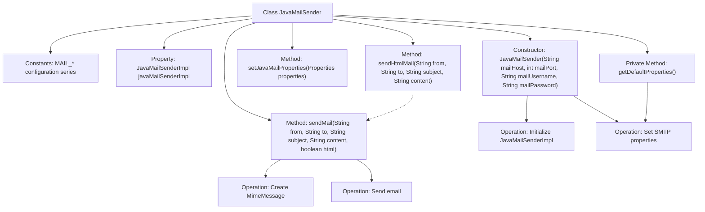

# Basic Information

|      |      |
|------|------|
| Name | JavaMailSender |
| Language | .java |
| Code Path | WeFe/common/java/common-verification-code/src/main/java/com/welab/wefe/common/verification/code/email/JavaMailSender.java |
| Package Name | com.welab.wefe.common.verification.code.email |
| Dependencies | ['org.springframework.mail.javamail.JavaMailSenderImpl', 'org.springframework.mail.javamail.MimeMessageHelper', 'javax.mail.internet.MimeMessage', 'java.util.Properties'] |
| Brief Description | The JavaMailSender class encapsulates email sending functionality, supporting SMTP authentication, SSL encryption, and timeout configuration, while providing methods for sending both HTML and plain text emails. |

# Description

JavaMailSender is a class used for sending emails, incorporating default UTF-8 encoding and SMTP-related configurations such as authentication, timeout settings, SSL enablement, and debug mode. The constructor requires the mail server address, port, username, and password. It provides methods for setting email properties and sending emails, with support for HTML format. When sending an email, it sets the sender, recipient, subject, and content, utilizing MimeMessageHelper to handle the email content. Default properties include SMTP authentication, read/write timeout, connection timeout, SSL enablement, and debug mode.

# Class Summary

| Name   | Type  | Description |
|-------|------|-------------|
| JavaMailSender | class | The JavaMailSender class encapsulates email sending functionality, supporting SMTP authentication, SSL encryption, with a default timeout of 30 seconds, and capable of sending both HTML and plain text emails. |

## Class JavaMailSender

|      |      |
|------|------|
| Access Modifier | public |
| Type | class |
| Name | JavaMailSender |
| Description | The JavaMailSender class encapsulates email sending functionality, supporting SMTP authentication, SSL encryption, with a default timeout of 30 seconds, and capable of sending both HTML and plain text emails. |

### UML Class Diagram

Class Diagram Description: This diagram illustrates the core structure of the JavaMailSender email delivery system. The JavaMailSender class encapsulates email sending functionality, relying on the JavaMailSenderImpl interface for concrete operations. It constructs email content via MimeMessage and MimeMessageHelper, while configuring SMTP parameters using Properties. The system supports HTML email delivery and includes default configurations such as connection timeouts and SSL encryption, demonstrating a complete email service processing workflow.

### Internal Method Call Graph

This code implements a JavaMail-based email utility class. The flowchart illustrates the class structure, including constant definitions, core constructor methods, and email sending methods. The constructor initializes the mail sender and sets SMTP connection parameters, the sendMail method constructs email content via MimeMessageHelper and sends it, while sendHtmlMail is its simplified version. The private method getDefaultProperties provides default SMTP configuration parameters. The entire process strictly follows the initialization-construction-sending workflow of email transmission, supporting HTML emails and custom property configuration.

### Field List

| Name  | Type  | Description |
|-------|-------|------|
| MAIL_SMTP_TIMEOUT = "30000" | String | Define a static constant for the SMTP email timeout set to 30000 milliseconds. |
| MAIL_DEBUG = "true" | String | The code defines a private static constant string MAIL_DEBUG with the value "true", which is used to control the email debugging functionality. |
| MAIL_SMTP_CONNECTION_TIMEOUT = "30000" | String | Define a static constant for the SMTP email connection timeout set to 30000 milliseconds. |
| MAIL_DEFAULT_ENCODING = "UTF-8" | String | Define a static constant for the default email encoding as UTF-8. |
| MAIL_SMTP_AUTH = "true" | String | Define the constant string MAIL_SMTP_AUTH with the value "true", used as the SMTP authentication enable flag. |
| javaMailSenderImpl | JavaMailSenderImpl | Private Java Mail Sender Instance. |
| MAIL_SMTP_SSL_ENABLE = "true" | String | The code defines a constant MAIL_SMTP_SSL_ENABLE with the value "true", indicating that SMTP SSL encryption is enabled. |
| MAIL_SMTP_WRITE_TIMEOUT = "30000" | String | Define a static constant for the email SMTP write operation timeout with a value of 30000 milliseconds. |

### Method List

| Name  | Type  | Description |
|-------|-------|------|
| setJavaMailProperties | void | This method is used to set JavaMail properties, configuring the relevant parameters of the mail sender by passing in a Properties object. |
| sendHtmlMail | void | Public method for sending HTML emails, with parameters including sender, recipient, subject, and content. It calls sendMail and sets the HTML flag to true, and may throw exceptions. |
| sendMail | void | Methods for sending emails, with parameters including sender, recipient, subject, content, and whether it is in HTML format, using JavaMailSenderImpl for sending. |
| getDefaultProperties | Properties | The method `getDefaultProperties` creates and returns a `Properties` object containing the default configuration for an SMTP mail server, setting parameters for authentication, timeouts, SSL, and debugging. |

