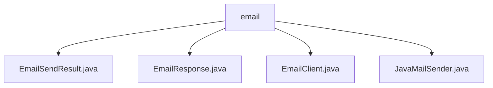

# Basic Information

|      |      |
|------|------|
| Name | email |
| Language | .java |
| Code Path | WeFe/common/java/common-verification-code/src/main/java/com/welab/wefe/common/verification/code/email |
| Package Name | docs.common.java.common-verification-code.src.main.java.com.welab.wefe.common.verification.code.email |
| Brief Description | The EmailSendResult class encapsulates the email sending result, including status code and message fields. EmailResponse inherits from AbstractResponse, determines whether the sending is successful, and returns a message. EmailClient inherits from AbstractClient, configures, and sends emails. JavaMailSender implements SMTP email sending functionality, supporting HTML format and SSL encryption. |

# Description

## Overview  
The core responsibility of this module is to encapsulate email sending functionality and result processing, following a pattern similar to an email gateway. It primarily consists of four components: EmailClient for sending emails, JavaMailSender as the underlying implementation, EmailSendResult for encapsulating results, and EmailResponse for handling responses. The interface specification uniformly adopts a response format of status code (code) and message (message), with the key data structure being the status code-message pair in EmailSendResult. External dependencies are limited to the SMTP protocol and the JavaMail library. For example, EmailClient uses JavaMailSender to send HTML emails and returns an EmailResponse.

## Key Business Scenarios  
The typical workflow is as follows: EmailClient configures SMTP parameters → invokes JavaMailSender to send an email → returns an EmailSendResult wrapped in EmailResponse. The interaction pattern employs the Builder pattern to construct parameters, such as using buildExtendParams to assemble email elements. The complete functionality covers email sending, status feedback, and result parsing, supporting HTML content and SSL encryption. For instance, when sending a verification code, the success or failure is determined by RESP_STATUS_OK(0), and error details are retrieved from the message field in case of failure.

### Package Internal Structure View

This flowchart illustrates the file structure of the email verification module, with the root node being the 'email' folder containing four Java class files: EmailSendResult.java, EmailResponse.java, EmailClient.java, and JavaMailSender.java. These files collectively form the core implementation of the email verification functionality.

# File List

| Name   | Type  | Description |
|-------|------|-------------|
| [EmailSendResult.java](EmailSendResult.md) | file | The EmailSendResult class contains code and message attributes, providing getter and setter methods. |
| [EmailResponse.java](EmailResponse.md) | file | The `EmailResponse` class inherits from `AbstractResponse`, includes a success status code of 0, accepts `EmailSendResult` data through the constructor, determines success by matching the status code, and returns the message body from the data. |
| [EmailClient.java](EmailClient.md) | file | The EmailClient class inherits from AbstractClient, providing email sending functionality. It includes constants such as host, port, and username. Emails are sent via the send method, and parameters are constructed using buildExtendParams. |
| [JavaMailSender.java](JavaMailSender.md) | file | The JavaMailSender class encapsulates email sending functionality, supporting SMTP authentication, SSL encryption, and timeout settings, while providing methods for sending both HTML and plain text emails. |

