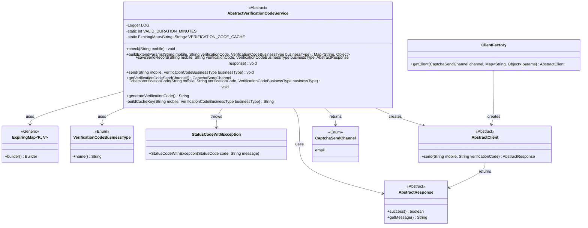
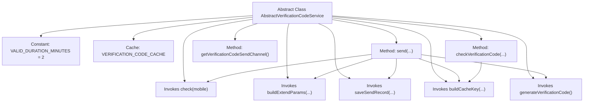
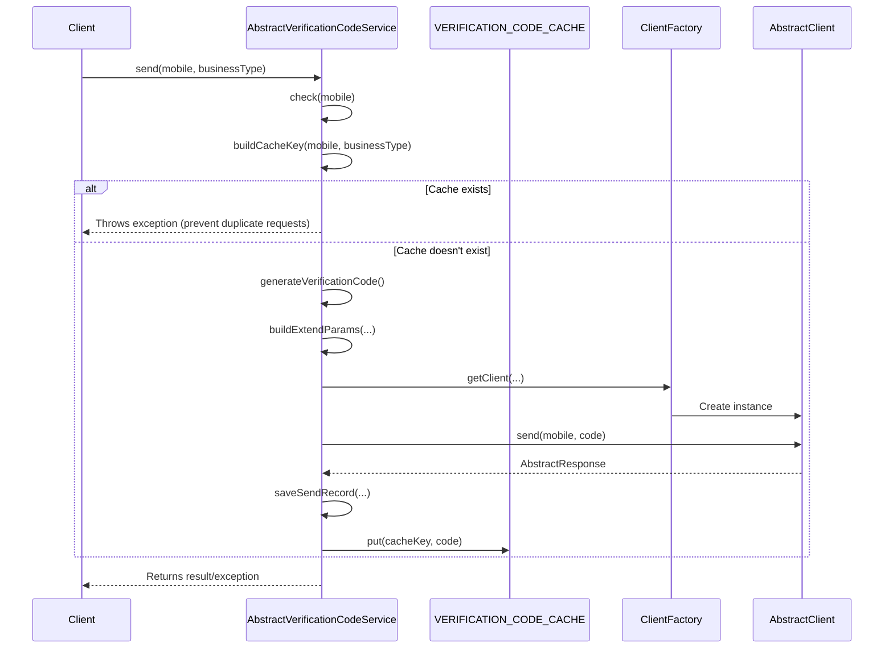

# Basic Information

|      |      |
|------|------|
| Name | AbstractVerificationCodeService |
| Language | .java |
| Code Path | WeFe/common/java/common-verification-code/src/main/java/com/welab/wefe/common/verification/code/service/AbstractVerificationCodeService.java |
| Package Name | com.welab.wefe.common.verification.code.service |
| Dependencies | ['com.welab.wefe.common.StatusCode', 'com.welab.wefe.common.exception.StatusCodeWithException', 'com.welab.wefe.common.util.StringUtil', 'com.welab.wefe.common.verification.code.AbstractClient', 'com.welab.wefe.common.verification.code.AbstractResponse', 'com.welab.wefe.common.verification.code.ClientFactory', 'com.welab.wefe.common.verification.code.common.CaptchaSendChannel', 'com.welab.wefe.common.verification.code.common.VerificationCodeBusinessType', 'net.jodah.expiringmap.ExpiringMap', 'org.slf4j.Logger', 'org.slf4j.LoggerFactory', 'java.util.Map', 'java.util.concurrent.TimeUnit'] |
| Brief Description | The abstract class AbstractVerificationCodeService provides verification code services, including sending, validating, and generating verification codes. It uses caching to store verification codes with a validity period of 2 minutes and supports custom business types and sending channels. |

# Description

This is an abstract verification code service class that provides functionalities for generating, sending, and validating verification codes. The verification code has a validity period of 2 minutes and is stored in an ExpiringMap cache. Key methods include sending verification codes, validating verification code effectiveness, and generating 6-digit random verification codes. The sending process involves checking the phone number, generating the verification code, invoking the client for sending, recording the transaction, and updating the cache. During validation, it checks that the phone number and verification code are non-empty and compares them against the cached values. This is an abstract class, requiring subclasses to implement specific logic for checking phone numbers, constructing extended parameters, and saving sending records. By default, it uses the email channel to send verification codes.

# Class Summary

| Name   | Type  | Description |
|-------|------|-------------|
| AbstractVerificationCodeService | class | The abstract class AbstractVerificationCodeService provides verification code services, including sending, validating, and generating verification codes. It uses caching to store verification codes with a validity period of 2 minutes and supports custom sending channels and business types. |

## Class AbstractVerificationCodeService

|      |      |
|------|------|
| Access Modifier | public abstract |
| Type | class |
| Name | AbstractVerificationCodeService |
| Description | The abstract class AbstractVerificationCodeService provides verification code services, including sending, validating, and generating verification codes. It uses caching to store verification codes with a validity period of 2 minutes and supports custom sending channels and business types. |

### UML Class Diagram

This code represents an abstract class `AbstractVerificationCodeService` designed to handle verification code sending and validation logic. It includes functionalities such as verification code caching, send record storage, and code generation, while requiring subclasses to implement specific business logic checks, parameter construction, and record saving through abstract methods. The class diagram illustrates interactions with components like verification code business types, exception handling, and client factories, demonstrating the core workflow and extensibility points of the verification code service.

### Internal Method Call Graph

This flowchart illustrates the core structure and invocation relationships of the verification code service class, containing 4 abstract methods and 5 concrete implementation methods. The sequence diagram details the complete process of sending verification codes: first validating the mobile number, checking the cache to prevent duplicate sending, generating a random 6-digit code, sending it via client channels, and finally saving the sending record while caching the code. All operations include exception handling mechanisms to ensure system robustness. The cache utilizes ExpiringMap for automatic expiration cleanup, with a verification code validity period of 2 minutes.

### Field List

| Name  | Type  | Description |
|-------|-------|------|
| VALID_DURATION_MINUTES = 2 | int | The static constant VALID_DURATION_MINUTES has a value of 2, indicating a valid duration of 2 minutes. |
| VERIFICATION_CODE_CACHE = ExpiringMap.builder()            .expiration(VALID_DURATION_MINUTES, TimeUnit.MINUTES)            .build() | ExpiringMap<String, String> | Created a static ExpiringMap cache to store verification codes, with the expiration time set to VALID_DURATION_MINUTES minutes. |
| LOG = LoggerFactory.getLogger(AbstractVerificationCodeService.class) | Logger | Declare a protected final logger for logging output in the AbstractVerificationCodeService class. |

### Method List

| Name  | Type  | Description |
|-------|-------|------|
| checkVerificationCode | void | Verify the validity of the phone number and verification code, and throw an exception if they are null or incorrect. |
| saveSendRecord | void | Abstract method: Save sending records, with parameters including mobile number, verification code, business type, and response object. |
| buildExtendParams | Map<String, Object> | Abstract method: Construct extension parameters, requires passing in phone number, verification code, and business type, may throw exceptions. |
| check | void | Abstract method `check`, which takes a string parameter `mobile` and may throw a `StatusCodeWithException` exception. |
| send | void | Method for sending verification code: Check the phone number, generate the verification code, send it via the client, record the sending result, cache the verification code, and handle exceptions. |
| generateVerificationCode | String | Generate a 6-digit random verification code within the range of 100000 to 999999. |
| buildCacheKey | String | Method to generate a cache key: concatenate the phone number and business type into a string, connected by an underscore. |
| getVerificationCodeSendChannel | CaptchaSendChannel | The method returns the verification code delivery channel, which is fixed as email. |

