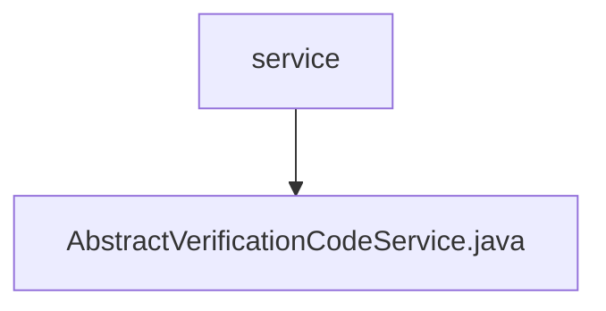

# Basic Information

|      |      |
|------|------|
| Name | service |
| Language | .java |
| Code Path | WeFe/common/java/common-verification-code/src/main/java/com/welab/wefe/common/verification/code/service |
| Package Name | docs.common.java.common-verification-code.src.main.java.com.welab.wefe.common.verification.code.service |
| Brief Description | The abstract class AbstractVerificationCodeService provides verification code services, including sending, validating, and generating verification codes. It uses caching to store verification codes with a validity period of 2 minutes, and supports custom business types and sending channels. |

# Description

This is an abstract verification code service class that provides functionalities for generating, sending, and validating verification codes. The verification code has a validity period of 2 minutes and is stored in an ExpiringMap cache. Key methods include sending verification codes, validating verification code effectiveness, and generating 6-digit random verification codes. The sending process involves phone number verification, verification code generation, client-side invocation for sending, record storage, and cache updates. During validation, it checks for non-empty phone numbers and verification codes and compares them against the cached values. This class is abstract and requires subclasses to implement specific logic for checking phone numbers, constructing extended parameters, and saving sending records. By default, it uses the email channel to send verification codes.

### Package Internal Structure View

This flowchart illustrates the hierarchical structure of the service directory within the verification module. Here, 'service' acts as the parent node containing a single child node 'AbstractVerificationCodeService.java', indicating that this is an abstract verification code service class file. The entire structure is concise and clear, reflecting the typical organization of service-layer files in Java projects.

# File List

| Name   | Type  | Description |
|-------|------|-------------|
| [AbstractVerificationCodeService.java](AbstractVerificationCodeService.md) | file | The abstract class AbstractVerificationCodeService provides verification code services, including sending, validating, and generating verification codes. It uses caching to store verification codes with a validity period of 2 minutes and supports custom business types and sending channels. |

