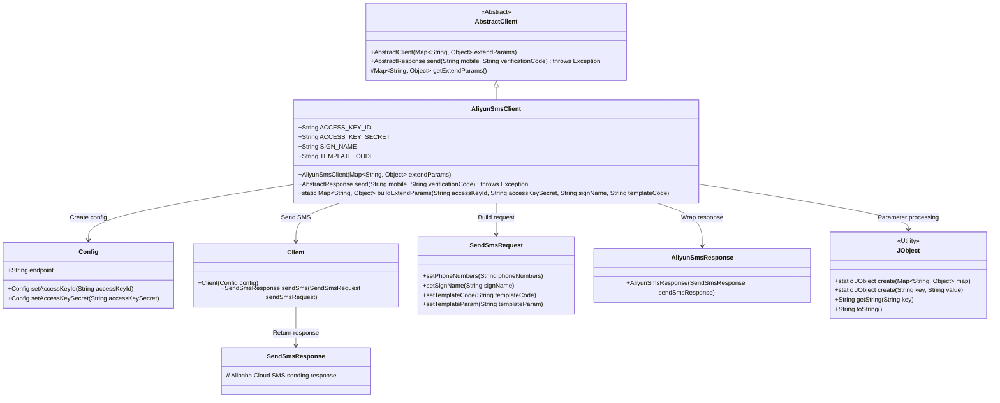
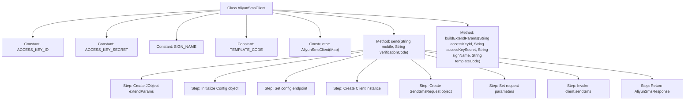

# Basic Information

|      |      |
|------|------|
| Name | AliyunSmsClient |
| Language | .java |
| Code Path | WeFe/common/java/common-verification-code/src/main/java/com/welab/wefe/common/verification/code/sms/AliyunSmsClient.java |
| Package Name | com.welab.wefe.common.verification.code.sms |
| Dependencies | ['com.aliyun.dysmsapi20170525.Client', 'com.aliyun.dysmsapi20170525.models.SendSmsRequest', 'com.aliyun.dysmsapi20170525.models.SendSmsResponse', 'com.aliyun.teaopenapi.models.Config', 'com.welab.wefe.common.util.JObject', 'com.welab.wefe.common.verification.code.AbstractClient', 'com.welab.wefe.common.verification.code.AbstractResponse', 'java.util.HashMap', 'java.util.Map'] |
| Brief Description | Alibaba Cloud SMS client class, inherits from the abstract client, sends SMS verification codes by configuring keys, signatures, and templates. |

# Description

This is an Alibaba Cloud SMS service client class that inherits from an abstract client class. The class defines four static constants representing configuration parameter key names. The constructor accepts an extended parameter map. Its primary function is to send SMS messages via the send method, which requires a phone number and verification code as input. Internally, it configures the client using Alibaba Cloud SDK and constructs the request, including setting the signature, template code, and template parameters. It also provides a static utility method for building extended parameter maps, which encapsulates configuration information such as access keys, signatures, and template codes.

# Class Summary

| Name   | Type  | Description |
|-------|------|-------------|
| AliyunSmsClient | class | Alibaba Cloud SMS client class, inherits from the abstract client, includes SMS sending methods, requires configuration of keys, signatures, and template codes. |

## Class AliyunSmsClient

|      |      |
|------|------|
| Access Modifier | public |
| Type | class |
| Name | AliyunSmsClient |
| Description | Alibaba Cloud SMS client class, inherits from the abstract client, includes SMS sending methods, requires configuration of keys, signatures, and template codes. |

### UML Class Diagram

This class diagram illustrates the core structure of the Alibaba Cloud SMS client. AliyunSmsClient inherits from AbstractClient, configures client information through Config, and uses Client to send SMS requests. The process involves parameter processing (JObject), request construction (SendSmsRequest), and response wrapping (AliyunSmsResponse), fully implementing the SMS sending functionality. Each component has clear responsibilities, achieving high cohesion and low coupling design goals through composition.

### Internal Method Call Graph

This flowchart illustrates the core structure and workflow of the Aliyun SMS client class. The class contains 4 constant fields, 1 constructor, and 2 main methods. The send method's process details the complete SMS sending procedure from parameter processing to final response, including key steps such as configuration initialization, request construction, and API invocation. The buildExtendParams method is used to construct an extended parameter dictionary, providing necessary parameters for client initialization. The overall design demonstrates encapsulation and simplified invocation of the Aliyun SMS API.

### Field List

| Name  | Type  | Description |
|-------|-------|------|
| TEMPLATE_CODE = "templateCode" | String | Defined a public static immutable string constant TEMPLATE_CODE with the value "templateCode". |
| ACCESS_KEY_SECRET = "accessKeySecret" | String | Defined an immutable static string constant ACCESS_KEY_SECRET with the value "accessKeySecret". |
| SIGN_NAME = "signName" | String | Defined a public static constant string SIGN_NAME with the value "signName". |
| ACCESS_KEY_ID = "accessKeyId" | String | Define a constant string ACCESS_KEY_ID with the value "accessKeyId". |

### Method List

| Name  | Type  | Description |
|-------|-------|------|
| send | AbstractResponse | This method sends verification codes via Alibaba Cloud SMS service by configuring keys, signatures, and templates, then calling the API to send SMS messages and return responses. |
| buildExtendParams | Map<String, Object> | Build an extended parameter Map containing the key ID, key, signature, and template code. |

