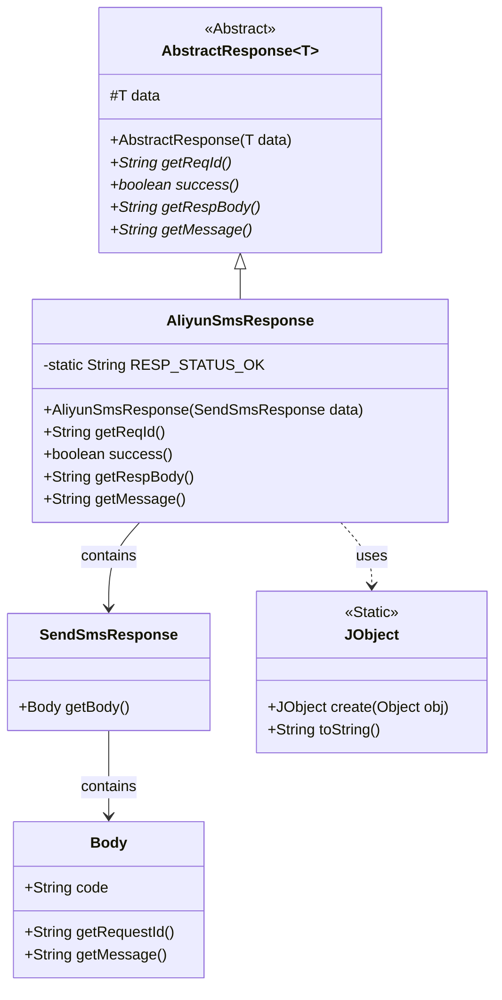
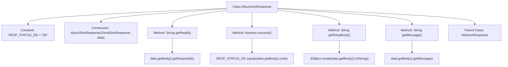

# Basic Information

|      |      |
|------|------|
| Name | AliyunSmsResponse |
| Language | .java |
| Code Path | WeFe/common/java/common-verification-code/src/main/java/com/welab/wefe/common/verification/code/sms/AliyunSmsResponse.java |
| Package Name | com.welab.wefe.common.verification.code.sms |
| Dependencies | ['com.aliyun.dysmsapi20170525.models.SendSmsResponse', 'com.welab.wefe.common.util.JObject', 'com.welab.wefe.common.verification.code.AbstractResponse'] |
| Brief Description | Alibaba Cloud SMS response class, inherits from the abstract response class, includes request ID, success status determination, response body, and message retrieval methods. |

# Description

This is a Java class named AliyunSmsResponse, which extends AbstractResponse with a generic type of SendSmsResponse. The class encapsulates the response handling logic for Alibaba Cloud SMS services, containing four core methods: getReqId retrieves the request ID, success determines whether the request was successful by comparing the status code, getRespBody converts the response body into a JSON string, and getMessage obtains the response message. The class defines a constant RESP_STATUS_OK representing the successful status code "OK". The constructor accepts a SendSmsResponse object and passes it to the parent class.

# Class Summary

| Name   | Type  | Description |
|-------|------|-------------|
| AliyunSmsResponse | class | Alibaba Cloud SMS response class, inherits from the abstract response class, includes request ID, status determination, response body, and message retrieval methods. The success status is "OK". |

## Class AliyunSmsResponse

|      |      |
|------|------|
| Access Modifier | public |
| Type | class |
| Name | AliyunSmsResponse |
| Description | Alibaba Cloud SMS response class, inherits from the abstract response class, includes request ID, status determination, response body, and message retrieval methods. The success status is "OK". |

### UML Class Diagram

This code demonstrates an Alibaba Cloud SMS response handling class AliyunSmsResponse, which inherits from the generic abstract class AbstractResponse. The class diagram clearly presents the inheritance relationships and component dependencies: AliyunSmsResponse retrieves response data through SendSmsResponse, which contains a Body object for storing status codes, request IDs, and other information. The JObject utility class is used for JSON serialization operations. This design implements core functionalities such as response status verification, request tracking, and message retrieval, with the RESP_STATUS_OK constant used to validate whether the request was successful.

### Internal Method Call Graph

This flowchart illustrates the structure of the AliyunSmsResponse class, including constant definitions, constructor, and four overridden methods. The class inherits from AbstractResponse<SendSmsResponse>, with each method obtaining underlying data by calling the getBody() method of the data object. They respectively implement request ID retrieval, status determination, response body conversion, and message extraction. The success() method determines whether the request succeeded by comparing the status code with the constant "OK".

### Field List

| Name  | Type  | Description |
|-------|-------|------|
| RESP_STATUS_OK = "OK" | String | Define a static constant string RESP_STATUS_OK with the value "OK". |

### Method List

| Name  | Type  | Description |
|-------|-------|------|
| getReqId | String | This method overrides getReqId and returns the value of the requestId field in data.body. |
| getRespBody | String | This method returns the result of converting data.getBody() into a JSON string. |
| getMessage | String | Rewrite the getMessage method to return the value of the message property in the body of the data object. |
| success | boolean | Check if the HTTP response status code indicates a successful state. |

