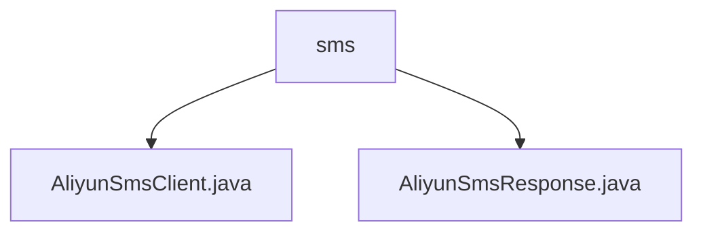

# Basic Information

|      |      |
|------|------|
| Name | sms |
| Language | .java |
| Code Path | WeFe/common/java/common-verification-code/src/main/java/com/welab/wefe/common/verification/code/sms |
| Package Name | docs.common.java.common-verification-code.src.main.java.com.welab.wefe.common.verification.code.sms |
| Brief Description | Alibaba Cloud SMS Service client class, inherits from an abstract class, sends SMS via the send method, requiring a phone number and verification code, internally configures requests using Alibaba Cloud SDK. The response handling class inherits from AbstractResponse, encapsulates response logic, includes methods such as obtaining the request ID and status determination, with the success status code being "OK". |

# Description

## Overview  
This module is a Java client implementation of Alibaba Cloud SMS service, with its core responsibility being to provide SMS sending capabilities (e.g., verification code notifications) by encapsulating the Alibaba Cloud SDK. The interface specifications include the Send method for sending SMS and response handling classes, following the design patterns of abstract clients and base response classes. Key data structures consist of configuration parameter mappings (such as access keys and signature templates) and response objects (encapsulating request IDs/status codes). The only external dependency is the Alibaba Cloud SMS SDK. For example, static utility methods are used to build extended parameter mappings, simplifying the configuration process.  

## Primary Business Scenarios  
A typical scenario involves triggering SMS verification code delivery, with the workflow as follows: client configuration of keys and templates → constructing requests (including phone numbers/verification codes) → invoking the Send method → parsing response statuses. The interaction model resembles a request-response pattern, where AliyunSmsResponse is used to determine the sending result (e.g., a status code of "OK" indicates success). Functional completeness is reflected in exception handling, response parsing, and configuration encapsulation, such as automatically converting template parameters to JSON format. The API type is synchronous invocation, and integration examples include verification code delivery during user registration.

### Package Internal Structure View

This flowchart illustrates the code structure of the SMS verification module. The `sms` folder contains two Java files: `AliyunSmsClient.java` and `AliyunSmsResponse.java`, which correspond to the client implementation and response object of Alibaba Cloud SMS service, respectively. The overall structure is concise and clear, reflecting the core components of the SMS verification functionality.

# File List

| Name   | Type  | Description |
|-------|------|-------------|
| [AliyunSmsClient.java](AliyunSmsClient.md) | file | Alibaba Cloud SMS client class, inherits from the abstract client, sends SMS verification codes by configuring keys, signatures, and templates. |
| [AliyunSmsResponse.java](AliyunSmsResponse.md) | file | Alibaba Cloud SMS response class, inherits from the abstract response class, includes request ID, success status determination, response body, and message retrieval methods. |

