# Basic Information

|      |      |
|------|------|
| Name | welab |
| Language | .java |
| Code Path | WeFe/common/java/common-web/src/main/java/com/welab |
| Package Name | docs.common.java.common-web.src.main.java.com.welab |
| Brief Description | This module integrates a Web API development framework, encompassing core functionalities such as logging, user activity management, permission control, traffic limiting, CAPTCHA services, and documentation generation. It employs annotation-driven and reflection mechanisms, supporting multi-format document output and automated validation. With thread-safe design and defensive programming to ensure stability, it is suitable for multi-role systems and microservices scenarios. |

# Description

## Overview  
This module provides a full-stack solution for web application development, with core responsibilities encompassing API lifecycle management (request handling/access control/logging) and development support tools (documentation generation/security policies). The interface specification follows a layered design, including the AbstractApi base class system, @Api annotation metadata, and the unified response structure ApiResult. Key data structures cover log entities (ApiLog), permission models (Caller enum), security policies (LoginSecurityPolicy), and documentation models (ApiItem). External dependencies include the Spring framework, SM4 encryption library, FastJson, and concurrency utility classes. For example, temporary key management is implemented via TempRsaCache, resembling the security interception mechanism at the gateway layer.  

## Core Business Scenarios  
The module supports typical interaction chains in multi-role systems: from request inbound (BaseController routing) → security validation (LoginSecurityPolicy/RSA decryption) → business execution (ApiExecutor reflective invocation) → response processing (DTO conversion/logging). The complete functional matrix includes: 1) Security controls (e.g., captcha service + blacklist mechanism); 2) Traffic governance (dual-dimensional rate limiting by IP/mobile number); 3) Development aids (automated API documentation generation). Typical integration cases manifest as chain configurations (Launcher initialization), annotation-driven approaches (e.g., @FlowLimitByMobile), and utility class combinations (CurrentAccountUtil + ModelMapper), suitable for rapid mid-platform service construction.

### Package Internal Structure View

```mermaid
graph TD
    wefe --> common
    common --> web
    web --> delegate
    web --> controller
    web --> api
    web --> api_document
    web --> util
    web --> service
    web --> dto
    web --> function
    web --> config
    delegate --> api_log
    api_log --> ApiLog.java
    api_log --> ApiCallerType.java
    api_log --> AbstractApiLogger.java
    controller --> BaseController.java
    api --> dev
    api --> base
    api --> LogoutApi.java
    dev --> Apis.java
    dev --> ErrorSqlList.java
    dev --> EnvApi.java
    dev --> DownloadLogFile.java
    dev --> SlowSqlList.java
    dev --> FindLogFileException.java
    dev --> HttpBinApi.java
    dev --> CreateTestDataSetApi.java
    base --> Caller.java
    base --> FlowLimitByMobile.java
    base --> FlowLimitByIp.java
    base --> Api.java
    base --> AbstractNoneOutputApi.java
    base --> AbstractApi.java
    base --> AbstractNoneInputApi.java
    api_document --> model
    api_document --> MarkdownFormatter.java
    api_document --> AbstractApiDocumentFormatter.java
    api_document --> JsonFormatter.java
    api_document --> HtmlFormatter.java
    model --> ApiItem.java
    model --> ApiParamField.java
    model --> ApiParam.java
    util --> DatabaseEncryptConverter.java
    util --> HttpServletRequestUtil.java
    util --> DatabaseEncryptUtil.java
    util --> CurrentAccountUtil.java
    util --> ModelMapper.java
    service --> account
    service --> flowlimit
    service --> CaptchaService.java
    account --> HistoryPasswordItem.java
    account --> SsoAccountInfo.java
    account --> AccountInfo.java
    flowlimit --> AbstractMemoryFlowLimitService.java
    flowlimit --> FlowLimitByIpService.java
    flowlimit --> AbstractFlowLimitService.java
    flowlimit --> FlowLimitByMobileService.java
    dto --> AbstractWithFilesApiInput.java
    dto --> AbstractTimedApiOutput.java
    dto --> GatewayMemberInfo.java
    dto --> Captcha.java
    dto --> NoneApiOutput.java
    dto --> UploadFileApiOutput.java
    dto --> PageableApiInput.java
    dto --> ApiResult.java
    dto --> UniqueIDApiInput.java
    dto --> AbstractApiOutput.java
    dto --> AbstractApiInput.java
    dto --> NoneApiInput.java
    dto --> PageableApiOutput.java
    dto --> AbstractSecureBoostInput.java
    dto --> AbstractLRInput.java
    dto --> AbstractGridSearchParam.java
    dto --> SignedApiInput.java
    function --> FlowLimitByMobileFunction.java
    function --> CheckSessionTokenFunction.java
    function --> BeforeApiExecuteFunction.java
    function --> AfterApiExecuteFunction.java
    function --> ApiPermissionPolicyFunction.java
    function --> OnApiExceptionFunction.java
    function --> FlowLimitByIpFunction.java
    config --> AppConfig.java
    config --> ApiBeanNameGenerator.java
    config --> MyCorsFilter.java
    config --> CommonConfig.java
    web --> TempRsaCache.java
    web --> Launcher.java
    web --> LoginSecurityPolicy.java
    web --> ApiExecutor.java
```

This flowchart illustrates the complete directory structure of the common-web module in the WeFe project, starting from the root directory 'wefe' and expanding hierarchically to various submodules and files. It primarily includes 10 submodules under the core web module (such as api, service, dto, etc.), each further subdivided into specific functional components and implementation classes. The diagram clearly presents the hierarchical relationships from top-level packages to concrete class files, covering approximately 70 nodes in total. It comprehensively includes all terminal files in the paths, strictly adhering to the rule of displaying only the lowest-level elements.

# File List

| Name   | Type  | Description |
|-------|------|-------------|
| [wefe](wefe/_module.md) | package | This module integrates a Web API development framework, encompassing core functionalities such as logging, user activity management, permission control, traffic limiting, CAPTCHA services, and documentation generation. It adopts an annotation-driven approach and reflection mechanism, supporting multi-format document output and automated validation. With thread-safe design and defensive programming to ensure stability, it is suitable for multi-role systems and microservices scenarios. |

