# Basic Information

|      |      |
|------|------|
| Name | wefe |
| Language | .java |
| Code Path | WeFe/common/java/common-web/src/main/java/com/welab/wefe |
| Package Name | docs.common.java.common-web.src.main.java.com.welab.wefe |
| Brief Description | This module integrates a Web API development framework, encompassing core functionalities such as logging, user activity management, permission control, traffic limiting, CAPTCHA services, and documentation generation. It adopts an annotation-driven approach and reflection mechanism, supporting multi-format document output and automated validation. With thread-safe design and defensive programming to ensure stability, it is suitable for multi-role systems and microservices scenarios. |

# Description

## Overview  
This module provides a full-stack solution for web application development, with core responsibilities including API lifecycle management (request handling/access control/logging) and development support tools (documentation generation/security policies). The interface specification follows a layered design, such as the AbstractApi base class system, @Api annotation metadata, and the ApiResult unified response structure. Key data structures encompass log entities (ApiLog), permission models (Caller enum), security policies (LoginSecurityPolicy), and documentation models (ApiItem). External dependencies include the Spring framework, SM4 encryption library, FastJson, and concurrency utility classes. For example, temporary key management is implemented via TempRsaCache, resembling the security interception mechanism at the gateway layer.  

## Core Business Scenarios  
The module supports typical interaction chains in multi-role systems: from request inbound (BaseController routing) → security validation (LoginSecurityPolicy/RSA decryption) → business execution (ApiExecutor reflective invocation) → response processing (DTO conversion/logging). The complete functional matrix includes: 1) Security controls (e.g., CAPTCHA service + blacklist mechanism); 2) Traffic governance (dual-dimensional rate limiting by IP/mobile number); 3) Development aids (automated API documentation generation). Typical integration cases manifest as chain configurations (Launcher initialization), annotation-driven approaches (e.g., @FlowLimitByMobile), and utility class combinations (CurrentAccountUtil + ModelMapper), suitable for rapid mid-platform service construction.

### Package Internal Structure View

```mermaid
graph TD
    wefe --> common
    wefe --> web
    common --> delegate
    common --> controller
    common --> api
    common --> api_document
    common --> util
    common --> service
    common --> dto
    common --> function
    common --> config
    delegate --> api_log
    api_log --> ApiLog.java
    api_log --> ApiCallerType.java
    api_log --> AbstractApiLogger.java
    controller --> BaseController.java
    api --> dev
    api --> base
    dev --> Apis.java
    dev --> ErrorSqlList.java
    dev --> EnvApi.java
    dev --> DownloadLogFile.java
    dev --> SlowSqlList.java
    dev --> FindLogFileException.java
    dev --> HttpBinApi.java
    dev --> CreateTestDataSetApi.java
    base --> Caller.java
    base --> FlowLimitByMobile.java
    base --> FlowLimitByIp.java
    base --> Api.java
    base --> AbstractNoneOutputApi.java
    base --> AbstractApi.java
    base --> AbstractNoneInputApi.java
    api_document --> model
    model --> ApiItem.java
    model --> ApiParamField.java
    model --> ApiParam.java
    api_document --> MarkdownFormatter.java
    api_document --> AbstractApiDocumentFormatter.java
    api_document --> JsonFormatter.java
    api_document --> HtmlFormatter.java
    util --> DatabaseEncryptConverter.java
    util --> HttpServletRequestUtil.java
    util --> DatabaseEncryptUtil.java
    util --> CurrentAccountUtil.java
    util --> ModelMapper.java
    service --> account
    account --> HistoryPasswordItem.java
    account --> SsoAccountInfo.java
    account --> AccountInfo.java
    service --> flowlimit
    flowlimit --> AbstractMemoryFlowLimitService.java
    flowlimit --> FlowLimitByIpService.java
    flowlimit --> AbstractFlowLimitService.java
    flowlimit --> FlowLimitByMobileService.java
    service --> CaptchaService.java
    dto --> AbstractWithFilesApiInput.java
    dto --> AbstractTimedApiOutput.java
    dto --> GatewayMemberInfo.java
    dto --> Captcha.java
    dto --> NoneApiOutput.java
    dto --> UploadFileApiOutput.java
    dto --> PageableApiInput.java
    dto --> ApiResult.java
    dto --> UniqueIDApiInput.java
    dto --> AbstractApiOutput.java
    dto --> AbstractApiInput.java
    dto --> NoneApiInput.java
    dto --> PageableApiOutput.java
    dto --> AbstractSecureBoostInput.java
    dto --> AbstractLRInput.java
    dto --> AbstractGridSearchParam.java
    dto --> SignedApiInput.java
    function --> FlowLimitByMobileFunction.java
    function --> CheckSessionTokenFunction.java
    function --> BeforeApiExecuteFunction.java
    function --> AfterApiExecuteFunction.java
    function --> ApiPermissionPolicyFunction.java
    function --> OnApiExceptionFunction.java
    function --> FlowLimitByIpFunction.java
    config --> AppConfig.java
    config --> ApiBeanNameGenerator.java
    config --> MyCorsFilter.java
    config --> CommonConfig.java
    web --> TempRsaCache.java
    web --> Launcher.java
    web --> LoginSecurityPolicy.java
    web --> ApiExecutor.java
```

This flowchart illustrates the complete directory structure of the common-web module in the WeFe project, starting from the top-level wefe node and expanding hierarchically to various submodules and files. It primarily consists of two major branches: common and web. The common branch is further subdivided into 12 submodules such as delegate, controller, and api, each containing specific Java class files. The entire structure clearly demonstrates the organization of the project's code, reflecting a modular design philosophy that facilitates developers in quickly locating file positions.

# File List

| Name   | Type  | Description |
|-------|------|-------------|
| [common](common/_module.md) | package | This module integrates a Web API development framework, encompassing core functionalities such as logging, user activity management, permission control, rate limiting, CAPTCHA services, and documentation generation. It employs annotation-driven and reflection mechanisms, supporting multi-format document output and automated validation. With thread-safe design and defensive programming to ensure stability, it is suitable for multi-role systems and microservices scenarios. |

