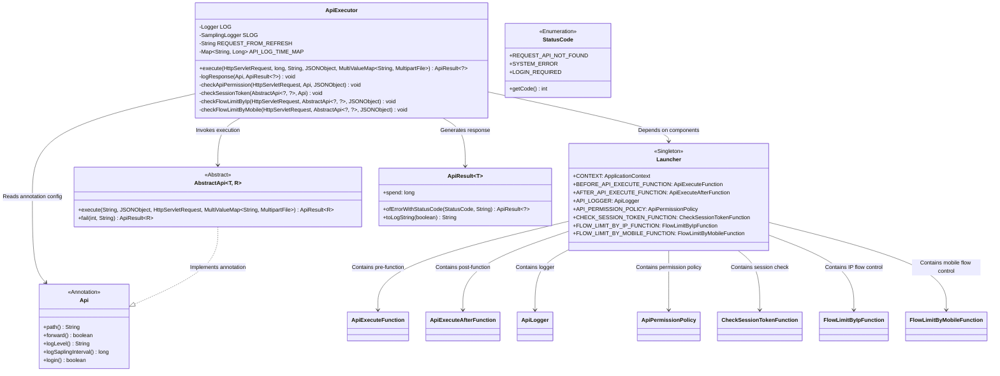
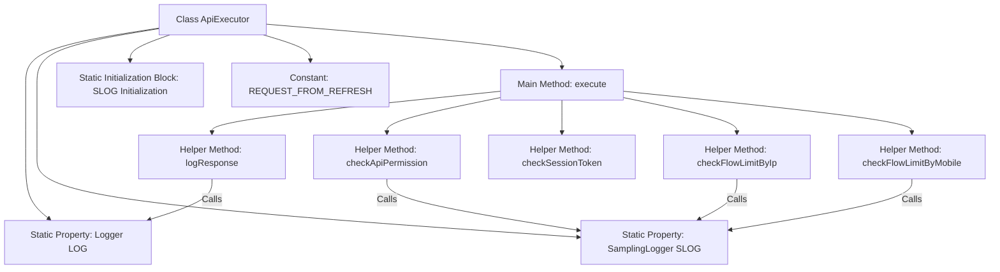
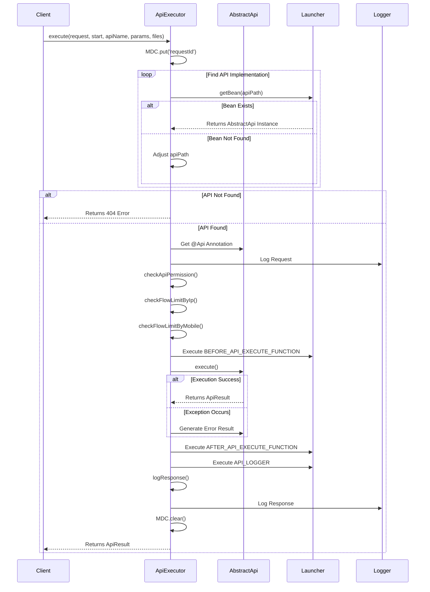

# Basic Information

|      |      |
|------|------|
| Name | ApiExecutor |
| Language | .java |
| Code Path | WeFe/common/java/common-web/src/main/java/com/welab/wefe/common/web/ApiExecutor.java |
| Package Name | com.welab.wefe.common.web |
| Dependencies | ['com.alibaba.fastjson.JSONObject', 'com.welab.wefe.common.SamplingLogger', 'com.welab.wefe.common.StatusCode', 'com.welab.wefe.common.TimeSpan', 'com.welab.wefe.common.exception.StatusCodeWithException', 'com.welab.wefe.common.web.api.base.AbstractApi', 'com.welab.wefe.common.web.api.base.Api', 'com.welab.wefe.common.web.api.base.FlowLimitByIp', 'com.welab.wefe.common.web.api.base.FlowLimitByMobile', 'com.welab.wefe.common.web.dto.ApiResult', 'org.apache.commons.lang3.StringUtils', 'org.slf4j.Logger', 'org.slf4j.LoggerFactory', 'org.slf4j.MDC', 'org.springframework.beans.BeansException', 'org.springframework.util.MultiValueMap', 'org.springframework.web.multipart.MultipartFile', 'javax.servlet.http.HttpServletRequest', 'java.util.Map', 'java.util.concurrent.ConcurrentHashMap'] |
| Brief Description | The ApiExecutor class implements API execution logic, including functions such as permission checks, traffic control, and logging, processing requests and returning results. |

# Description

The `ApiExecutor` class is a core handler for processing API requests, incorporating functionalities such as logging, permission checks, and traffic control. It dynamically locates and executes corresponding API implementation classes through reflection, supporting request parameter parsing, pre/post-processing hooks, exception handling, and response logging. The class implements IP and mobile number-based traffic control checks and provides a flexible log sampling mechanism to reduce disk usage. The execution process includes API path matching, permission validation, traffic control, business logic execution, and result processing, ultimately returning an `ApiResult` object containing metrics like execution time.

# Class Summary

| Name   | Type  | Description |
|-------|------|-------------|
| ApiExecutor | class | The ApiExecutor class handles API requests, including API lookup, permission checks, rate limiting, API execution, and logging. It supports pre- and post-operations, and the returned results include execution time and status. |

## Class ApiExecutor

|      |      |
|------|------|
| Access Modifier | public |
| Type | class |
| Name | ApiExecutor |
| Description | The ApiExecutor class handles API requests, including API lookup, permission checks, rate limiting, API execution, and logging. It supports pre- and post-operations, and the returned results include execution time and status. |

### UML Class Diagram

This code demonstrates the core structure of an API executor, primarily consisting of the ApiExecutor class and its dependencies. The ApiExecutor retrieves concrete API implementations (AbstractApi) through the Spring context, performs permission checks, flow control, and other operations before and after execution, and integrates various configurable extension features via the Launcher class. The class diagram clearly illustrates the collaboration between components, including key functional modules such as annotation configuration reading, execution flow control, exception handling, and logging, reflecting a highly extensible API gateway design pattern.

### Internal Method Call Graph

This code demonstrates the complete workflow of an API executor, handling HTTP request parsing, permission validation, flow control, business logic execution, and response logging. The flowchart clearly illustrates the class structure and method invocation relationships, while the sequence diagram details the end-to-end processing from client request to response return, including exception handling and post-execution operations. The design features robust logging, permission control, and rate-limiting mechanisms, showcasing solid API gateway capabilities.

### Field List

| Name  | Type  | Description |
|-------|-------|------|
| LOG = LoggerFactory.getLogger(ApiExecutor.class) | Logger | Define the static constant LOG in the ApiExecutor class for logging purposes. |
| REQUEST_FROM_REFRESH = "request-from-refresh" | String | Static constant string REQUEST_FROM_REFRESH with the value "request-from-refresh". |
| SLOG | SamplingLogger | Protected static constant sampling logger SLOG. |
| API_LOG_TIME_MAP = new ConcurrentHashMap<>() | Map<String, Long> | The private static constant API_LOG_TIME_MAP uses a thread-safe ConcurrentHashMap to store mappings from strings to long integers. |

### Method List

| Name  | Type  | Description |
|-------|-------|------|
| checkSessionToken | void | Check session token validity: Skip interfaces that do not require login; Do not execute if no check method is set; Comments show the original check logic (not enabled). |
| checkFlowLimitByIp | void | Check IP traffic limit: Skip if no limit function is set or the annotation is invalid; otherwise, call the limit check function. |
| logResponse | void | This method controls the frequency of API response log printing based on annotation configuration to avoid frequent logging. It determines whether to omit logs through time interval checks, reducing disk usage. Finally, it outputs the response content according to the log level, limiting length to prevent excessive size. |
| execute | ApiResult<?> | This method handles API requests: locates the corresponding interface, checks permissions and rate limits, allows custom operations before and after execution, logs the process, and returns the result. Error messages are returned in case of exceptions. |
| checkApiPermission | void | Check API permissions: Skip if no permission policy is set, otherwise invoke the policy check method. |
| checkFlowLimitByMobile | void | Check the mobile number data usage restriction feature; skip if it is not enabled or the parameters are invalid, otherwise perform the restriction check. |

