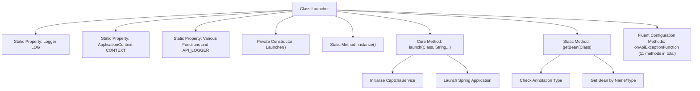

# Basic Information

|      |      |
|------|------|
| Name | Launcher |
| Language | .java |
| Code Path | WeFe/common/java/common-web/src/main/java/com/welab/wefe/common/web/Launcher.java |
| Package Name | com.welab.wefe.common.web |
| Dependencies | ['com.welab.wefe.common.util.StringUtil', 'com.welab.wefe.common.web.delegate.api_log.AbstractApiLogger', 'com.welab.wefe.common.web.function', 'com.welab.wefe.common.web.service.CaptchaService', 'org.slf4j.Logger', 'org.slf4j.LoggerFactory', 'org.springframework.boot.SpringApplication', 'org.springframework.context.ApplicationContext', 'org.springframework.stereotype.Component', 'org.springframework.stereotype.Repository', 'org.springframework.stereotype.Service'] |
| Brief Description | The Launcher class is a starter that includes functionalities such as API permission checks, token validation, and traffic control. It provides event triggering and logging, supporting Spring application startup and Bean retrieval. |

# Description

The `Launcher` class is a core startup class designed for initializing and managing various configurations and functionalities of API services. It contains multiple static variables used to set API permission check policies, session token verification, IP and mobile number traffic control, pre- and post-API execution events, and exception handling. The class provides method chaining to allow flexible configuration of these features. The startup method `launch` is responsible for initializing the captcha service and launching the Spring application context. Additionally, it offers utility methods for retrieving Spring Beans, supporting Bean instance acquisition via annotation values or types. The class follows the singleton pattern, prohibiting external instantiation, and its instance can be obtained through the static `instance` method.

# Class Summary

| Name   | Type  | Description |
|-------|------|-------------|
| Launcher | class | The Launcher class serves as an API launcher, incorporating configuration methods for permission checks, traffic control, pre/post events, and exception handling. It supports Spring application startup and Bean retrieval. |


## Class Launcher

|      |      |
|------|------|
| Access Modifier | public |
| Type | class |
| Name | Launcher |
| Description | The Launcher class serves as an API launcher, incorporating configuration methods for permission checks, traffic control, pre/post events, and exception handling. It supports Spring application startup and Bean retrieval. |


### UML Class Diagram

```mermaid
classDiagram
    class Launcher {
        -static Logger LOG
        +static ApplicationContext CONTEXT
        +static ApiPermissionPolicyFunction API_PERMISSION_POLICY
        +static CheckSessionTokenFunction CHECK_SESSION_TOKEN_FUNCTION
        +static FlowLimitByIpFunction FLOW_LIMIT_BY_IP_FUNCTION
        +static FlowLimitByMobileFunction FLOW_LIMIT_BY_MOBILE_FUNCTION
        +static String API_PACKAGE_PATH
        +static BeforeApiExecuteFunction BEFORE_API_EXECUTE_FUNCTION
        +static AfterApiExecuteFunction AFTER_API_EXECUTE_FUNCTION
        +static OnApiExceptionFunction ON_API_EXCEPTION_FUNCTION
        +static AbstractApiLogger API_LOGGER
        -Launcher()
        +static Launcher instance()
        +void launch(Class<?> primarySource, String... args)
        +static ~T~ getBean(Class~T~ requiredType)
        +Launcher onApiExceptionFunction(OnApiExceptionFunction func)
        +Launcher beforeApiExecuteFunction(BeforeApiExecuteFunction func)
        +Launcher afterApiExecuteFunction(AfterApiExecuteFunction func)
        +Launcher apiLogger(AbstractApiLogger logger)
        +Launcher apiPermissionPolicy(ApiPermissionPolicyFunction func)
        +Launcher checkSessionTokenFunction(CheckSessionTokenFunction func)
        +Launcher flowLimitByIpFunctionFunction(FlowLimitByIpFunction func)
        +Launcher flowLimitByMobileFunctionFunction(FlowLimitByMobileFunction func)
        +Launcher apiPackagePath(String path)
        +Launcher apiPackageClass(Class<?> packageClass)
    }

    <<Interface>> ApiPermissionPolicyFunction
    <<Interface>> CheckSessionTokenFunction
    <<Interface>> FlowLimitByIpFunction
    <<Interface>> FlowLimitByMobileFunction
    <<Interface>> BeforeApiExecuteFunction
    <<Interface>> AfterApiExecuteFunction
    <<Interface>> OnApiExceptionFunction

    class AbstractApiLogger {
        <<abstract>>
    }

    Launcher --> ApiPermissionPolicyFunction : configures
    Launcher --> CheckSessionTokenFunction : configures
    Launcher --> FlowLimitByIpFunction : configures
    Launcher --> FlowLimitByMobileFunction : configures
    Launcher --> BeforeApiExecuteFunction : configures
    Launcher --> AfterApiExecuteFunction : configures
    Launcher --> OnApiExceptionFunction : configures
    Launcher --> AbstractApiLogger : configures
```

This diagram illustrates the structure of the Launcher class and its relationships with multiple functional interfaces. Launcher is a core bootstrap class that maintains various API policy functions (such as permission checks, flow control, etc.) and logging components through static fields, providing fluent configuration methods. The class diagram clearly distinguishes interfaces (marked with <<Interface>>) and abstract classes, showing Launcher's unidirectional dependencies on these components. All configuration interfaces are set via Launcher's instance methods, reflecting a highly configurable design pattern.


### Internal Method Call Graph



This flowchart illustrates the core structure of the Launcher class, which is a typical implementation of the application launcher pattern. The class contains static configuration properties, a private constructor, instance acquisition methods, and core startup logic. The main workflow consists of three parts: 1) Storing global configurations via static properties; 2) Initializing services and launching the Spring application through the launch() method; 3) Providing the getBean() method to retrieve components from the context. Notably, the 11 fluent configuration methods employ the Builder pattern to enable smooth configuration of various strategy functions.

### Field List

| Name  | Type  | Description |
|-------|-------|------|
| CHECK_SESSION_TOKEN_FUNCTION | CheckSessionTokenFunction | Static public session token verification function instance declaration. |
| API_PERMISSION_POLICY | ApiPermissionPolicyFunction | Declared a static API_PERMISSION_POLICY variable of type ApiPermissionPolicyFunction. |
| BEFORE_API_EXECUTE_FUNCTION | BeforeApiExecuteFunction | Static variable BEFORE_API_EXECUTE_FUNCTION, used for operations before API execution. |
| API_PACKAGE_PATH | String | Static string variable API_PACKAGE_PATH, used to store the API package path. |
| CONTEXT | ApplicationContext | Static public application context variable CONTEXT. |
| FLOW_LIMIT_BY_MOBILE_FUNCTION | FlowLimitByMobileFunction | The static public variable FLOW_LIMIT_BY_MOBILE_FUNCTION, of type FlowLimitByMobileFunction. |
| FLOW_LIMIT_BY_IP_FUNCTION | FlowLimitByIpFunction | Static variable FLOW_LIMIT_BY_IP_FUNCTION, used for IP traffic limiting functionality. |
| AFTER_API_EXECUTE_FUNCTION | AfterApiExecuteFunction | The static variable AFTER_API_EXECUTE_FUNCTION, of type AfterApiExecuteFunction, is used for operations after API execution. |
| API_LOGGER | AbstractApiLogger | Declare a static public variable API_LOGGER of type AbstractApiLogger. |
| ON_API_EXCEPTION_FUNCTION | OnApiExceptionFunction | Define a static API exception handling function variable. |
| LOG = LoggerFactory.getLogger(Launcher.class) | Logger | Define a private static log object LOG for the Launcher class, created using LoggerFactory. |

### Method List

| Name  | Type  | Description |
|-------|-------|------|
| onApiExceptionFunction | Launcher | Set the API exception handling function and return the current object instance. |
| launch | void | Startup method, initialize the captcha service and run the Spring application. |
| afterApiExecuteFunction | Launcher | This method sets the callback function after API execution and returns the current object instance. |
| getBean | T | Static methods obtain the bean name through class annotations; if none is present, they retrieve it by type, otherwise by name. |
| apiLogger | Launcher | This method sets up the API logger and returns the current object instance. |
| apiPermissionPolicy | Launcher | Set the API permission policy function and return the current object instance. |
| beforeApiExecuteFunction | Launcher | This method is used to set a callback function before API execution, which accepts a function parameter and returns the current object instance. |
| flowLimitByIpFunctionFunction | Launcher | Java Method: Set IP rate limiting function and return the current object instance. |
| flowLimitByMobileFunctionFunction | Launcher | This method sets the flow restriction function and returns the current object instance. |
| apiPackagePath | Launcher | Set the API package path and return the current object instance. |
| apiPackageClass | Launcher | Set the API package path in Java method and return the current object instance. |
| checkSessionTokenFunction | Launcher | Set the session token check function and return the current object instance. |
| instance | Launcher | The static method instance() returns a new instance of Launcher. |


