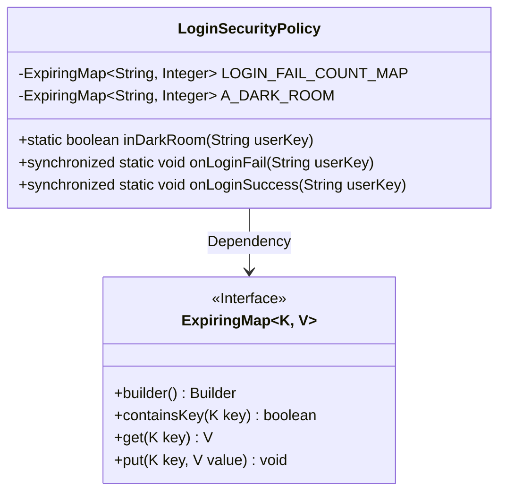
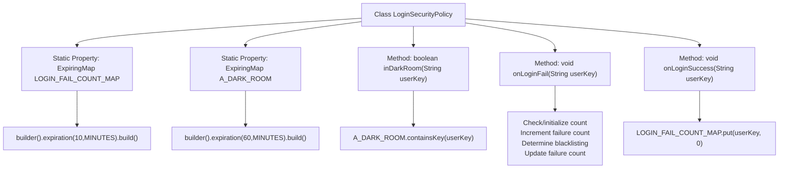

# Basic Information

|      |      |
|------|------|
| Name | LoginSecurityPolicy |
| Language | .java |
| Code Path | WeFe/common/java/common-web/src/main/java/com/welab/wefe/common/web/LoginSecurityPolicy.java |
| Package Name | com.welab.wefe.common.web |
| Dependencies | ['net.jodah.expiringmap.ExpiringMap', 'java.util.concurrent.TimeUnit'] |
| Brief Description | The LoginSecurityPolicy class manages login security policies and includes two expiration maps: LOGIN_FAIL_COUNT_MAP records the number of failed login attempts within 1 minute, expiring after 10 minutes; A_DARK_ROOM tracks users with excessive failures, expiring after 60 minutes. Methods include checking if a user is in the "dark room," recording login failure and success events. Users entering the "dark room" after exceeding 5 failed attempts. |

# Description

The `LoginSecurityPolicy` class implements user login security policies, containing two expiration maps: `LOGIN_FAIL_COUNT_MAP` records the number of failed login attempts per username per minute, expiring in 10 minutes; `A_DARK_ROOM` stores users temporarily blocked due to multiple failures, expiring in 60 minutes. It provides three methods: `inDarkRoom` checks if a user is blocked; `onLoginFail` logs failed attempts and blocks users exceeding 5 attempts; `onLoginSuccess` resets the user's failure count. Thread safety is ensured via synchronized methods.

# Class Summary

| Name   | Type  | Description |
|-------|------|-------------|
| LoginSecurityPolicy | class | Login security policy class, records the number of user login failures with a 10-minute expiration. Exceeding 5 failures results in a 1-hour penalty in the "blacklist room." Provides methods to check blacklist status and record login success/failure. |

## Class LoginSecurityPolicy

|      |      |
|------|------|
| Access Modifier | public |
| Type | class |
| Name | LoginSecurityPolicy |
| Description | Login security policy class, records the number of user login failures with a 10-minute expiration. Exceeding 5 failures results in a 1-hour penalty in the "blacklist room." Provides methods to check blacklist status and record login success/failure. |

### UML Class Diagram

This code demonstrates a login security policy class that utilizes two ExpiringMaps to track failed login attempts and banned users respectively. LOGIN_FAIL_COUNT_MAP stores user login failure counts within 10 minutes, while A_DARK_ROOM maintains banned users for 60 minutes. It provides three static methods: checking if a user is banned, recording login failures (banning after 5 attempts), and resetting failure counts. Thread safety is ensured through synchronized methods, effectively preventing brute-force attacks.

### Internal Method Call Graph

This code implements a login security policy system with two core features: login failure count tracking and user blacklist management. Using ExpiringMap for time-expired caching, LOGIN_FAIL_COUNT_MAP records user failures within 10 minutes while A_DARK_ROOM stores blacklisted users for 60 minutes. Users exceeding 5 consecutive failures are blacklisted, and successful logins reset the failure count. All operations are thread-safe through synchronized blocks to prevent concurrency issues.

### Field List

| Name  | Type  | Description |
|-------|-------|------|
| LOGIN_FAIL_COUNT_MAP = ExpiringMap            .builder()            .expiration(10, TimeUnit.MINUTES)            .build() | ExpiringMap<String, Integer> | Define a private static ExpiringMap with String keys and Integer values to track login failure attempts, configured with a 10-minute automatic expiration. |
| A_DARK_ROOM = ExpiringMap            .builder()            .expiration(60, TimeUnit.MINUTES)            .build() | ExpiringMap<String, Integer> | Create a static ExpiringMap instance A_DARK_ROOM with an expiration time of 60 minutes. |

### Method List

| Name  | Type  | Description |
|-------|-------|------|
| inDarkRoom | boolean | The method `inDarkRoom` checks whether `userKey` exists in `A_DARK_ROOM` and returns a boolean value. |
| onLoginFail | void | The synchronization method records the number of user login failures, and adds the user to the blacklist if the count exceeds 5. |
| onLoginSuccess | void | The synchronous static method `onLoginSuccess` takes the `userKey` parameter and resets the corresponding value in `LOGIN_FAIL_COUNT_MAP` to 0. |

