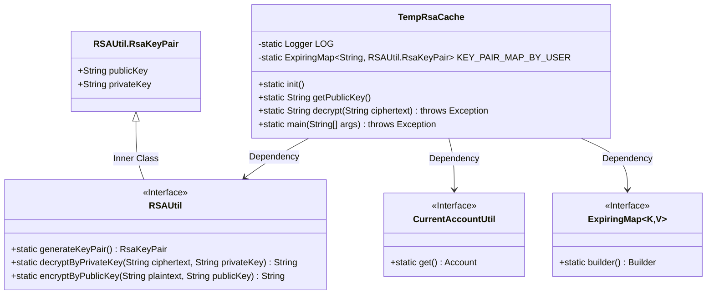
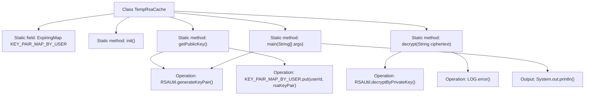

# Basic Information

|      |      |
|------|------|
| Name | TempRsaCache |
| Language | .java |
| Code Path | WeFe/common/java/common-web/src/main/java/com/welab/wefe/common/web/TempRsaCache.java |
| Package Name | com.welab.wefe.common.web |
| Dependencies | ['com.welab.wefe.common.util.RSAUtil', 'com.welab.wefe.common.web.util.CurrentAccountUtil', 'net.jodah.expiringmap.ExpirationPolicy', 'net.jodah.expiringmap.ExpiringMap', 'org.slf4j.Logger', 'org.slf4j.LoggerFactory', 'java.util.concurrent.TimeUnit'] |
| Brief Description | The TempRsaCache class manages user RSA key pair caching with a 60-minute expiration period. It provides public key generation and decryption functionality, logging error messages when decryption fails. |

# Description

The TempRsaCache class is a temporary caching utility employing RSA encryption, which stores the mapping between user IDs and RSA key pairs using ExpiringMap, with automatic expiration after 60 minutes of inactivity. It provides functionalities for retrieving public keys and decrypting data, logging error messages upon decryption failure. The main method demonstrates the key generation, encryption, and decryption processes.

# Class Summary

| Name   | Type  | Description |
|-------|------|-------------|
| TempRsaCache | class | The TempRsaCache class manages the caching of user RSA key pairs, with a 60-minute expiration period, providing public key retrieval and decryption functions, and logs decryption failures. |

## Class TempRsaCache

|      |      |
|------|------|
| Access Modifier | public |
| Type | class |
| Name | TempRsaCache |
| Description | The TempRsaCache class manages the caching of user RSA key pairs, with a 60-minute expiration period, providing public key retrieval and decryption functions, and logs decryption failures. |

### UML Class Diagram

This class diagram illustrates the structure of the TempRsaCache class and its dependencies. TempRsaCache uses ExpiringMap to cache RSA key pairs and relies on RSAUtil for key pair generation and encryption/decryption operations. CurrentAccountUtil provides current user information. RSAUtil.RsaKeyPair is an inner class of RSAUtil that stores public and private keys. ExpiringMap is a generic interface for implementing time-based expiration caching functionality.

### Internal Method Call Graph

This code flowchart illustrates the core structure and functionality of the TempRsaCache class. The class maintains a user-to-RSA key pair mapping through a static ExpiringMap, providing public key retrieval (getPublicKey) and decryption (decrypt) capabilities. The getPublicKey method generates new key pairs and stores them in cache, while the decrypt method uses private keys for decryption and logs error messages upon failure. The main method demonstrates a complete encryption-decryption workflow, including key generation, data encryption, decryption, and result output. The entire process highlights user ID-based key management and exception handling mechanisms.

### Field List

| Name  | Type  | Description |
|-------|-------|------|
| KEY_PAIR_MAP_BY_USER = ExpiringMap            .builder()            .expirationPolicy(ExpirationPolicy.ACCESSED)            .expiration(60, TimeUnit.MINUTES)            .build() | ExpiringMap<String, RSAUtil.RsaKeyPair> | Using ExpiringMap to store user RSA key pairs, which automatically expire after 60 minutes of access. |
| LOG = LoggerFactory.getLogger(TempRsaCache.class) | Logger | The class TempRsaCache defines a static immutable logger instance LOG. |

### Method List

| Name  | Type  | Description |
|-------|-------|------|
| getPublicKey | String | Generate an RSA key pair, store it, and return the public key. |
| init | void | Empty method definition, with no concrete implementation. |
| main | void | Generate an RSA key pair, print the public and private keys, encrypt the plaintext and print the ciphertext, then decrypt and print the result. |
| decrypt | String | The static method `decrypt` decrypts RSA ciphertext using a private key, logs an error on failure, and throws an exception. |

