# Basic Information

|      |      |
|------|------|
| Name | web |
| Language | .java |
| Code Path | WeFe/common/java/common-web/src/main/java/com/welab/wefe/common/web |
| Package Name | docs.common.java.common-web.src.main.java.com.welab.wefe.common.web |
| Brief Description | This module integrates a Web API development framework, encompassing core functionalities such as logging, user activity management, permission control, traffic limiting, CAPTCHA services, and documentation generation. It adopts an annotation-driven approach and reflection mechanism, supporting multi-format document output and automated validation. With thread-safe design and defensive programming to ensure stability, it is suitable for multi-role systems and microservices scenarios. |

# Description

## Overview  
This module provides a full-stack solution for web application development, with core responsibilities including API lifecycle management (request handling/access control/logging) and development support tools (documentation generation/security policies). The interface specification follows a layered design, such as the AbstractApi base class system, @Api annotation metadata, and the ApiResult unified response structure. Key data structures encompass log entities (ApiLog), permission models (Caller enum), security policies (LoginSecurityPolicy), and documentation models (ApiItem). External dependencies include the Spring framework, SM4 encryption library, FastJson, and concurrency utility classes. For example, temporary key management is implemented via TempRsaCache, resembling the security interception mechanism at the gateway layer.  

## Core Business Scenarios  
The module supports typical interaction chains in multi-role systems: from request inbound (BaseController routing) → security validation (LoginSecurityPolicy/RSA decryption) → business execution (ApiExecutor reflective invocation) → response processing (DTO conversion/logging). The complete functional matrix includes: 1) Security controls (e.g., captcha service + blacklist mechanism); 2) Traffic governance (dual-dimensional rate limiting by IP/mobile number); 3) Development assistance (automated API documentation generation). Typical integration cases manifest as chained configurations (Launcher initialization), annotation-driven approaches (e.g., @FlowLimitByMobile), and utility class combinations (CurrentAccountUtil + ModelMapper), suitable for rapid mid-platform service construction.

### Package Internal Structure View

```mermaid
graph TD
    web --> delegate
    web --> controller
    web --> api
    web --> api_document
    web --> util
    web --> service
    web --> dto
    web --> function
    web --> config
    web --> TempRsaCache.java
    web --> Launcher.java
    web --> LoginSecurityPolicy.java
    web --> ApiExecutor.java
    delegate --> api_log
    api_log --> ApiLog.java
    api_log --> ApiCallerType.java
    api_log --> AbstractApiLogger.java
    controller --> BaseController.java
    api --> dev
    api --> base
    api --> LogoutApi.java
    dev --> Apis.java
    dev --> ErrorSqlList.java
    dev --> EnvApi.java
    dev --> DownloadLogFile.java
    dev --> SlowSqlList.java
    dev --> FindLogFileException.java
    dev --> HttpBinApi.java
    dev --> CreateTestDataSetApi.java
    base --> Caller.java
    base --> FlowLimitByMobile.java
    base --> FlowLimitByIp.java
    base --> Api.java
    base --> AbstractNoneOutputApi.java
    base --> AbstractApi.java
    base --> AbstractNoneInputApi.java
    api_document --> model
    api_document --> MarkdownFormatter.java
    api_document --> AbstractApiDocumentFormatter.java
    api_document --> JsonFormatter.java
    api_document --> HtmlFormatter.java
    model --> ApiItem.java
    model --> ApiParamField.java
    model --> ApiParam.java
    util --> DatabaseEncryptConverter.java
    util --> HttpServletRequestUtil.java
    util --> DatabaseEncryptUtil.java
    util --> CurrentAccountUtil.java
    util --> ModelMapper.java
    service --> account
    service --> flowlimit
    service --> CaptchaService.java
    account --> HistoryPasswordItem.java
    account --> SsoAccountInfo.java
    account --> AccountInfo.java
    flowlimit --> AbstractMemoryFlowLimitService.java
    flowlimit --> FlowLimitByIpService.java
    flowlimit --> AbstractFlowLimitService.java
    flowlimit --> FlowLimitByMobileService.java
    dto --> AbstractWithFilesApiInput.java
    dto --> AbstractTimedApiOutput.java
    dto --> GatewayMemberInfo.java
    dto --> Captcha.java
    dto --> NoneApiOutput.java
    dto --> UploadFileApiOutput.java
    dto --> PageableApiInput.java
    dto --> ApiResult.java
    dto --> UniqueIDApiInput.java
    dto --> AbstractApiOutput.java
    dto --> AbstractApiInput.java
    dto --> NoneApiInput.java
    dto --> PageableApiOutput.java
    dto --> AbstractSecureBoostInput.java
    dto --> AbstractLRInput.java
    dto --> AbstractGridSearchParam.java
    dto --> SignedApiInput.java
    function --> FlowLimitByMobileFunction.java
    function --> CheckSessionTokenFunction.java
    function --> BeforeApiExecuteFunction.java
    function --> AfterApiExecuteFunction.java
    function --> ApiPermissionPolicyFunction.java
    function --> OnApiExceptionFunction.java
    function --> FlowLimitByIpFunction.java
    config --> AppConfig.java
    config --> ApiBeanNameGenerator.java
    config --> MyCorsFilter.java
    config --> CommonConfig.java
```

This flowchart illustrates the directory structure of the web module in the WeFe project, starting from the root directory 'web' and hierarchically expanding its subdirectories and files. It primarily includes core directories such as delegate, controller, api, and api_document, each containing their respective subdirectories and implementation class files. For example, the api directory is divided into two submodules, dev and base, which contain different API implementation classes; the service directory includes sub-service modules like account and flowlimit. The overall structure clearly demonstrates the layered design and functional module division of the project.

# File List

| Name   | Type  | Description |
|-------|------|-------------|
| [TempRsaCache.java](TempRsaCache.md) | file | The TempRsaCache class manages user RSA key pair caching with a 60-minute expiration. It provides public key generation and decryption functions, logging error messages when decryption fails. |
| [Launcher.java](Launcher.md) | file | The Launcher class is a starter that includes functionalities such as API permission checks, token validation, and traffic control. It provides event triggering and logging, supporting Spring application startup and Bean retrieval. |
| [LoginSecurityPolicy.java](LoginSecurityPolicy.md) | file | The `LoginSecurityPolicy` class manages login security policies and includes two expiration mappings: `LOGIN_FAIL_COUNT_MAP` records the number of login failures within 1 minute, expiring after 10 minutes; `A_DARK_ROOM` tracks users with excessive failures, expiring after 60 minutes. Methods include checking if a user is in the "dark room," logging login failure and success events. Users entering the "dark room" after exceeding 5 failures. |
| [ApiExecutor.java](ApiExecutor.md) | file | The ApiExecutor class implements API execution logic, including functions such as permission checks, traffic control, and logging, processing requests and returning results. |
| [dto](dto/_module.md) | package | AbstractWithFilesApiInput handles file uploads; AbstractTimedApiOutput contains time attributes; GatewayMemberInfo stores member information; Captcha processes verification codes; NoneApiOutput indicates an empty response; UploadFileApiOutput stores file IDs; PageableApiInput handles pagination; ApiResult encapsulates API responses; UniqueIDApiInput processes unique IDs; AbstractApiOutput serves as the base class for outputs; AbstractApiInput processes inputs; NoneApiInput indicates no input; PageableApiOutput encapsulates paginated data; AbstractSecureBoostInput and AbstractLRInput handle model parameters; AbstractGridSearchParam handles grid search; SignedApiInput processes signed inputs. |
| [config](config/_module.md) | package | Spring Boot configuration class implements cross-origin and JSON serialization settings, including CORS filter, FastJson configuration, and sensitive value handling. ApiBeanNameGenerator generates bean names with Api annotations and validates path formats. MyCorsFilter processes CORS requests, verifies origins, and sets response headers. CommonConfig manages general settings such as log paths, environment variables, and database encryption. |
| [function](function/_module.md) | package | The FlowLimitByMobileFunction checks mobile device traffic limits. The CheckSessionTokenFunction verifies the validity of session tokens. The BeforeApiExecuteFunction performs operations before API execution. The AfterApiExecuteFunction handles post-API execution callbacks. The ApiPermissionPolicyFunction checks API permissions. The OnApiExceptionFunction handles API exceptions. The FlowLimitByIpFunction checks IP traffic limits. |
| [service](service/_module.md) | package | The account management module uniformly manages user information and password security, providing standardized interfaces and data structures. The rate limiting module controls API access frequency based on a key-value strategy, supporting IP and mobile number throttling. The captcha service generates and verifies Base64 image captchas with a 60-second validity period, ensuring thread safety. |
| [util](util/_module.md) | package | The `DatabaseEncryptConverter` class implements encryption and decryption conversion between attributes and database columns. The `HttpServletRequestUtil` utility class retrieves client IP addresses, handling proxy and local scenarios. `DatabaseEncryptUtil` provides database encryption and decryption functionality, relying on `SM4Util` for implementation. `CurrentAccountUtil` manages logged-in user information, storing it using `ThreadLocal`. The `ModelMapper` utility class performs object mapping and conversion, adopting the singleton pattern. |
| [api_document](api_document/_module.md) | package | This module automatically generates API documentation through reflection and annotations, supporting JSON, Markdown, and HTML formats. Its core includes a three-level ApiItem model that handles generics, validation rules, and field filtering, similar to Swagger but with a code-first approach. |
| [api](api/_module.md) | package | The development auxiliary API module provides monitoring, logging, and test data generation functionalities, based on the AbstractApi base class. The Web API framework supports identity recognition, rate limiting, and request processing, utilizing the Api annotation and abstract classes to simplify development. The LogoutApi handles parameterless logout requests. |
| [controller](controller/_module.md) | package | The BaseController provides REST interfaces, including file downloading, static resource handling, GET/POST request functionalities, supports parameter merging and file uploads, and uniformly returns results in ApiResult format. |
| [delegate](delegate/_module.md) | package | The ApiLog class records API call logs, including request and response information. The ApiCallerType enum defines the types of callers, currently supporting only User. The AbstractApiLogger abstract class manages logs and user activity time, providing an ignore API list and update functionality. |

