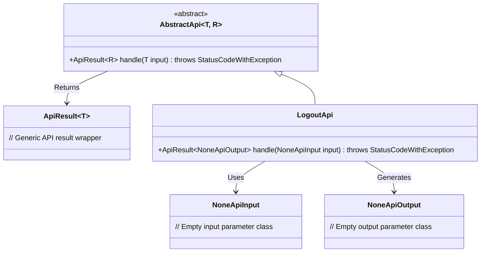
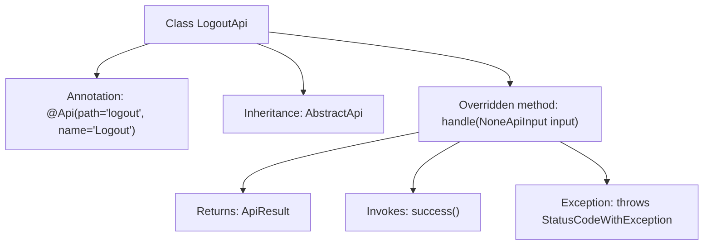

# Basic Information

|      |      |
|------|------|
| Name | LogoutApi |
| Language | .java |
| Code Path | WeFe/common/java/common-web/src/main/java/com/welab/wefe/common/web/api/LogoutApi.java |
| Package Name | com.welab.wefe.common.web.api |
| Dependencies | ['com.welab.wefe.common.exception.StatusCodeWithException', 'com.welab.wefe.common.web.api.base.AbstractApi', 'com.welab.wefe.common.web.api.base.Api', 'com.welab.wefe.common.web.dto.ApiResult', 'com.welab.wefe.common.web.dto.NoneApiInput', 'com.welab.wefe.common.web.dto.NoneApiOutput'] |
| Brief Description | This is a logout API class, inherited from AbstractApi, handling requests with no input or output, and returning an empty result upon success. |

# Description

This content describes a Java class named LogoutApi, which handles API requests for user logout. The class inherits from the base class AbstractApi, with generic parameters specifying NoneApiInput as the input and NoneApiOutput as the output. The @Api annotation defines the API path as "logout" and the name as "Logout". The core method handle takes a NoneApiInput parameter and returns an ApiResult-wrapped response, with the processing logic being a no-op that directly returns a success status. The overall class structure indicates that this is a simple logout interface implementation requiring no parameters and returning no values.

# Class Summary

| Name   | Type  | Description |
|-------|------|-------------|
| LogoutApi | class | This is a logout API class that inherits from AbstractApi, handling requests with no input or output, and returning an empty result upon success. |

## Class LogoutApi

|      |      |
|------|------|
| Access Modifier | @Api(path = "logout", name = "退出登录");public |
| Type | class |
| Name | LogoutApi |
| Description | This is a logout API class that inherits from AbstractApi, handling requests with no input or output, and returning an empty result upon success. |

### UML Class Diagram

Class diagram description: This code demonstrates the implementation structure of a logout API. LogoutApi inherits from the generic abstract class AbstractApi, specifying NoneApiInput as the input type and NoneApiOutput as the output type. The diagram includes core abstract base API class, empty parameter classes, result wrapper class, and their inheritance relationships, illustrating the application of the template method pattern through generics to achieve flexible definition of input and output types.

### Internal Method Call Graph

This code describes a class named LogoutApi, which handles API requests for user logout. The class inherits from the AbstractApi base class and overrides the handle method. This method accepts an input parameter of type NoneApiInput and returns a result of type ApiResult<NoneApiOutput>. Within the handle method, it invokes the success() method to return a success status and declares that it may throw a StatusCodeWithException. The class is annotated with @Api, specifying the API path as "logout" and the name as "Logout".

### Field List

| Name  | Type  | Description |
|-------|-------|------|

### Method List

| Name  | Type  | Description |
|-------|-------|------|
| handle | ApiResult<NoneApiOutput> | This is a Java method that overrides the parent class method, handles requests with no input parameters, and returns a successful result with no output data. |

