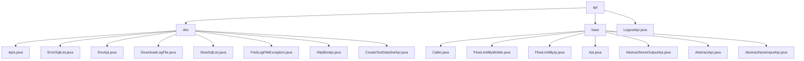

# Basic Information

|      |      |
|------|------|
| Name | api |
| Language | .java |
| Code Path | WeFe/common/java/common-web/src/main/java/com/welab/wefe/common/web/api |
| Package Name | docs.common.java.common-web.src.main.java.com.welab.wefe.common.web.api |
| Brief Description | The development auxiliary API module provides monitoring, logging, and test data generation functionalities, based on the AbstractApi base class. The Web API framework supports identity recognition, rate limiting, and request processing, utilizing the Api annotation and abstract classes to simplify development. The LogoutApi handles parameterless logout requests. |

# Description

## Overview  
This module is a collection of Web API development frameworks and auxiliary tools, with core responsibilities including basic request processing (authentication/rate limiting) and development support features (monitoring/logging). The interface specifications uniformly inherit from the AbstractApi system (e.g., AbstractNoneInputApi), use @Api to define metadata, and responses are encapsulated in the ApiResult structure. Key data structures cover monitoring entities (ErrorSql), permission identifiers (Caller enum), and parameterless placeholders (NoneApiInput). External dependencies involve the Spring framework, CommonConfig configuration service, and concurrency utility classes. For example, LogoutApi implements stateless logout, while EnvApi provides environment variable queries.  

## Primary Business Scenarios  
Suitable for multi-role system development and debugging scenarios, similar to an operations control panel mode. The core framework handles three types of requirements: identity differentiation (e.g., Caller.Board for admin-side tagging), rate limiting (e.g., @FlowLimitByMobile for throttling), and request pipelines (e.g., signature verification). Development support features include SQL monitoring (ErrorSqlList), log retrieval (FindLogFileException), and test data generation (CreateTestDataSetApi). Typical interactions include parameterless queries (system time) and parameter operations (record deletion), such as HttpBinApi for composable debugging toolchain construction.

### Package Internal Structure View

This flowchart illustrates the API structure under the common-web module in the WeFe project, which is divided into two main subdirectories (dev and base) and an independent file LogoutApi.java. The dev directory contains 9 development-related API classes, while the base directory includes 7 foundational API classes and abstract classes, presenting a clear hierarchical relationship overall.

# File List

| Name   | Type  | Description |
|-------|------|-------------|
| [LogoutApi.java](LogoutApi.md) | file | This is a logout API class that inherits from AbstractApi, handling requests with no input or output, and returning an empty result upon success. |
| [base](base/_module.md) | package | The Caller enum defines three types of caller identities. The `@FlowLimitByMobile` and `@FlowLimitByIp` annotations restrict access frequency for mobile devices and IPs, respectively. The `@Api` annotation marks interface classes and configures access control. The `AbstractApi` abstract class provides a common framework for APIs, with its subclasses `AbstractNoneOutputApi` and `AbstractNoneInputApi` handling API requests without output and input, respectively. |
| [dev](dev/_module.md) | package | The Apis class retrieves a list of APIs, supporting formats such as json, markdown, or html. ErrorSqlList returns a list of erroneous SQL queries. EnvApi provides system environment information. DownloadLogFile handles log downloads. SlowSqlList returns a list of slow SQL queries. FindLogFileException searches for log exceptions. HttpBinApi displays HTTP request details. CreateTestDataSetApi generates test datasets. |

