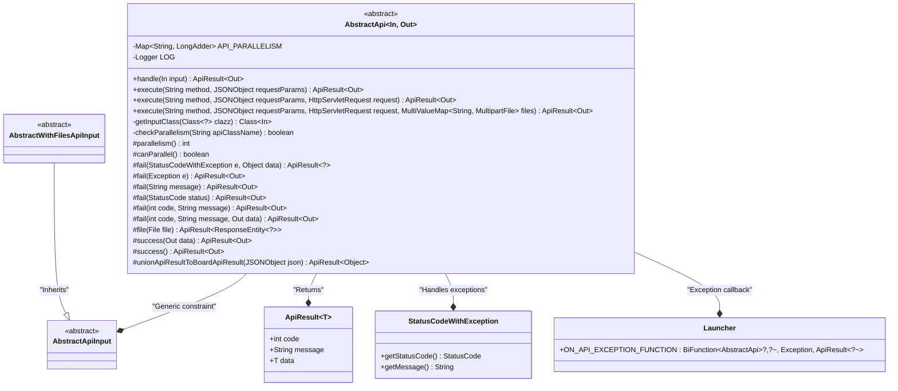
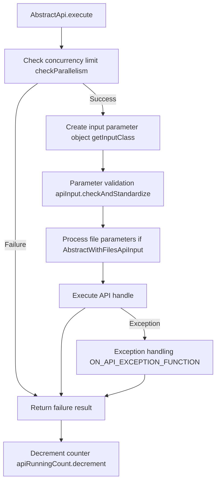
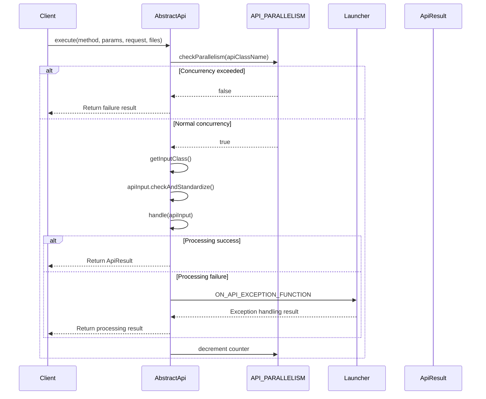

# Basic Information

|      |      |
|------|------|
| Name | AbstractApi |
| Language | .java |
| Code Path | WeFe/common/java/common-web/src/main/java/com/welab/wefe/common/web/api/base/AbstractApi.java |
| Package Name | com.welab.wefe.common.web.api.base |
| Dependencies | ['com.alibaba.fastjson.JSONObject', 'com.welab.wefe.common.StatusCode', 'com.welab.wefe.common.exception.StatusCodeWithException', 'com.welab.wefe.common.util.enums.ContentType', 'com.welab.wefe.common.web.Launcher', 'com.welab.wefe.common.web.dto.AbstractApiInput', 'com.welab.wefe.common.web.dto.AbstractWithFilesApiInput', 'com.welab.wefe.common.web.dto.ApiResult', 'org.slf4j.Logger', 'org.slf4j.LoggerFactory', 'org.springframework.core.io.FileSystemResource', 'org.springframework.http.HttpHeaders', 'org.springframework.http.MediaType', 'org.springframework.http.ResponseEntity', 'org.springframework.util.MultiValueMap', 'org.springframework.web.multipart.MultipartFile', 'javax.servlet.http.HttpServletRequest', 'java.io.File', 'java.lang.reflect.ParameterizedType', 'java.lang.reflect.Type', 'java.util.Map', 'java.util.concurrent.ConcurrentHashMap', 'java.util.concurrent.atomic.LongAdder'] |
| Brief Description | Abstract API base class supporting concurrency control, parameter validation, exception handling, and file uploads, providing a unified execution entry point and result encapsulation. |

# Description

AbstractApi is an abstract generic class that defines a common framework for API execution. It uses ConcurrentHashMap to track the concurrency of each API and controls concurrency through the checkParallelism method. The core method, execute, handles the request flow, including parameter conversion, validation, file processing, and invokes the handle method implemented by subclasses. It provides a robust error handling mechanism, supporting custom exception proxies (ON_API_EXCEPTION_FUNCTION). The class includes various result encapsulation methods (success/fail/file) and supports file download responses. It obtains input parameter types through generic reflection, allowing subclasses to override the parallelism and canParallel methods to adjust concurrency strategies. The entire class implements complete lifecycle management of APIs from request to response.

# Class Summary

| Name   | Type  | Description |
|-------|------|-------------|
| AbstractApi | class | The abstract class AbstractApi implements the basic framework of an API, including concurrency control, parameter validation, exception handling, and result encapsulation. Subclasses must implement the handle method to process business logic. It supports file uploads and customizable concurrency limits. |

## Class AbstractApi

|      |      |
|------|------|
| Access Modifier | public abstract |
| Type | class |
| Name | AbstractApi |
| Description | The abstract class AbstractApi implements the basic framework of an API, including concurrency control, parameter validation, exception handling, and result encapsulation. Subclasses must implement the handle method to process business logic. It supports file uploads and customizable concurrency limits. |

### UML Class Diagram

This code demonstrates the design of an abstract API base class `AbstractApi`, which uses generic parameters `In` and `Out` to represent input and output types, respectively. The class provides the core framework for API execution, including concurrency control, parameter validation, exception handling, and result encapsulation. The `execute` method processes requests, calls the abstract method `handle` to implement specific business logic, and uses `ApiResult` to uniformly encapsulate the return results. The class diagram clearly shows the relationships with related classes (such as the input parameter base class, exception class, and result encapsulation class), reflecting good layered design and extensibility.

### Internal Method Call Graph

This code implements an abstract API base class with core functionalities including concurrency control, parameter validation, business processing, and exception handling. The flowchart illustrates the core execution flow: first checking concurrency limits, then creating and validating input parameters, executing business logic, and finally processing results or exceptions. The sequence diagram details the interaction process between client API calls and concurrency control, parameter processing, and exception delegation. The design supports extended features such as file uploads, parameter standardization, and custom exception handling.

### Field List

| Name  | Type  | Description |
|-------|-------|------|
| API_PARALLELISM = new ConcurrentHashMap<>() | Map<String, LongAdder> | Define a thread-safe concurrent map API_PARALLELISM with string keys and LongAdder counter values. |
| LOG = LoggerFactory.getLogger(this.getClass()) | Logger | A protected final logger instance is defined in the class for logging the class's information. |

### Method List

| Name  | Type  | Description |
|-------|-------|------|
| fail | ApiResult<?> | This method is used to construct a failed API response, including the status code, error message, and optional data. The returned ApiResult object encapsulates this information. |
| execute | ApiResult<Out> | The public method `execute` accepts a method name, JSON parameters, and an HTTP request, returns `ApiResult<Out>`, and internally calls the method of the same name while passing a null value as the fourth parameter. |
| execute | ApiResult<Out> | The method executes API requests, checks concurrency limits, processes input parameters and files, invokes business logic and returns results, logs errors and returns error messages when exceptions occur, and finally decrements the concurrency count. |
| fail | ApiResult<Out> | The method `fail` returns `ApiResult<Out>`, captures exceptions, and returns error code -1 along with the exception class name and message. |
| fail | ApiResult<Out> | The method returns an error result, with a default status code of -1, accompanied by a message and no data. |
| checkParallelism | boolean | Synchronization method checks API class concurrency: If no record exists, initialize the counter; when parallel execution is allowed, verify whether the limit is not exceeded; otherwise, ensure the concurrency does not exceed 1. |
| unionApiResultToBoardApiResult | ApiResult<Object> | Convert a JSON object into an ApiResult object, including the fields code, message, and data. |
| fail | ApiResult<Out> | Java Method: Returns a failed ApiResult object containing status code and message, with no data. |
| execute | ApiResult<Out> | The public method `execute` accepts a method name and JSON parameters, returns `ApiResult<Out>`, and internally invokes the four-parameter method of the same name. |
| file | ApiResult<ResponseEntity<?>> | The method checks if the file exists and throws an exception if it does not. After setting the HTTP header information, it returns a file resource response, including cache control, download attributes, etc. The result is encapsulated in ApiResult. |
| getInputClass | Class<In> | Methods for obtaining input classes: Traverse the parent class until a type with generic parameters as a subclass of AbstractApiInput is found, otherwise recursively search the parent class. |
| fail | ApiResult<Out> | This method is used to construct a failed response, accepting an error code, message, and data, and returning the encapsulated ApiResult object. |
| success | ApiResult<Out> | Define a method to return an empty successful ApiResult. |
| success | ApiResult<Out> | Define a method to return successful API results, encapsulating the data into an ApiResult object and returning it. |
| parallelism | int | This method returns the parallelism, with the default value being the maximum integer value. |
| canParallel | boolean | The method canParallel returns a boolean value of true, indicating support for parallel processing. |
| fail | ApiResult<Out> | Java Method: Returns a failed ApiResult containing an error code and message, with no data. |
| handle | ApiResult<Out> | Abstract method, processes input and returns ApiResult<Out>, may throw exceptions. |

