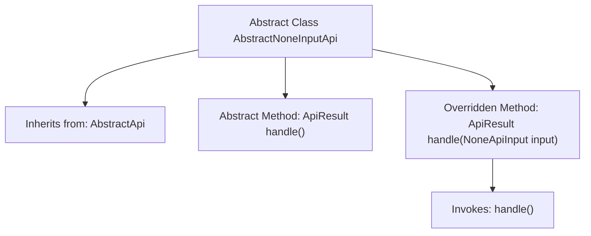

# Basic Information

|      |      |
|------|------|
| Name | AbstractNoneInputApi |
| Language | .java |
| Code Path | WeFe/common/java/common-web/src/main/java/com/welab/wefe/common/web/api/base/AbstractNoneInputApi.java |
| Package Name | com.welab.wefe.common.web.api.base |
| Dependencies | ['com.welab.wefe.common.exception.StatusCodeWithException', 'com.welab.wefe.common.web.dto.ApiResult', 'com.welab.wefe.common.web.dto.NoneApiInput'] |
| Brief Description | The abstract class `AbstractNoneInputApi` extends `AbstractApi`, defining an API handling interface with no input parameters. It returns results via the `handle` method and may throw a `StatusCodeWithException` exception. |

# Description

This is an abstract class named AbstractNoneInputApi, which inherits from the AbstractApi class. It uses the generic type Out as the output type, with the input type fixed as NoneApiInput. The class defines an abstract method handle that takes no parameters and returns a result of type ApiResult<Out>, potentially throwing a StatusCodeWithException. It also overrides the handle method of the parent class, ignoring the input parameters and directly invoking the parameterless handle method. This class is primarily used for handling API request scenarios that do not require input parameters.

# Class Summary

| Name   | Type  | Description |
|-------|------|-------------|
| AbstractNoneInputApi | class | The abstract class `AbstractNoneInputApi` extends `AbstractApi`, defining the API processing logic with no input parameters. It returns results via the `handle` method and may throw a `StatusCodeWithException` exception. |


## Class AbstractNoneInputApi

|      |      |
|------|------|
| Access Modifier | public abstract |
| Type | class |
| Name | AbstractNoneInputApi |
| Description | The abstract class `AbstractNoneInputApi` extends `AbstractApi`, defining the API processing logic with no input parameters. It returns results via the `handle` method and may throw a `StatusCodeWithException` exception. |


### UML Class Diagram

```mermaid
classDiagram
    class AbstractApi~T, R~ {
        <<abstract>>
        +ApiResult~R~ handle(T input) throws StatusCodeWithException
    }
    
    class AbstractNoneInputApi~Out~ {
        <<abstract>>
        ~NoneApiInput~
        ~Out~
        +ApiResult~Out~ handle() throws StatusCodeWithException
        +ApiResult~Out~ handle(NoneApiInput input) throws StatusCodeWithException
    }
    
    AbstractNoneInputApi --|> AbstractApi : Inheritance
    // AbstractNoneInputApi is a concrete implementation of AbstractApi, specifically designed for API calls without input parameters
    // The generic parameter Out specifies the output type, with NoneApiInput serving as a fixed input type placeholder
```

This code demonstrates an abstract class `AbstractNoneInputApi` that inherits from the generic class `AbstractApi`, specifically designed to handle API call scenarios without input parameters. The class uses `NoneApiInput` as an input type placeholder and defines a parameterless abstract `handle()` method, while also overriding the parent class's parameterized `handle` method. The class diagram clearly illustrates generic parameter passing (Out inherits from the parent class's R) and the application of the template method pattern, where the specific business logic is determined by the child class's implementation of the parameterless `handle()` method.


### Internal Method Call Graph



This code illustrates a generic abstract class `AbstractNoneInputApi<Out>` that inherits from `AbstractApi<NoneApiInput, Out>`. Its core functionality is to provide an API processing framework without input parameters, containing an abstract method `handle()` that must be implemented by subclasses, as well as overriding the parent class's `handle(NoneApiInput input)` method. The overridden method ignores input parameters and directly calls the parameterless `handle()` method, achieving automatic input parameter shielding. It is suitable for API scenarios that do not require input parameters.

### Field List

| Name  | Type  | Description |
|-------|-------|------|

### Method List

| Name  | Type  | Description |
|-------|-------|------|
| handle | ApiResult<Out> | This is a Java method override that handles API requests with no input parameters, returning encapsulated results or throwing exceptions. |
| handle | ApiResult<Out> | The abstract method handle returns ApiResult<Out> and may throw a StatusCodeWithException. |


