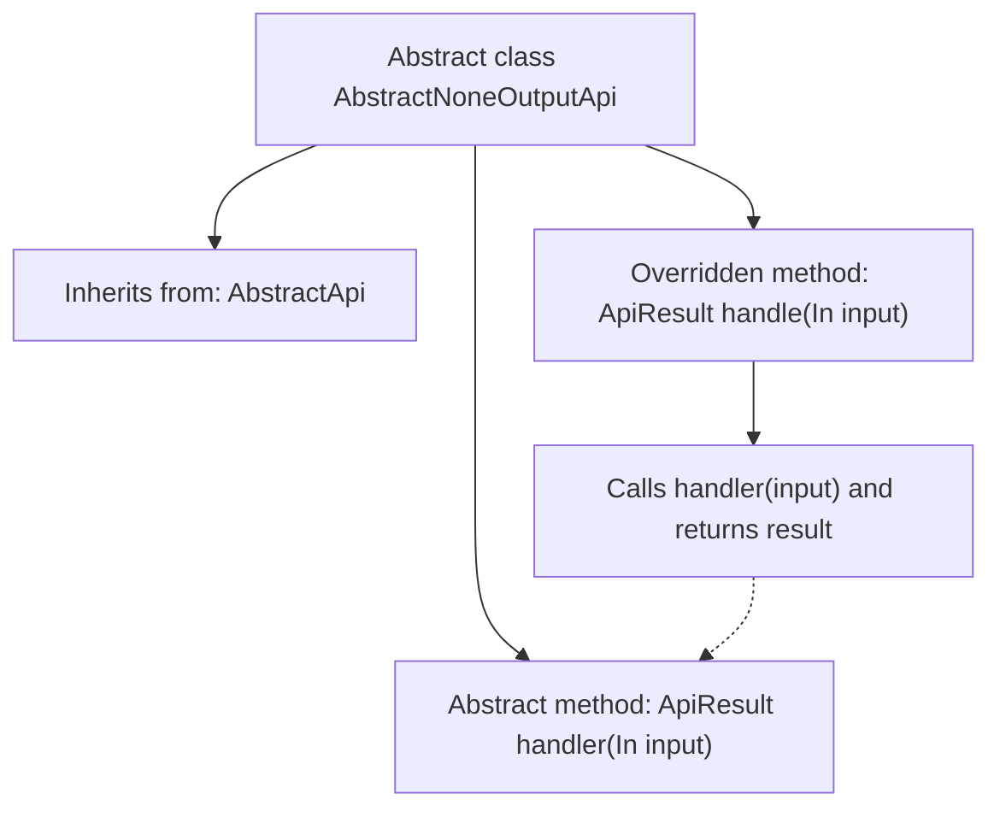

# Basic Information

|      |      |
|------|------|
| Name | AbstractNoneOutputApi |
| Language | .java |
| Code Path | WeFe/common/java/common-web/src/main/java/com/welab/wefe/common/web/api/base/AbstractNoneOutputApi.java |
| Package Name | com.welab.wefe.common.web.api.base |
| Dependencies | ['com.welab.wefe.common.web.dto.AbstractApiInput', 'com.welab.wefe.common.web.dto.ApiResult', 'com.welab.wefe.common.web.dto.NoneApiOutput'] |
| Brief Description | The abstract class `AbstractNoneOutputApi` extends `AbstractApi`, defining a no-output API template that requires subclasses to implement the `handler` method for processing input and returning results, while overriding the parent class's `handle` method to directly invoke `handler`. |

# Description

This is an abstract class named AbstractNoneOutputApi, which inherits from the AbstractApi class. It uses generics, specifying that the input type In must inherit from AbstractApiInput, while the output type is fixed as NoneApiOutput. The class contains a protected abstract method handler that requires subclass implementation. This method takes an input parameter and returns an ApiResult. It overrides the handle method of the parent class, directly invoking the handler method to process the input. The entire class is designed to handle API requests with no output results.

# Class Summary

| Name   | Type  | Description |
|-------|------|-------------|
| AbstractNoneOutputApi | class | The abstract class `AbstractNoneOutputApi` defines a template for APIs with no output, where generic inputs must inherit from `AbstractApiInput`. Override the `handle` method to invoke the abstract method `handler` for processing the input and returning an `ApiResult`, without returning specific output. |


## Class AbstractNoneOutputApi

|      |      |
|------|------|
| Access Modifier | public abstract |
| Type | class |
| Name | AbstractNoneOutputApi |
| Description | The abstract class `AbstractNoneOutputApi` defines a template for APIs with no output, where generic inputs must inherit from `AbstractApiInput`. Override the `handle` method to invoke the abstract method `handler` for processing the input and returning an `ApiResult`, without returning specific output. |


### UML Class Diagram

```mermaid
classDiagram
    class AbstractApi~In, Out~ {
        <<abstract>>
        +handle(In input) ApiResult~Out~
    }
    // AbstractApi is the base abstract class defining generic processing interface

    class AbstractNoneOutputApi~In~ {
        <<abstract>>
        -handler(In input) ApiResult
        +handle(In input) ApiResult~NoneApiOutput~
    }
    // Inherits from AbstractApi with output type fixed as NoneApiOutput

    class NoneApiOutput {
        // Marker class for empty output
    }

    AbstractApi <|-- AbstractNoneOutputApi
    // Specialized inheritance with generic parameter

    AbstractNoneOutputApi ..> NoneApiOutput : Fixed usage
    // Constrained output type dependency

```

This code demonstrates an abstract class structure for handling API requests without output. AbstractNoneOutputApi inherits from the generic base class AbstractApi, achieving specialization by fixing the output type as NoneApiOutput while maintaining generic input type capability. The core design delegates actual processing logic to the handler method implemented by subclasses, while unifying result wrapping logic, embodying the Template Method pattern. The class diagram clearly presents three key relationships: generic parameter specialization, abstract method inheritance, and fixed-type dependency.


### Internal Method Call Graph



This code illustrates the design structure of an abstract class `AbstractNoneOutputApi`, which inherits from the generic base class `AbstractApi` with the output type specified as `NoneApiOutput`. The core includes an abstract method `handler()` to be implemented by subclasses, and an overridden `handle()` method that directly delegates the call to `handler()`. The flowchart clearly reflects the class inheritance relationship, method overriding logic, and internal call chain, embodying the design philosophy of the Template Method pattern where the parent class defines the processing framework while subclasses implement specific logic.

### Field List

| Name  | Type  | Description |
|-------|-------|------|

### Method List

| Name  | Type  | Description |
|-------|-------|------|
| handle | ApiResult<NoneApiOutput> | This is a Java method override that processes input and returns an ApiResult object, potentially throwing exceptions. |
| handler | ApiResult | Abstract method `handler`, which takes input of type `In` and returns `ApiResult`, potentially throwing exceptions. |


