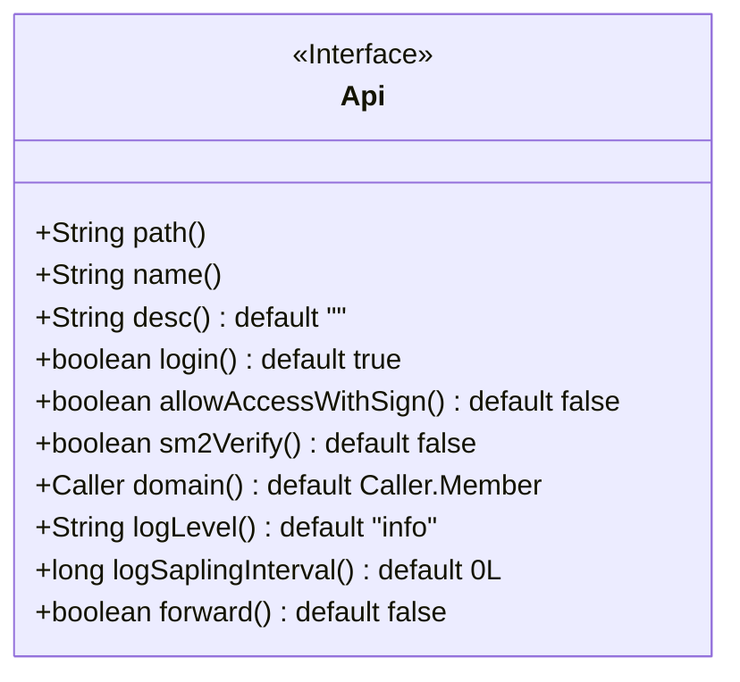

# Basic Information

|      |      |
|------|------|
| Name | Api |
| Language | .java |
| Code Path | WeFe/common/java/common-web/src/main/java/com/welab/wefe/common/web/api/base/Api.java |
| Package Name | com.welab.wefe.common.web.api.base |
| Dependencies | ['org.springframework.stereotype.Component', 'java.lang.annotation.ElementType', 'java.lang.annotation.Retention', 'java.lang.annotation.RetentionPolicy', 'java.lang.annotation.Target'] |
| Brief Description | Annotations for defining API interfaces, including configuration items such as path, name, description, login requirement, signature access, SM2 verification, caller, log level, log sampling period, and forwarding match. |

# Description

The code defines a Java annotation named `Api`, used to mark interface classes. The annotation includes multiple configuration items: `path` represents the interface path, `name` denotes the interface name, and `desc` provides descriptive information. `login` controls whether login is required for access, while `allowAccessWithSign` and `sm2Verify` govern signature-based access and SM2 verification, respectively. `domain` specifies the caller, and `logLevel` sets the logging level. `logSaplingInterval` defines the log sampling interval to reduce disk usage, and `forward` controls whether to forward matching URIs. Most configuration items come with default values.

# Class Summary

| Name   | Type  | Description |
|-------|------|-------------|
| Api | annotation | Annotations for defining API interfaces, including configuration items such as path, name, description, login requirement, signature access, SM2 verification, caller, log level, log sampling period, and forwarding match. |

## Class Api

|      |      |
|------|------|
| Access Modifier | @Retention(RetentionPolicy.RUNTIME);@Target(ElementType.TYPE);@Component;public |
| Type | annotation |
| Name | Api |
| Description | Annotations for defining API interfaces, including configuration items such as path, name, description, login requirement, signature access, SM2 verification, caller, log level, log sampling period, and forwarding match. |

### UML Class Diagram

This code defines an annotation interface named `Api`, used to mark and configure metadata for API interfaces. The interface includes multiple configurable attributes such as path, name, description (desc), login requirement (login), signature access control (allowAccessWithSign), SM2 verification (sm2Verify), caller (domain), log level (logLevel), log sampling interval (logSaplingInterval), and forwarding matching (forward). These attributes provide flexible control over API behavior, including security verification, log management, and request forwarding. The annotation is ensured to be available at runtime via `@Retention(RetentionPolicy.RUNTIME)`, and `@Target(ElementType.TYPE)` restricts its usage to class or interface declarations only.

### Internal Method Call Graph

```mermaid
graph TD
    A["Annotation @interface Api"]
    B["Meta-annotation: @Retention(RetentionPolicy.RUNTIME)"]
    C["Meta-annotation: @Target(ElementType.TYPE)"]
    D["Meta-annotation: @Component"]
    E["Attribute: String path()"]
    F["Attribute: String name()"]
    G["Attribute: String desc() default ''"]
    H["Attribute: boolean login() default true"]
    I["Attribute: boolean allowAccessWithSign() default false"]
    J["Attribute: boolean sm2Verify() default false"]
    K["Attribute: Caller domain() default Caller.Member"]
    L["Attribute: String logLevel() default 'info'"]
    M["Attribute: long logSaplingInterval() default 0L"]
    N["Attribute: boolean forward() default false"]

    A --> B
    A --> C
    A --> D
    A --> E
    A --> F
    A --> G
    A --> H
    A --> I
    A --> J
    A --> K
    A --> L
    A --> M
    A --> N
```

This flowchart illustrates the structure of the custom annotation `@Api`, comprising 3 meta-annotations and 10 configurable attributes. The meta-annotations define its runtime retention policy (RUNTIME), target type (TYPE), and component identification. Attributes cover basic configurations like interface path, name, and description, along with security settings such as login control, signature-based access, and SM2 verification. They also include operational parameters like log level and sampling interval, concluding with a request forwarding flag. All attributes provide default values, forming a flexible interface definition specification.

### Field List

| Name  | Type  | Description |
|-------|-------|------|
| domain | Caller | The default domain for the caller is Caller.Member. |
| logLevel | String | Define the default log level as "info". |
| sm2Verify | boolean | SM2 verification is disabled by default. |
| logSaplingInterval | long | Sampling interval for long integer logs, default value is 0. |
| login | boolean | The login feature is enabled by default. |
| desc | String | The method desc returns an empty string by default. |
| allowAccessWithSign | boolean | Access control via signatures is allowed, disabled by default. |
| path | String | Methods for obtaining path strings. |
| name | String | Methods to obtain the name string. |
| forward | boolean | The boolean parameter forward, with a default value of false. |

### Method List

| Name  | Type  | Description |
|-------|-------|------|

