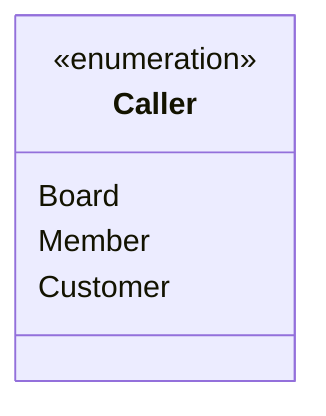
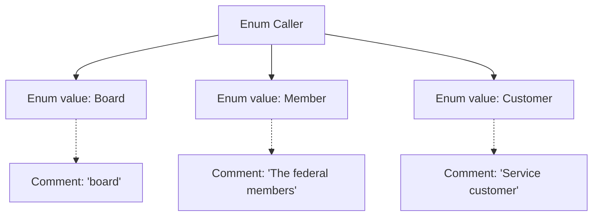

# Basic Information

|      |      |
|------|------|
| Name | Caller |
| Language | .java |
| Code Path | WeFe/common/java/common-web/src/main/java/com/welab/wefe/common/web/api/base/Caller.java |
| Package Name | com.welab.wefe.common.web.api.base |
| Dependencies | [] |
| Brief Description | The enumeration Caller defines three types of callers: Board (Board of Directors), Member (Federation Members), and Customer (Service Customers). |

# Description

This is a public enumeration type named Caller, defining three distinct caller identities. The first is Board, representing the identity of the board of directors; the second is Member, representing the identity of a federation member; and the third is Customer, representing the identity of a service client. Each identity is briefly explained through comments, clearly indicating the respective role types it represents. The enumeration structure is concise and straightforward, suitable for scenarios requiring differentiation between different caller types.

# Class Summary

| Name   | Type  | Description |
|-------|------|-------------|
| Caller | enum | The enumeration Caller defines three types of callers: Board (Board of Directors), Member (Federation Members), and Customer (Service Customers). |

## Class Caller

|      |      |
|------|------|
| Access Modifier | public |
| Type | enum |
| Name | Caller |
| Description | The enumeration Caller defines three types of callers: Board (Board of Directors), Member (Federation Members), and Customer (Service Customers). |

### UML Class Diagram

This code defines an enumeration type named Caller, which includes three enumeration constants: Board (Board of Directors), Member (Federation Member), and Customer (Service Client). The enumeration is used to represent fixed types of callers, with each constant's role explained through annotations. This design is suitable for scenarios requiring clear differentiation between caller sources, such as permission control or logging.

### Internal Method Call Graph

This flowchart illustrates the structure of the Caller enum, which contains three enum values (Board, Member, Customer) along with their corresponding comment descriptions. Board is associated with the comment "board", Member with "The federal members", and Customer with "Service customer". The diagram clearly presents the relationship between the enum definition and its documentation comments, making it suitable for scenarios requiring quick understanding of the enum's business significance.

### Field List

| Name  | Type  | Description |
|-------|-------|------|

### Method List

| Name  | Type  | Description |
|-------|-------|------|

