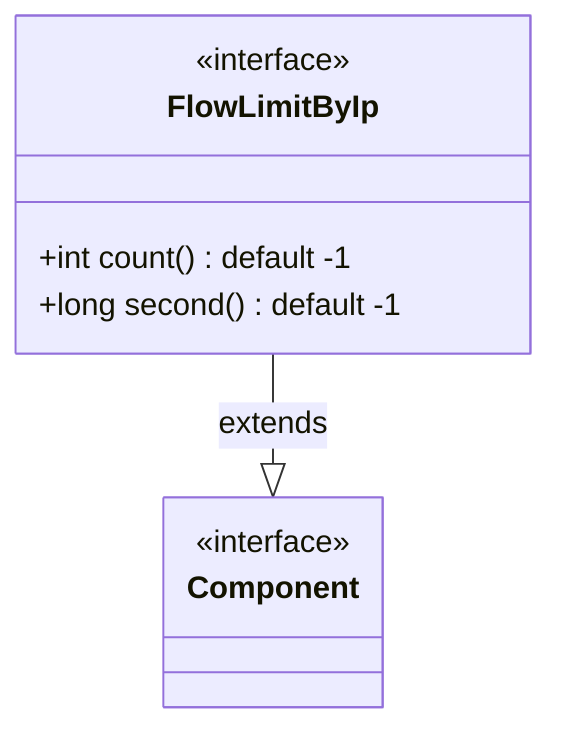
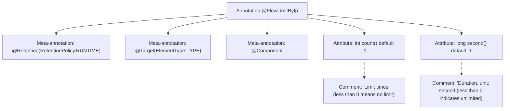

# Basic Information

|      |      |
|------|------|
| Name | FlowLimitByIp |
| Language | .java |
| Code Path | WeFe/common/java/common-web/src/main/java/com/welab/wefe/common/web/api/base/FlowLimitByIp.java |
| Package Name | com.welab.wefe.common.web.api.base |
| Dependencies | ['org.springframework.stereotype.Component', 'java.lang.annotation.ElementType', 'java.lang.annotation.Retention', 'java.lang.annotation.RetentionPolicy', 'java.lang.annotation.Target'] |
| Brief Description | The custom annotation `FlowLimitByIp` is used for IP-based rate limiting, allowing configuration of the count (unlimited by default) and time (in seconds, unlimited by default). It is retained at runtime and applies to classes. |

# Description

This is a Java annotation named FlowLimitByIp, designed for implementing traffic control based on IP addresses. The annotation has a retention policy of RUNTIME and targets TYPE (class-level), while also being marked as a Spring component (@Component). It includes two configurable parameters: count (indicating the request limit with a default value of -1 for unlimited) and second (representing the time window in seconds with a default value of -1 for unlimited). This annotation is suitable for scenarios requiring IP-based access frequency control at the class level.

# Class Summary

| Name   | Type  | Description |
|-------|------|-------------|
| FlowLimitByIp | annotation | The custom annotation `FlowLimitByIp` is used for IP-based rate limiting, allowing the configuration of count and time (in seconds), with the default being unlimited (-1). It takes effect at runtime and is applied at the class level. |

## Class FlowLimitByIp

|      |      |
|------|------|
| Access Modifier | @Retention(RetentionPolicy.RUNTIME);@Target(ElementType.TYPE);@Component;public |
| Type | annotation |
| Name | FlowLimitByIp |
| Description | The custom annotation `FlowLimitByIp` is used for IP-based rate limiting, allowing the configuration of count and time (in seconds), with the default being unlimited (-1). It takes effect at runtime and is applied at the class level. |

### UML Class Diagram

This code defines an annotation interface named `FlowLimitByIp` for controlling flow limiting based on IP addresses. The annotation has two configurable parameters: `count` represents the limit count (default -1 means no limit), and `second` indicates the time window length in seconds (default -1 means no limit). The annotation is marked as `@Component` with a retention policy of RUNTIME, allowing it to be retrieved via reflection during runtime. The class diagram illustrates the inheritance relationship between the annotation interface and the Spring component marker, suitable for implementing IP rate limiting through AOP aspects or interceptors.

### Internal Method Call Graph

This flowchart illustrates the structure of the `@FlowLimitByIp` annotation, which includes three meta-annotation declarations (runtime retention, class-level target, Spring component marker), two attributes with default values (count and second), and their corresponding descriptive comments. The annotation is designed to implement IP-based flow control functionality, where the count and second parameters respectively specify the maximum request count within a time window and the duration of the statistical period, with negative values indicating no limits.

### Field List

| Name  | Type  | Description |
|-------|-------|------|
| second | long | The default value of the long type parameter second is -1. |
| count | int | Default counting method that returns -1. |

### Method List

| Name  | Type  | Description |
|-------|-------|------|

