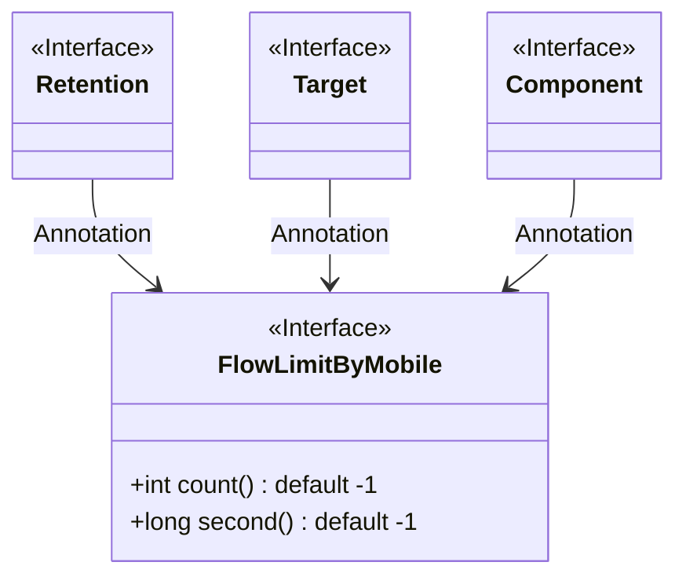
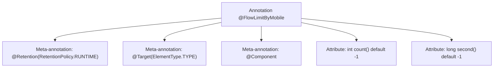

# Basic Information

|      |      |
|------|------|
| Name | FlowLimitByMobile |
| Language | .java |
| Code Path | WeFe/common/java/common-web/src/main/java/com/welab/wefe/common/web/api/base/FlowLimitByMobile.java |
| Package Name | com.welab.wefe.common.web.api.base |
| Dependencies | ['org.springframework.stereotype.Component', 'java.lang.annotation.ElementType', 'java.lang.annotation.Retention', 'java.lang.annotation.RetentionPolicy', 'java.lang.annotation.Target'] |
| Brief Description | The `FlowLimitByMobile` annotation is used for mobile rate limiting, allowing configuration of the count (unlimited by default) and time (in seconds, unlimited by default). It is retained at runtime and applies to classes. |

# Description

This is a Java annotation named FlowLimitByMobile, designed to restrict access frequency based on mobile devices. The annotation has a runtime retention policy, targets class-level usage, and is marked as a Spring component. It includes two parameters: count indicates the limit threshold (default -1 means no limit), and second specifies the duration in seconds (default -1 means no limit). This annotation is suitable for scenarios requiring traffic control on mobile requests.

# Class Summary

| Name   | Type  | Description |
|-------|------|-------------|
| FlowLimitByMobile | annotation | The `FlowLimitByMobile` annotation is used for mobile rate limiting, allowing configuration of the rate limit count (unlimited by default) and time interval (unlimited by default). It is retained at runtime and applies at the class level. |

## Class FlowLimitByMobile

|      |      |
|------|------|
| Access Modifier | @Retention(RetentionPolicy.RUNTIME);@Target(ElementType.TYPE);@Component;public |
| Type | annotation |
| Name | FlowLimitByMobile |
| Description | The `FlowLimitByMobile` annotation is used for mobile rate limiting, allowing configuration of the rate limit count (unlimited by default) and time interval (unlimited by default). It is retained at runtime and applies at the class level. |

### UML Class Diagram

This code defines an annotation interface named `FlowLimitByMobile`, designed to restrict the frequency of mobile requests. The annotation includes two configurable parameters: `count` represents the request limit (default -1 indicates no limit), and `second` specifies the time window length in seconds (default -1 indicates no limit). The annotation is modified by three meta-annotations: `@Retention`, `@Target`, and `@Component`, which respectively designate its retention policy as runtime, target type as class/interface/enum, and mark it as a Spring component. This design is commonly used for traffic control scenarios in mobile API implementations.

### Internal Method Call Graph

This flowchart illustrates the structure of the `@FlowLimitByMobile` annotation, a custom annotation for method call rate limiting. It includes two meta-annotations (`@Retention` and `@Target`) to specify its runtime retention policy and applicability to classes/interfaces, while inheriting `@Component` to enable Spring scanning. Two attributes are defined: `count` indicates the request limit (default -1 for unlimited), and `second` represents the time window (default -1 for unlimited), collectively implementing mobile-based flow control functionality.

### Field List

| Name  | Type  | Description |
|-------|-------|------|
| count | int | Default counting method that returns -1. |
| second | long | The default value of the method `second` is -1, indicating a long integer parameter. |

### Method List

| Name  | Type  | Description |
|-------|-------|------|

