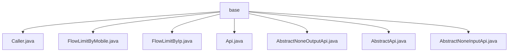

# Basic Information

|      |      |
|------|------|
| Name | base |
| Language | .java |
| Code Path | WeFe/common/java/common-web/src/main/java/com/welab/wefe/common/web/api/base |
| Package Name | docs.common.java.common-web.src.main.java.com.welab.wefe.common.web.api.base |
| Brief Description | The Caller enum defines three types of caller identities. The `@FlowLimitByMobile` and `@FlowLimitByIp` annotations restrict access frequency for mobile devices and IPs, respectively. The `@Api` annotation marks interface classes and configures access control. The `AbstractApi` abstract class provides a common framework for APIs, with its subclasses `AbstractNoneOutputApi` and `AbstractNoneInputApi` handling API requests without output and input, respectively. |

# Description

## Overview  
This module serves as the foundational framework for Web APIs, providing core capabilities such as identity recognition, traffic control, and request processing. It distinguishes caller identities (Board/Member/Customer) via the `Caller` enumeration, implements device/IP-level rate limiting (similar to the token bucket algorithm) using the `@FlowLimitByMobile` and `@FlowLimitByIp` annotations, and defines interface metadata (e.g., path/permissions) with the `@Api` annotation. The abstract class `AbstractApi` and its subclasses (`AbstractNoneOutputApi`/`AbstractNoneInputApi`) construct the request processing pipeline, supporting concurrency control, parameter validation, and unified response encapsulation. Key data structures include the generic wrapper `ApiResult` and placeholder classes `NoneApiInput`/`NoneApiOutput` for empty parameters. It relies on the Spring component model and concurrency utilities (e.g., `ConcurrentHashMap`).  

## Primary Business Scenarios  
Suitable for multi-role API development, such as board backend interfaces requiring `Caller.Board` identity tagging, or mobile login interfaces restricted to 5 requests per minute via `@FlowLimitByMobile(count=5, second=60)`. A typical workflow involves: an `@Api`-marked interface class inheriting `AbstractNoneInputApi` for parameter-free queries (e.g., fetching system time) or `AbstractNoneOutputApi` for parameterized operations (e.g., record deletion). The framework automatically handles signature verification (`allowAccessWithSign`), SM2 encryption (`sm2Verify`), and exception proxying (`ON_API_EXCEPTION_FUNCTION`), allowing developers to focus on business logic.

### Package Internal Structure View

This flowchart illustrates the hierarchical structure of the base package under the common-web module in the WeFe project. The base package serves as the root node and directly contains 7 Java class files, including traffic restriction-related classes such as Caller and FlowLimitByMobile, as well as abstract base classes like AbstractApi. All class files reside at the same level without nested subdirectories, reflecting the package's role as a foundational collection of API functionalities.

# File List

| Name   | Type  | Description |
|-------|------|-------------|
| [Caller.java](Caller.md) | file | The enumeration Caller defines three types of callers: Board (Board of Directors), Member (Federation Member), and Customer (Service Customer). |
| [FlowLimitByMobile.java](FlowLimitByMobile.md) | file | The `FlowLimitByMobile` annotation is used for mobile rate limiting, allowing configuration of the count (unlimited by default) and time (in seconds, unlimited by default). It is retained at runtime and applies to classes. |
| [FlowLimitByIp.java](FlowLimitByIp.md) | file | The custom annotation `FlowLimitByIp` is used for IP-based rate limiting, allowing configuration of the number of attempts (unlimited by default) and time duration (in seconds, unlimited by default). It is retained during runtime and applies to classes. |
| [Api.java](Api.md) | file | Annotations for defining API interfaces, including configuration items such as path, name, description, login requirement, signature access, SM2 verification, caller, log level, log sampling period, and forwarding match. |
| [AbstractNoneOutputApi.java](AbstractNoneOutputApi.md) | file | The abstract class `AbstractNoneOutputApi` extends `AbstractApi`, defining a no-output API template that requires subclasses to implement the `handler` method for processing input and returning results, while overriding the parent class's `handle` method to directly invoke `handler`. |
| [AbstractApi.java](AbstractApi.md) | file | Abstract API base class supporting concurrency control, parameter validation, exception handling, and file uploads, providing a unified execution entry point and result encapsulation. |
| [AbstractNoneInputApi.java](AbstractNoneInputApi.md) | file | The abstract class `AbstractNoneInputApi` extends `AbstractApi`, defining an API processing interface with no input parameters. It returns results via the `handle` method and may throw a `StatusCodeWithException` exception. |

