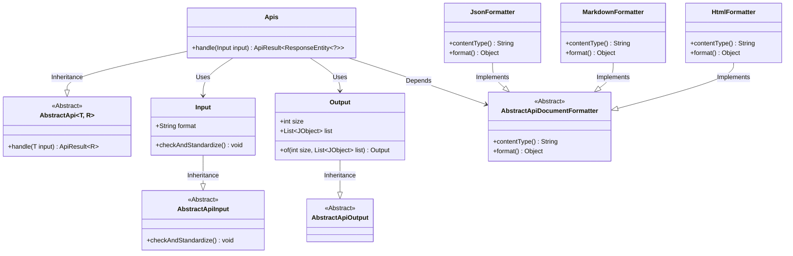

# Basic Information

|      |      |
|------|------|
| Name | Apis |
| Language | .java |
| Code Path | WeFe/common/java/common-web/src/main/java/com/welab/wefe/common/web/api/dev/Apis.java |
| Package Name | com.welab.wefe.common.web.api.dev |
| Dependencies | ['com.welab.wefe.common.exception.StatusCodeWithException', 'com.welab.wefe.common.util.JObject', 'com.welab.wefe.common.web.api.base.AbstractApi', 'com.welab.wefe.common.web.api.base.Api', 'com.welab.wefe.common.web.api_document.AbstractApiDocumentFormatter', 'com.welab.wefe.common.web.api_document.HtmlFormatter', 'com.welab.wefe.common.web.api_document.JsonFormatter', 'com.welab.wefe.common.web.api_document.MarkdownFormatter', 'com.welab.wefe.common.web.dto.AbstractApiInput', 'com.welab.wefe.common.web.dto.AbstractApiOutput', 'com.welab.wefe.common.web.dto.ApiResult', 'org.springframework.http.ResponseEntity', 'java.io.IOException', 'java.util.List'] |
| Brief Description | The Java class Apis defines API interfaces, supporting JSON, Markdown, and HTML format outputs, and includes input and output parameter validation logic. |

# Description

This is an API class named Apis, used for retrieving a list of APIs and accessible without login. It inherits from AbstractApi, with Input as the input type and ResponseEntity as the output type. The processing logic selects different formatters (json, markdown, or default html) based on the input parameter format to generate responses in the corresponding format. The Output class includes two fields, size and list, for returning API list data. The Input class contains a format field and handles null cases in the validation method.

# Class Summary

| Name   | Type  | Description |
|-------|------|-------------|
| Apis | class | The Apis class is used to retrieve API lists, supporting output in JSON, Markdown, and HTML formats, with input parameter validation and standardized processing. |

## Class Apis

|      |      |
|------|------|
| Access Modifier | @Api(path = "apis", name = "获取 api 列表", login = false);public |
| Type | class |
| Name | Apis |
| Description | The Apis class is used to retrieve API lists, supporting output in JSON, Markdown, and HTML formats, with input parameter validation and standardized processing. |

### UML Class Diagram

This code implements an API handler class Apis, which inherits from the generic abstract class AbstractApi, to dynamically select formatters (JSON/Markdown/HTML) for generating responses based on input format. It includes nested classes Input (handling input parameter validation) and Output (defining output data structure), and creates different document formatters (JsonFormatter/MarkdownFormatter/HtmlFormatter) through the factory pattern. The overall design follows the template method pattern, with core processing logic implemented in the handle method for format determination and response construction.

### Internal Method Call Graph

```mermaid
graph TD
    A["Class Apis"]
    B["Annotation: @Api"]
    C["Parent Class: AbstractApi<Input, ResponseEntity<?>>"]
    D["Method: handle(Input input)"]
    E["Local Variable: AbstractApiDocumentFormatter formatter"]
    F["switch(input.format)"]
    G["case 'json': new JsonFormatter()"]
    H["case 'markdown': new MarkdownFormatter()"]
    I["default: new HtmlFormatter()"]
    J["Build ResponseEntity"]
    K["Set content-type header"]
    L["Call formatter.format()"]
    M["Return success(response)"]
    N["Nested Class Output"]
    O["Property: int size"]
    P["Property: List<JObject> list"]
    Q["Static Method: of(int size, List<JObject> list)"]
    R["Nested Class Input"]
    S["Property: String format"]
    T["Method: checkAndStandardize()"]

    A --> B
    A --> C
    A --> D
    D --> E
    D --> F
    F --> G
    F --> H
    F --> I
    D --> J
    J --> K
    J --> L
    D --> M
    A --> N
    N --> O
    N --> P
    N --> Q
    A --> R
    R --> S
    R --> T
```

This flowchart illustrates the complete structure of the Apis class, which is an API processing class inheriting from AbstractApi. Its primary function is to generate API documentation responses in different formats (json/markdown/html) based on input format. The class contains two nested classes: Input for parameter validation and Output for defining response data structure. The core processing logic resides in the handle method, where a document formatter is selected via switch statement to construct an HTTP response with appropriate Content-Type header. The entire process clearly demonstrates the full workflow from input processing, format selection to response generation.

### Field List

| Name  | Type  | Description |
|-------|-------|------|

### Method List

| Name  | Type  | Description |
|-------|-------|------|
| handle | ApiResult<ResponseEntity<?>> | The method selects the corresponding formatting tool (JSON, Markdown, or default HTML) based on the input format, generates a response, sets the content-type header, and finally returns a successful result. |

