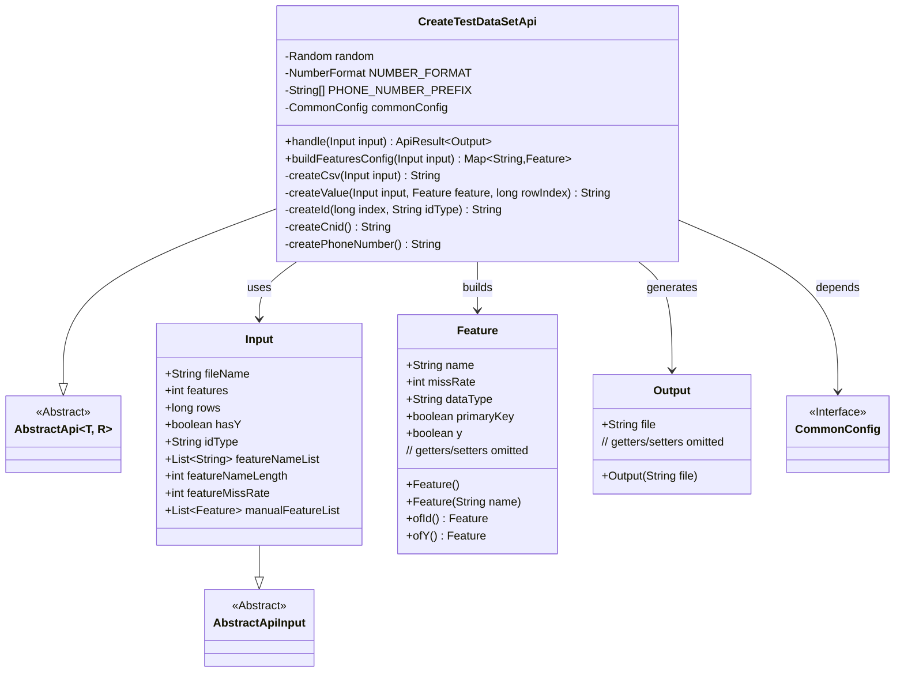
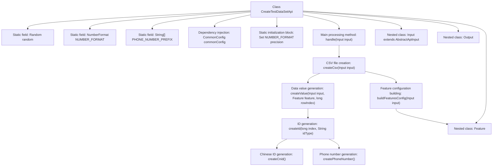
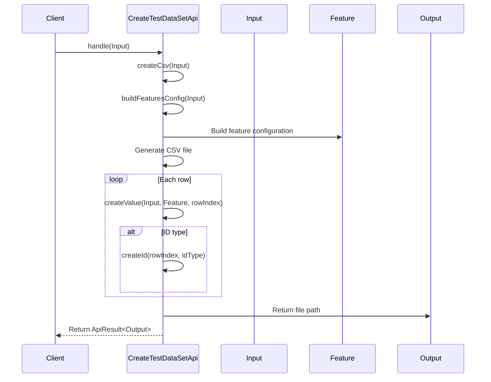

# Basic Information

|      |      |
|------|------|
| Name | CreateTestDataSetApi |
| Language | .java |
| Code Path | WeFe/common/java/common-web/src/main/java/com/welab/wefe/common/web/api/dev/CreateTestDataSetApi.java |
| Package Name | com.welab.wefe.common.web.api.dev |
| Dependencies | ['com.welab.wefe.common.StatusCode', 'com.welab.wefe.common.exception.StatusCodeWithException', 'com.welab.wefe.common.fieldvalidate.annotation.Check', 'com.welab.wefe.common.util.DateUtil', 'com.welab.wefe.common.util.OS', 'com.welab.wefe.common.util.RandomUtil', 'com.welab.wefe.common.util.StringUtil', 'com.welab.wefe.common.web.api.base.AbstractApi', 'com.welab.wefe.common.web.api.base.Api', 'com.welab.wefe.common.web.config.CommonConfig', 'com.welab.wefe.common.web.dto.AbstractApiInput', 'com.welab.wefe.common.web.dto.ApiResult', 'org.apache.commons.io.FileUtils', 'org.springframework.beans.factory.annotation.Autowired', 'java.io.File', 'java.io.FileOutputStream', 'java.io.IOException', 'java.nio.file.Path', 'java.nio.file.Paths', 'java.text.NumberFormat', 'java.util', 'java.util.stream.Collectors'] |
| Brief Description | This API is designed to generate test datasets, supporting customizable parameters such as features, number of data rows, and missing rate, with output in CSV format. It includes functionalities for ID generation, data type processing, and missing value simulation. |

# Description

This API class is designed for generating test datasets, supporting customizable parameters such as the number of features, rows, missing rate, and ID type. It constructs feature mappings based on input configurations and generates CSV files containing random data, with the file path automatically determined by the operating system. It supports various data types, including integers, dates, genders, etc., and allows configuration of missing values. The generated CSV includes a header row and data rows, with data dynamically generated according to feature configurations. The output is the absolute path of the file.

# Class Summary

| Name   | Type  | Description |
|-------|------|-------------|
| CreateTestDataSetApi | class | API for creating test datasets, supporting the generation of CSV files with customizable features, missing rate control, and various ID types (auto-increment, ID card, phone number). Input parameters include file name, number of features, number of rows, etc., and the output is the file path. |

## Class CreateTestDataSetApi

|      |      |
|------|------|
| Access Modifier | @Api(path = "test/create_data_set", name = "generate data set for testing");public |
| Type | class |
| Name | CreateTestDataSetApi |
| Description | API for creating test datasets, supporting the generation of CSV files with customizable features, missing rate control, and various ID types (auto-increment, ID card, phone number). Input parameters include file name, number of features, number of rows, etc., and the output is the file path. |

### UML Class Diagram

This code represents a test dataset generation API class that inherits from the abstract class AbstractApi. Its primary function is to generate CSV-formatted test data files based on input parameters. The class diagram illustrates the relationships between CreateTestDataSetApi and its input/output classes, along with the internally used Feature configuration class. The API handles multiple data types, supports custom feature configurations, and accounts for practical requirements like data missing rates. The generated file path is ultimately returned via the Output class.

### Internal Method Call Graph

This code implements a test dataset generation API, whose primary function is to dynamically generate CSV-formatted test data based on input parameters. The flowchart illustrates the class structure relationships, including static fields, core methods, and nested classes; the sequence diagram depicts the complete process from API invocation to data generation. The system supports multiple data type generation, missing rate control, custom feature configuration, automatically selects file storage locations based on the operating system, and finally returns the generated file path.

### Field List

| Name  | Type  | Description |
|-------|-------|------|
| random = new Random() | Random | Define a static immutable random number generator instance. |
| commonConfig | CommonConfig | The code snippet uses @Autowired to automatically inject an instance of CommonConfig. |
| PHONE_NUMBER_PREFIX = {"139", "138", "137", "136", "135", "134", "159", "158", "157", "150", "151", "152", "188", "187", "182", "183", "184", "178", "130", "131", "132", "156", "155", "186", "185", "176", "133", "153", "189", "180", "181", "177"} | String[] | Defined a static string array containing common Chinese mobile number prefixes. |
| NUMBER_FORMAT = NumberFormat.getInstance() | NumberFormat | Define a static constant NUMBER_FORMAT using the default instance of NumberFormat. |

### Method List

| Name  | Type  | Description |
|-------|-------|------|
| createCsv | String | Method to generate CSV file: Dynamically generate the file name based on input parameters, save it to the specified directory, delete any existing file first, then write the header row and data rows, print progress every 10,000 rows, and return the absolute file path. |
| handle | ApiResult<Output> | The method processes the input to generate a CSV file, returns the file path upon success, and throws a system error exception upon failure. |
| createId | String | The method generates different IDs based on idType: auto_increment returns an index, cnid calls createCnid, phone_number calls createPhoneNumber, and others return an empty string. |
| createValue | String | This method generates different types of random values based on input parameters: primary keys return IDs, boolean values return 1/0, null values are returned probabilistically, and other types return corresponding random values (numbers, genders, dates, etc.). |
| createPhoneNumber | String | Generate random phone numbers: randomly select from preset prefixes, followed by 8 random digits, totaling 11 digits. |
| buildFeaturesConfig | Map<String, Feature> | Build a feature configuration mapping that includes input features, ID features, optional Y features, manually specified feature lists, and randomly generated features, ensuring the total count meets the requirement. |
| createCnid | String | Methods for generating an 18-digit random numeric string. |

