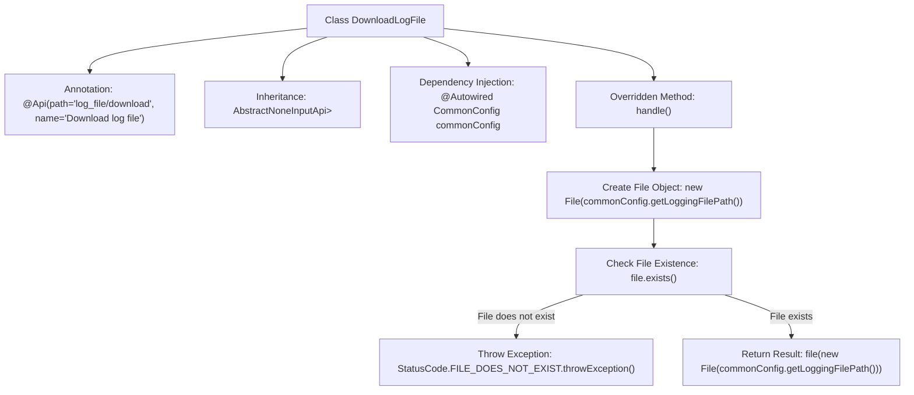

# Basic Information

|      |      |
|------|------|
| Name | DownloadLogFile |
| Language | .java |
| Code Path | WeFe/common/java/common-web/src/main/java/com/welab/wefe/common/web/api/dev/DownloadLogFile.java |
| Package Name | com.welab.wefe.common.web.api.dev |
| Dependencies | ['com.welab.wefe.common.StatusCode', 'com.welab.wefe.common.exception.StatusCodeWithException', 'com.welab.wefe.common.web.api.base.AbstractNoneInputApi', 'com.welab.wefe.common.web.api.base.Api', 'com.welab.wefe.common.web.config.CommonConfig', 'com.welab.wefe.common.web.dto.ApiResult', 'org.springframework.beans.factory.annotation.Autowired', 'org.springframework.http.ResponseEntity', 'java.io.File'] |
| Brief Description | This is an API class for downloading log files, which checks if the file exists and returns the file content. The path is "log_file/download". |

# Description

This is an API class named `DownloadLogFile`, designed to handle log file download requests. The class inherits from `AbstractNoneInputApi` and returns a `ResponseEntity`. It is annotated with `@Api` to define the API path as `"log_file/download"` and the name as "Download Log File". The class injects a `CommonConfig` configuration object to retrieve the log file path. In the `handle` method, it first checks if the log file exists—if not, it throws a file-not-found exception; if it exists, it calls the `file` method to return the file content. The entire process does not accept input parameters and solely handles the file download logic.

# Class Summary

| Name   | Type  | Description |
|-------|------|-------------|
| DownloadLogFile | class | This is an API class for downloading log files, which checks if the file exists and returns the file content, or throws an exception if the file does not exist. |


## Class DownloadLogFile

|      |      |
|------|------|
| Access Modifier | @Api(path = "log_file/download", name = "下载日志文件");public |
| Type | class |
| Name | DownloadLogFile |
| Description | This is an API class for downloading log files, which checks if the file exists and returns the file content, or throws an exception if the file does not exist. |


### UML Class Diagram

```mermaid
classDiagram
    class DownloadLogFile {
        -CommonConfig commonConfig
        +handle() ApiResult~ResponseEntity~?~
    }
    class AbstractNoneInputApi~R~ {
        <<Abstract>>
        #handle() ApiResult~R~
    }
    class CommonConfig {
        +getLoggingFilePath() String
    }
    class StatusCodeWithException {
        <<Exception>>
    }
    class ApiResult~T~ {
        +file(File) ApiResult~T~
    }
    class ResponseEntity {
    }
    class StatusCode {
        <<Enum>>
        +FILE_DOES_NOT_EXIST
    }

    DownloadLogFile --|> AbstractNoneInputApi~ResponseEntity~?~ : Inheritance
    DownloadLogFile --> CommonConfig : Dependency
    DownloadLogFile ..> StatusCodeWithException : Throws
    DownloadLogFile ..> StatusCode : Uses Enum
    AbstractNoneInputApi ..> ApiResult : Returns
    DownloadLogFile ..> ResponseEntity : Generic Parameter
```

This code demonstrates the implementation class `DownloadLogFile` for a log file download API, which inherits from the abstract class `AbstractNoneInputApi` with the generic return type specified as `ResponseEntity<?>`. The class injects the `CommonConfig` configuration class to obtain the log file path and handles file-not-found exceptions. The diagram clearly illustrates inheritance, dependency relationships between classes, and exception handling mechanisms, reflecting typical design patterns in the API layer of Spring Boot.


### Internal Method Call Graph



This flowchart illustrates the core logical structure of the DownloadLogFile class. The class defines an API endpoint via the @Api annotation, inherits from an abstract parent class, and injects CommonConfig configuration. The main process is implemented in the handle() method: first checking if the log file exists, throwing a status-coded exception if absent, or returning a file response if present. The flow clearly demonstrates the business logic of file validation and exception handling.

### Field List

| Name  | Type  | Description |
|-------|-------|------|
| commonConfig | CommonConfig | Using @Autowired to automatically inject an instance of CommonConfig. |

### Method List

| Name  | Type  | Description |
|-------|-------|------|
| handle | ApiResult<ResponseEntity<?>> | Process the log file request, check if the file exists, throw an exception if it does not exist, and return the file content if it exists. |


