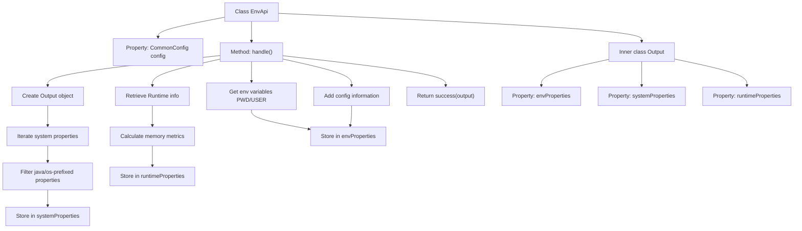

# Basic Information

|      |      |
|------|------|
| Name | EnvApi |
| Language | .java |
| Code Path | WeFe/common/java/common-web/src/main/java/com/welab/wefe/common/web/api/dev/EnvApi.java |
| Package Name | com.welab.wefe.common.web.api.dev |
| Dependencies | ['com.welab.wefe.common.InformationSize', 'com.welab.wefe.common.exception.StatusCodeWithException', 'com.welab.wefe.common.fieldvalidate.annotation.Check', 'com.welab.wefe.common.web.api.base.AbstractNoneInputApi', 'com.welab.wefe.common.web.api.base.Api', 'com.welab.wefe.common.web.config.CommonConfig', 'com.welab.wefe.common.web.dto.ApiResult', 'com.welab.wefe.common.wefe.enums.env.EnvBranch', 'org.springframework.beans.factory.annotation.Autowired', 'java.lang.management.ManagementFactory', 'java.util.LinkedHashMap', 'java.util.Map', 'java.util.TreeMap'] |
| Brief Description | The EnvApi class is used to retrieve environment variables, system properties, and runtime information, including JVM memory and thread count, and returns formatted output results. |

# Description

EnvApi is an API class designed for retrieving environment variables and system information, inheriting from AbstractNoneInputApi. It collects three categories of information through the handle method: system properties (those starting with java or os), runtime information (such as thread count, memory usage, etc.), and environment variables (e.g., PWD, USER). Additionally, it includes the environment name, branch, and demo environment flag from the CommonConfig configuration. The output is organized into three maps—envProperties, systemProperties, and runtimeProperties—each storing different types of information. All data is returned in key-value pairs.

# Class Summary

| Name   | Type  | Description |
|-------|------|-------------|
| EnvApi | class | The EnvApi class provides an interface for environment variables, collecting system properties, runtime memory and thread information, as well as configured environment names and branches, and returns an Output object containing these three types of information. |


## Class EnvApi

|      |      |
|------|------|
| Access Modifier | @Api(path = "env", name = "环境变量");public |
| Type | class |
| Name | EnvApi |
| Description | The EnvApi class provides an interface for environment variables, collecting system properties, runtime memory and thread information, as well as configured environment names and branches, and returns an Output object containing these three types of information. |


### UML Class Diagram

```mermaid
classDiagram
    class AbstractNoneInputApi~T~ {
        <<Abstract>>
        #ApiResult~T~ handle() throws StatusCodeWithException
        +ApiResult~T~ success(T data)
    }

    class EnvApi {
        -CommonConfig config
        +EnvApi()
        #ApiResult~Output~ handle() throws StatusCodeWithException
    }

    class EnvApi$Output {
        +LinkedHashMap~String,String~ envProperties
        +TreeMap~String,String~ systemProperties
        +LinkedHashMap~String,String~ runtimeProperties
    }

    class CommonConfig {
        +EnvName getEnvName()
        +EnvBranch getEnvBranch()
    }

    class InformationSize {
        <<Utility>>
        +String fromByte(long bytes)
    }

    AbstractNoneInputApi~T~ <|-- EnvApi
    EnvApi *-- EnvApi$Output
    EnvApi --> CommonConfig : Dependency
    EnvApi ..> InformationSize : Invoke
```

This code demonstrates an environment variable query API implementation. EnvApi inherits from the abstract class AbstractNoneInputApi and collects system properties, runtime information, and environment variables through the handle() method. The Output inner class uses three Map structures to store different types of environmental data. CommonConfig provides environment configuration information, while InformationSize is a byte conversion utility class. The class diagram clearly illustrates inheritance relationships, composition relationships, and utility class invocation.


### Internal Method Call Graph



This code implements the EnvApi class, primarily designed to collect and return system environment information. The process starts with the handle method, which first creates an Output object, then gathers data in three parts: system properties (java/os-prefixed), runtime memory information (thread count, memory usage, etc.), and environment variables (PWD/USER). Finally, it adds the envName and envBranch information from the configuration center, encapsulating all data into the Output object for return. The inner class Output uses three Map structures to store different types of environment data respectively, with fields marked by @Check annotations to indicate their purposes.

### Field List

| Name  | Type  | Description |
|-------|-------|------|
| config | CommonConfig | Automatically inject the CommonConfig configuration class instance. |

### Method List

| Name  | Type  | Description |
|-------|-------|------|
| handle | ApiResult<Output> | The method collects system properties, runtime information, and environment variables, including Java and OS properties, JVM memory status, thread count, processor quantity, and specific environment variables, ultimately returning the encapsulated result. |


