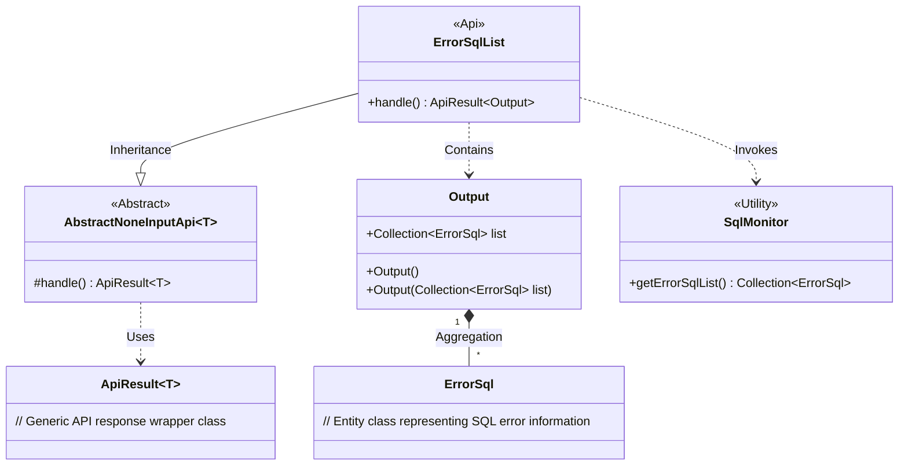
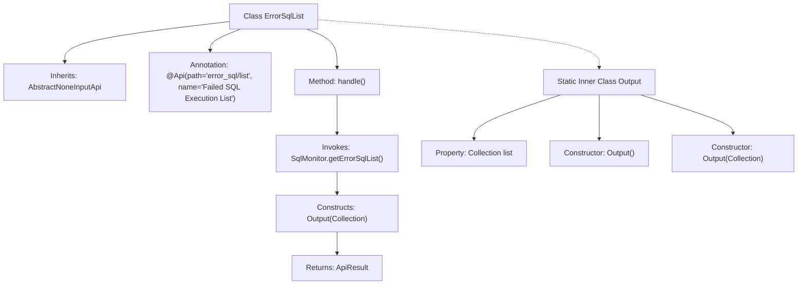

# Basic Information

|      |      |
|------|------|
| Name | ErrorSqlList |
| Language | .java |
| Code Path | WeFe/common/java/common-web/src/main/java/com/welab/wefe/common/web/api/dev/ErrorSqlList.java |
| Package Name | com.welab.wefe.common.web.api.dev |
| Dependencies | ['com.welab.wefe.common.data.mysql.sql_monitor.ErrorSql', 'com.welab.wefe.common.data.mysql.sql_monitor.SqlMonitor', 'com.welab.wefe.common.exception.StatusCodeWithException', 'com.welab.wefe.common.web.api.base.AbstractNoneInputApi', 'com.welab.wefe.common.web.api.base.Api', 'com.welab.wefe.common.web.dto.ApiResult', 'java.util.Collection'] |
| Brief Description | Define the API class `ErrorSqlList` to retrieve the list of failed SQL queries, which takes no input parameters and returns an output result containing a collection of `ErrorSql`. The processing logic invokes `SqlMonitor` to fetch the data and encapsulates it into an `ApiResult` for return. |

# Description

The code defines an API class named `ErrorSqlList`, which is used to retrieve a list of failed SQL executions. The API path is `"error_sql/list"`, inheriting from the base class `AbstractNoneInputApi`, with the output type being the inner class `Output`. The processing logic is implemented through the `handle` method, which calls `SqlMonitor.getErrorSqlList()` to fetch the collection of error SQLs and encapsulates it into an `Output` object for return. The `Output` class contains a `Collection<ErrorSql>` type `list` field and provides both no-argument and parameterized constructors. This API does not accept input parameters and directly returns the list of error SQLs.

# Class Summary

| Name   | Type  | Description |
|-------|------|-------------|
| ErrorSqlList | class | This is an API class with the path "error_sql/list", used to retrieve a list of failed SQL executions. It inherits from AbstractNoneInputApi and returns output containing a collection of error SQLs. The processing logic directly calls SqlMonitor.getErrorSqlList() to fetch the data. |

## Class ErrorSqlList

|      |      |
|------|------|
| Access Modifier | @Api(path = "error_sql/list", name = "执行失败的 sql 列表");public |
| Type | class |
| Name | ErrorSqlList |
| Description | This is an API class with the path "error_sql/list", used to retrieve a list of failed SQL executions. It inherits from AbstractNoneInputApi and returns output containing a collection of error SQLs. The processing logic directly calls SqlMonitor.getErrorSqlList() to fetch the data. |

### UML Class Diagram

Class Diagram Description: This diagram illustrates the structure of the ErrorSqlList class and its relationships. ErrorSqlList inherits from the generic class AbstractNoneInputApi<Output> and contains a nested Output class for encapsulating error SQL lists. The Output class has an aggregation relationship with ErrorSql, obtaining data through the SqlMonitor utility class. The overall design implements an API function for retrieving failed SQL lists, adhering to object-oriented design principles.

### Internal Method Call Graph

This flowchart illustrates the structure and internal relationships of the ErrorSqlList class. The class inherits from AbstractNoneInputApi, defines API path and name via @Api annotation, with its core method handle() invoking SqlMonitor to retrieve failed SQL lists and encapsulate them into the Output inner class for return. As a static inner class, Output contains two constructors and a collection property for storing error SQL data. The entire process clearly demonstrates the complete chain from request handling to data return.

### Field List

| Name  | Type  | Description |
|-------|-------|------|

### Method List

| Name  | Type  | Description |
|-------|-------|------|
| handle | ApiResult<Output> | Java method override, returns an ApiResult success response containing a list of erroneous SQL statements. |

