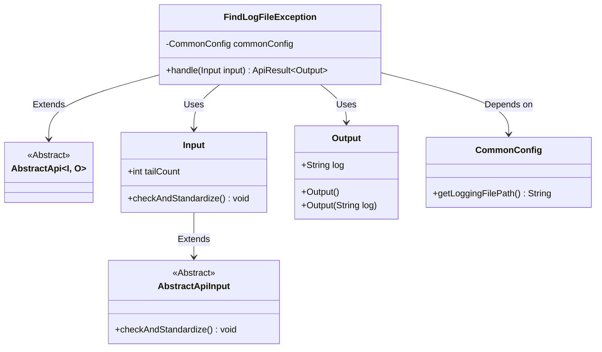
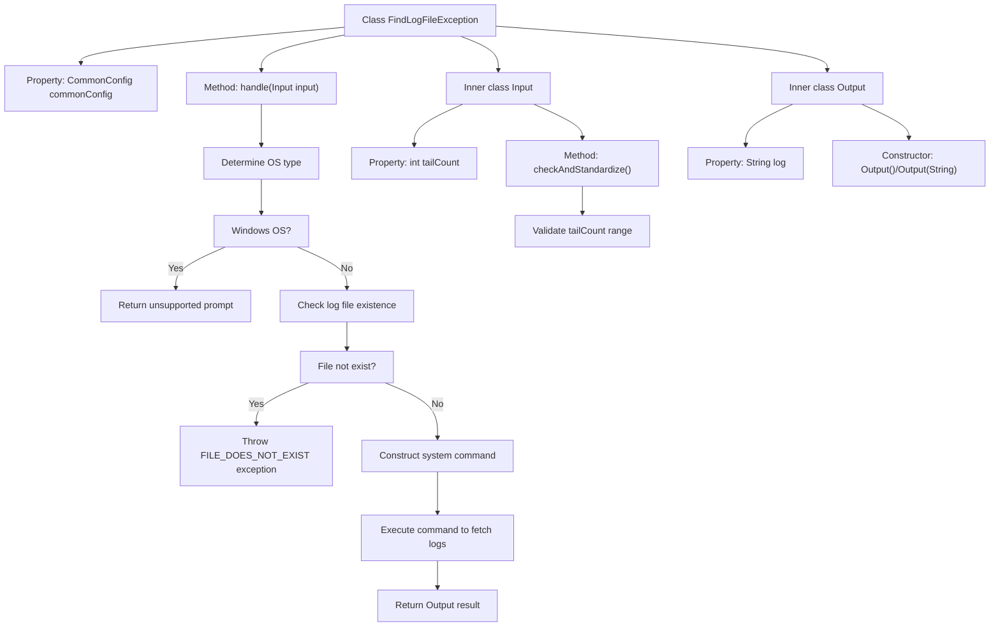

# Basic Information

|      |      |
|------|------|
| Name | FindLogFileException |
| Language | .java |
| Code Path | WeFe/common/java/common-web/src/main/java/com/welab/wefe/common/web/api/dev/FindLogFileException.java |
| Package Name | com.welab.wefe.common.web.api.dev |
| Dependencies | ['com.welab.wefe.common.StatusCode', 'com.welab.wefe.common.exception.StatusCodeWithException', 'com.welab.wefe.common.fieldvalidate.annotation.Check', 'com.welab.wefe.common.util.OS', 'com.welab.wefe.common.web.api.base.AbstractApi', 'com.welab.wefe.common.web.api.base.Api', 'com.welab.wefe.common.web.config.CommonConfig', 'com.welab.wefe.common.web.dto.AbstractApiInput', 'com.welab.wefe.common.web.dto.ApiResult', 'org.springframework.beans.factory.annotation.Autowired', 'java.io.File'] |
| Brief Description | Search for exception APIs in log files, which are not supported on Windows systems. After verifying the file's existence, execute commands to extract exception stacks, with a return line limit of 100-1000. |

# Description

This API class is designed to search for exception stack blocks in log files, with the path "log_file/find_exception". It inherits from AbstractApi, accepts Input parameters, and returns Output results. On Windows systems, it directly returns an unsupported prompt, while on non-Windows systems, it executes the grep command to search for exception stacks. The Input class includes a tailCount parameter, which limits the number of returned log lines to between 1 and 1000, with a default value of 100. The Output class contains a log content string. Before execution, it checks whether the log file exists and throws an exception if it does not.

# Class Summary

| Name   | Type  | Description |
|-------|------|-------------|
| FindLogFileException | class | This API is used to search for exception stack blocks in log files and does not support Windows systems. The input parameter limits the number of log lines returned to between 1 and 1000, with a default value of 100. The output includes the matched log content. |

## Class FindLogFileException

|      |      |
|------|------|
| Access Modifier | @Api(path = "log_file/find_exception", name = "搜索日志文件中的异常堆栈块");public |
| Type | class |
| Name | FindLogFileException |
| Description | This API is used to search for exception stack blocks in log files and does not support Windows systems. The input parameter limits the number of log lines returned to between 1 and 1000, with a default value of 100. The output includes the matched log content. |

### UML Class Diagram

Class Diagram Description: This diagram illustrates the class structure for log exception search functionality. FindLogFileException inherits from the generic abstract class AbstractApi, handling Input and Output data types. Input extends AbstractApiInput and contains log line count validation logic, while Output encapsulates log content. CommonConfig provides log file path configuration through dependency injection. The overall implementation enables cross-platform log exception extraction, explicitly excluding Windows system support.

### Internal Method Call Graph

The flowchart describes the processing flow of a log exception search API: First detect the operating system type, directly return unsupported for Windows; For non-Windows systems, check if the log file exists, throw an exception if not; If exists, construct a system command to execute log search, and finally return the result. The inner class Input handles parameter validation, while Output encapsulates return data. The entire process includes key steps such as OS determination, file checking, command construction and execution.

### Field List

| Name  | Type  | Description |
|-------|-------|------|
| commonConfig | CommonConfig | Automatically inject an instance of the CommonConfig configuration class. |

### Method List

| Name  | Type  | Description |
|-------|-------|------|
| handle | ApiResult<Output> | Java method handles log queries, returning an unsupported prompt on Windows systems, while executing grep/tail commands on non-Windows systems to retrieve the last N lines of logs, and throwing an error if the file does not exist. |

