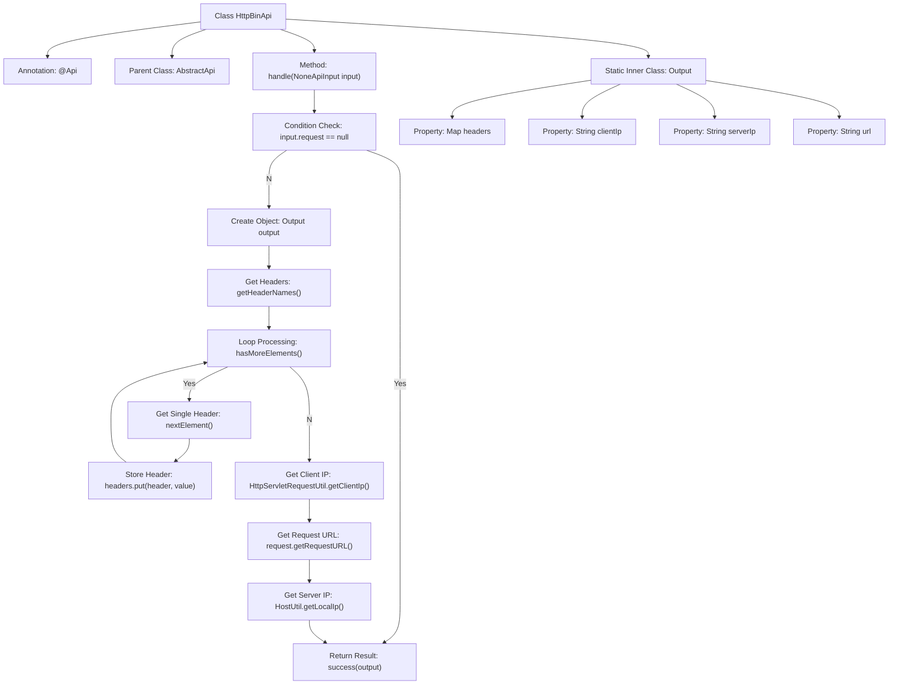

# Basic Information

|      |      |
|------|------|
| Name | HttpBinApi |
| Language | .java |
| Code Path | WeFe/common/java/common-web/src/main/java/com/welab/wefe/common/web/api/dev/HttpBinApi.java |
| Package Name | com.welab.wefe.common.web.api.dev |
| Dependencies | ['com.welab.wefe.common.exception.StatusCodeWithException', 'com.welab.wefe.common.util.HostUtil', 'com.welab.wefe.common.web.api.base.AbstractApi', 'com.welab.wefe.common.web.api.base.Api', 'com.welab.wefe.common.web.dto.ApiResult', 'com.welab.wefe.common.web.dto.NoneApiInput', 'com.welab.wefe.common.web.util.HttpServletRequestUtil', 'java.util.Enumeration', 'java.util.HashMap', 'java.util.Map'] |
| Brief Description | The HttpBinApi class is used to view HTTP request information, including request headers, client IP, server IP, and URL, and can be accessed without login. |

# Description

The HttpBinApi class is a no-login-required API interface designed to inspect HTTP request objects. It inherits from AbstractApi, takes NoneApiInput as input, and outputs a custom Output class containing request headers, client IP, server IP, and URL. The processing logic involves checking the non-null status of the request object, then extracting header information, obtaining the client IP, request URL, and server IP, and finally encapsulating them into an Output object for return. If the request object is null, an empty result is returned.

# Class Summary

| Name   | Type  | Description |
|-------|------|-------------|
| HttpBinApi | class | The HttpBinApi class is a login-free API used to retrieve HTTP request headers, client IP, server IP, and request URL, returning an Output object containing this data. |


## Class HttpBinApi

|      |      |
|------|------|
| Access Modifier | @Api(path = "http_bin", name = "查看 http 请求对象", login = false);public |
| Type | class |
| Name | HttpBinApi |
| Description | The HttpBinApi class is a login-free API used to retrieve HTTP request headers, client IP, server IP, and request URL, returning an Output object containing this data. |


### UML Class Diagram

```mermaid
classDiagram
    class AbstractApi~T, R~ {
        <<Abstract>>
        +handle(T input) ApiResult~R~
    }

    class NoneApiInput {
        +HttpServletRequest request
    }

    class HttpBinApi {
        +handle(NoneApiInput input) ApiResult~Output~
    }

    class HttpBinApi$Output {
        +Map~String, String~ headers
        +String clientIp
        +String serverIp
        +String url
    }

    class HttpServletRequestUtil {
        <<Utility>>
        +getClientIp(HttpServletRequest request) String
    }

    class HostUtil {
        <<Utility>>
        +getLocalIp() String
    }

    AbstractApi <|-- HttpBinApi
    HttpBinApi --> NoneApiInput : uses
    HttpBinApi --> HttpBinApi$Output : generates
    HttpBinApi --> HttpServletRequestUtil : invokes
    HttpBinApi --> HostUtil : invokes
```

This code defines an HttpBinApi class that inherits from the AbstractApi generic class, designed to process HTTP request information. Its primary function is to collect request headers, client IP, URL, and server IP, encapsulating them into the Output inner class for return. The code utilizes utility classes HttpServletRequestUtil and HostUtil to retrieve client IP and local IP, demonstrating clear separation of responsibilities. The class diagram illustrates inheritance relationships, dependencies, and the structure of inner classes, with the Output class serving as a data carrier containing various request-related information.


### Internal Method Call Graph



This flowchart illustrates the complete processing flow of the HttpBinApi class. It first checks whether the request object exists. If not, it directly returns a success response. Otherwise, it creates an Output object and sequentially processes request headers, retrieves client IP, request URL, and server IP, before finally encapsulating the results for return. The static inner class Output defines the structure for storing response data, containing four fields: a collection of request headers, client IP, server IP, and URL. The entire process clearly demonstrates the collection and encapsulation of HTTP request information.

### Field List

| Name  | Type  | Description |
|-------|-------|------|

### Method List

| Name  | Type  | Description |
|-------|-------|------|
| handle | ApiResult<Output> | Process API requests, collect request headers, client IP, URL, and server IP, then return a successful result. If the request is empty, directly return success. |


